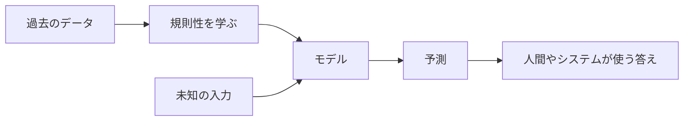

## 第1章　機械学習とは何か

**この章でわかること**

- 機械学習が「データから規則性を学ぶ」方法であること
- 普通のプログラムと機械学習の違い
- 入力、出力、予測、学習、推論の基本的な意味
- 機械学習、AI、深層学習、生成AIの関係

### 1.1　機械学習の目的

機械学習とは、「データから規則性を見つけ、その規則性を使って未知の入力に対する答えを出す技術」です。

普通のプログラムでは、人間がルールを書きます。たとえば送料計算なら「5,000円以上は無料、それ未満は600円」というルールを書けばよいです。ルールが明確で人間がそれを知っている問題には、このやり方が一番わかりやすいです。

しかし、人間が明確なルールとして書きにくい問題もたくさんあります。たとえば写真を見て「犬か猫か」を判定する問題です。人間なら感覚的にわかりますが、「耳が尖っていたら猫」「鼻が長ければ犬」といったルールを書こうとすると、すぐに例外だらけになり、破綻します。

機械学習では、ルールを細かく書く代わりに、大量の犬と猫の画像を与えます。そして、コンピュータがそのデータから、区別するための特徴を自動的に学びます。

つまり機械学習の目的は、人間が直接ルールを書きにくい問題に対して、データから使える規則性を獲得することです。

もう少し抽象的にいうと、機械学習は「入力から出力を得る関数」を、データから作る技術です。

```text
画像 → 犬か猫か
メール本文 → スパムかどうか
家の情報 → 価格
文章の途中まで → 次に来る単語
```

この「入力から出力を得る仕組み」を、手作業で全部書くのではなく、データを使って作るのが機械学習です。



### 1.2　「ルールを書く」プログラムと「データから学ぶ」プログラム

普通のプログラムと機械学習の違いは、「何を人間が書くか」にあります。

普通のプログラムでは、人間がルールを書きます。

```text
入力 + ルール → 出力
（例：税抜価格に 1.1 を掛ける → 税込価格）
```

機械学習では、入力と正解の例をたくさん用意し、その関係を学ばせます。

```text
入力 + 正解 → ルールを作る
（例：過去の家の情報 と 実際の価格 から、価格を予測するルールを作る）
```

ここでいう「ルール」は、必ずしも人間が読んで理解しやすい形ではありません。多くの場合、大量の数値、つまりパラメータとして表現されます。ニューラルネットワークでは、このパラメータは「重み」と呼ばれる数値です。学習とは、この重みを少しずつ調整して、よい出力が出るようにする作業です。

たとえば家の価格予測なら、最初の予測はかなり適当で、5,000万円の家を3,000万円と予測するかもしれません。そこで「実際の価格」と「予測」のズレを計算し、そのズレが小さくなるように、パラメータを調整します。これを大量のデータで何度も繰り返すと、だんだん予測がよくなります。これが「学習する」ということです。

### 1.3　入力、出力、予測

機械学習では、ほとんどの問題を「入力を受け取って、何かを出力する問題」として考えます。この見方は、Transformer や大規模言語モデルを理解するときにも、最終的にはここに戻ってきます。

```text
画像分類    : 画像 → 種類
スパム判定   : メール本文 → スパムかどうか
価格予測    : 家の情報 → 価格
文章生成    : ここまでの文章 → 次に来る単語
```

ここで重要なのは、機械学習の出力は「絶対に正しい答え」ではなく「予測」だという点です。

モデルは、もっともらしい答えを返しますが、常に正解とは限りません。犬を猫と間違えることも、事実と違う文章を生成することもあります。

普通のプログラムは、ルールが正しければ同じ入力に常に正しい出力を返します。一方、機械学習モデルは、データから学んだ傾向に基づいて予測します。だから「未知の入力に対して、どれくらいうまく予測できるか」が重要になります。この能力を、後の章で「汎化性能」と呼びます。

### 1.4　モデルとは何か

機械学習でいう「モデル」とは、入力を受け取って出力を返す仕組みです。もっと単純にいえば、関数です。

```text
出力 = モデル(入力)
（例：価格 = モデル(広さ, 駅からの距離, 築年数, 地域)）
```

普通の関数との大きな違いは、内部の処理を「誰が決めるか」です。

普通の関数では、`税込価格 = 税抜価格 * 1.1` のように、人間が処理を直接書きます。一方、機械学習のモデルでは、内部の処理の一部、または大部分が、データによって決まります。ニューラルネットワークなら、モデルの中の大量の重みが、人間ではなく学習によって決まります。

つまり、モデルとは「データから調整される関数」だと考えるとわかりやすいです。

この見方は、Transformer を理解するときにも重要です。Transformer も、結局は巨大な関数です。入力としてトークン列を受け取り、出力として次のトークンの確率分布を返します。

```text
次トークンの確率分布 = Transformer(ここまでのトークン列)
```

内部構造は複雑ですが、機械学習の基本としては、まず「モデルは入力を出力に変換する関数である」と理解しておけば十分です。

### 1.5　学習とは何か

機械学習における「学習」とは、モデルの出力が正解に近づくように、内部のパラメータを調整することです。

家の価格予測で考えます。最初、モデルは適当な予測をします（実際5,000万円を3,000万円と予測、など）。このズレを計算し、ズレが小さくなるようにパラメータを少し変えます。次の家でも同じことをします。これを大量のデータで何度も繰り返すと、だんだんよい予測を出せるようになります。

ここで重要なのは、学習の目的は「正解を丸暗記する」ことではない、という点です。

学習データに正しく答えられることは必要ですが、それだけでは不十分です。本当に重要なのは、まだ見たことのないデータにもうまく予測できることです。過去のデータにだけ正しく、新しい家の価格をまったく予測できないなら、役に立ちません。

つまり、学習の目的は、学習データそのものを覚えることではなく、その背後にある規則性を捉えることです。学習データに強くなりすぎて未知のデータに弱くなることを「過学習」といい、機械学習で頻繁に出てくる問題です。

### 1.6　推論とは何か

機械学習では、「学習」と「推論」を区別します。

- **学習**：正解付きのデータを使って、モデルのパラメータを調整すること（モデルを作る段階）。
- **推論**：学習済みのモデルを使って、新しい入力に対する出力を得ること（作ったモデルを使う段階）。

犬猫分類なら、学習時は大量の犬・猫の画像とその正解を使ってパラメータを調整します。学習が終わったら、新しい画像を入力し、正解を教えずにモデル自身に予測させます。これが推論です。

言語モデルも同じです。学習時は大量の文章で「この文脈の次に来るトークン」を学びます。推論時は、ユーザーの入力を受け取り、続きとしてもっともらしいトークンを生成します。

```text
入力：今日はとても
出力候補：暑い、寒い、楽しい、忙しい、眠い...（それぞれに確率がつく）
```

確率に基づいて次のトークンを選び、入力に追加し、また次を予測する。これを繰り返して文章が生成されます。つまり、生成AIの文章生成も、基本的には推論です。

### 1.7　機械学習でできること、できないこと

機械学習は強力ですが、何でもできる魔法ではありません。

得意なのは、データの中に規則性があり、それを使えば未知の入力に有用な予測ができる問題です。画像認識、音声認識、翻訳などは、入力と出力の間に対応関係があり、大量のデータからその関係を学べるので、得意な分野です。

一方、苦手なこともあります。

- **データが少ない問題**：データから学ぶ技術なので、十分なデータがなければ学習できません。
- **規則性がない問題**：完全にランダムなものは、どんな高度なモデルでも予測できません。
- **学習データと本番データが大きく違う場合**：昼間の犬の画像だけで学習すると、夜や雪の中の画像ではうまく判定できないかもしれません。
- **理由の説明**：特にニューラルネットは内部に大量の数値があり、「なぜその判断をしたか」を人間が完全に理解するのは難しいことがあります。大規模言語モデルも、もっともらしいが事実と違う文章を生成することがあります。

したがって、機械学習を使うときには、「予測である」「間違える可能性がある」「学習データに依存する」という前提を、忘れてはいけません。

### 1.8　機械学習とAI、深層学習、生成AIの関係

最後に、関連する言葉の関係を整理します。

**AI**（Artificial Intelligence、人工知能）は、人間の知的な振る舞いをコンピュータで実現しようとする技術全般を指す、広い言葉です。

その中に**機械学習**があります。ルールをすべて人間が書くのではなく、データから学ぶことで知的な振る舞いを実現する方法です。

機械学習の中に**深層学習**があります。ニューラルネットワークを多層に重ねたモデルを使う一分野で、画像・音声・自然言語処理で高い性能を出してきました。

そして**生成AI**は、文章・画像・音声などを生成するAIで、その多くが深層学習を使っています。

```text
AI
└── 機械学習
    └── 深層学習
        └── 生成AIの多く
```

ただし、すべてのAIが機械学習ではなく（人間がルールを書く古典的AIもある）、すべての機械学習が深層学習でもありません（線形回帰、決定木など他の手法もある）。Transformer は深層学習モデルであり、大規模言語モデルは Transformer をベースにしたものが多く、いずれも「入力から出力を予測するモデルを、データから学習する」という機械学習の考え方の上にあります。

### 1.9　本章のまとめ

**Transformer への接続**

Transformer も、基本的には入力から出力を予測する機械学習モデルです。言語モデルとして使う場合、入力はここまでのトークン列で、出力は次に来るトークンの確率分布です。

**ミニ演習**

- スパム判定、家の価格予測、次トークン予測について、それぞれの入力と出力を書き出してみましょう。
- ルールベースで解きやすい問題と、機械学習で解きやすい問題を1つずつ考えてみましょう。
- 「学習」と「推論」の違いを、自分の言葉で1文ずつ説明してみましょう。

この章で一番重要な考え方は、次の一文です。

**機械学習とは、データを使って、入力から出力を予測する関数を作る技術である。**

普通のプログラムが「入力 + ルール → 出力」だったのに対し、機械学習は「入力 + 正解 → ルールを作る」と考えます。作られる「ルール」は、ニューラルネットワークでは大量の重みとして表現されます。学習とはその重みを調整して正解に近い出力を出せるようにすること、推論とは学習済みモデルで新しい入力の答えを出すことです。

Transformer も大規模言語モデルも、この延長にあります。文章を入力し、モデルが計算し、次トークンの確率を出し、その予測が正解に近づくように大量の文章で学習する。この基本構造を押さえておくと、この後の「教師あり学習」「損失関数」「勾配降下法」「ニューラルネットワーク」「Transformer」も、同じ流れの中で理解しやすくなります。
