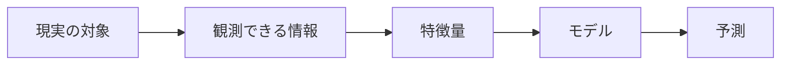
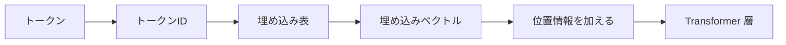

## 第10章　特徴量と表現

**この章でわかること**

- 特徴量がモデルの予測材料であること
- one-hot 表現と埋め込みベクトルの違い
- 深層学習が表現を自動的に学ぶという考え方
- Transformer がトークンを文脈表現へ変換すること

### 10.1　特徴量とは何か

機械学習では、モデルに入力する情報を「特徴量」（feature）と呼びます。特徴量とは、モデルが予測を行うための手がかりです。

```text
家の価格予測 : 広さ・築年数・駅距離・地域・部屋数・階数・日当たり
スパム判定   : 本文の単語・件名の単語・URLの数・送信元・添付ファイルの有無
画像分類     : 各ピクセルの明るさ・色成分
```

モデルは、入力された特徴量をもとに予測します。ここで重要なのは、モデルは入力に含まれていない情報を直接使えない、という点です。家の価格予測で「地域」を入力に入れていなければ、モデルは地域による価格差を直接学べません。つまり、特徴量の選び方は、モデルの性能に大きく影響します。特徴量は、モデルが世界を見るための入り口です。



### 10.2　特徴量は予測の材料である

特徴量は、モデルが判断するための材料です。料理でいえば食材に近く、よい食材がなければ腕のよい料理人でも限界があるように、よい特徴量がなければ高度なモデルでも良い予測は難しくなります。

家の価格を「広さ」だけで予測すると、「広い家ほど高い」という傾向は学べても、東京都心の50平米と地方の50平米の違いや、駅距離・築年数の違いを扱えません。地域・駅距離・築年数などの特徴量を追加すると、モデルは価格に関係する複数の要因を考慮できます。

ただし、特徴量を増やせば必ずよくなるわけではありません。関係のない特徴量やノイズの多い特徴量を入れると、過学習しやすくなることもあります。しかし、予測に必要な情報が入力に含まれていなければモデルはそれを使えないので、「どの情報を入力として与えるか」は非常に重要です。

### 10.3　人間が設計する特徴量

深層学習が広く使われる以前は、人間が特徴量を設計することが非常に重要でした。この作業を「特徴量エンジニアリング」（feature engineering）と呼びます。データから予測に役立つ情報を取り出し、モデルが扱いやすい形に変換する作業です。

たとえば ECサイトの購入予測なら、元データ（ユーザーID、商品ID、閲覧履歴、購入履歴など）から、人間が工夫して次のような特徴量を作れます。

```text
過去30日間の購入回数 / 過去7日間の閲覧回数 / 最後に購入してからの日数
カートに入れたが購入しなかった回数 / 商品の価格がユーザーの平均購入価格より高いか
```

スパム判定でも、本文そのものだけでなく、URLの数・大文字の割合・送信元ドメインの過去のスパム率などを特徴量として作れます。特徴量エンジニアリングは機械学習の実務で非常に重要で、今でも表形式データや業務データでは重要です。深層学習によって特徴量の多くをモデルが自動学習できるようになりましたが、何を入力するかという設計はなくなりません。

### 10.4　特徴量のスケーリング

特徴量には、値のスケールがあります。家の価格予測で「広さ：80 / 築年数：10 / 駅距離：8 / 価格：8000」のように、特徴量ごとに値の大きさが大きく違うことがあります。あるいは「年齢：35 / 年収：8000000」のように桁が大きく違うこともあります。

機械学習では、特徴量のスケールが大きく違うと学習がうまくいきにくくなる場合があります。特に勾配降下法を使うモデルでは、大きなスケールの特徴量が計算に強く影響しすぎることがあります。そこで、特徴量のスケーリングを行います。

```text
標準化 : (元の値 - 平均) / 標準偏差   → 平均0・標準偏差1に近づける
正規化 : (元の値 - 最小値) / (最大値 - 最小値)  → 0〜1の範囲に収める
```

スケーリングはすべてのモデルで必須ではありません（決定木系では影響が小さい）が、線形モデル、ロジスティック回帰、ニューラルネットワークでは重要になることが多いです。深層学習では、入力のスケーリングだけでなく、モデル内部の値を安定させるための正規化技術も使われます。Transformer の Layer Normalization も、内部表現のスケールを安定させる重要な仕組みです。

### 10.5　カテゴリ値の扱い

機械学習モデルは基本的に数値を扱いますが、現実のデータにはカテゴリ値（数値そのものではなく種類を表す値）がよく出てきます。地域（東京都・神奈川県…）、商品カテゴリ（食品・衣類・家電…）、会員ランクなどです。これらはそのままでは多くのモデルに入力できないので、数値に変換する必要があります。

単純にカテゴリに番号を振る方法（東京都→1、神奈川県→2…）もありますが、注意が必要です。番号を振ると、モデルが数値の大小に意味があると誤解する可能性があります（千葉県=4が東京都=1の4倍、という意味はない）。カテゴリ間に自然な順序がない場合、単純な番号化は問題を生むことがあります。

そこでよく使われるのが one-hot 表現です。各カテゴリを別々の列として表します。

```text
東京都 → [1, 0, 0, 0] / 神奈川県 → [0, 1, 0, 0] / 埼玉県 → [0, 0, 1, 0] / 千葉県 → [0, 0, 0, 1]
```

これなら、カテゴリ間に余計な大小関係を持ち込みません。自然言語処理でも、単語やトークンはカテゴリの一種です。「猫」「犬」といったトークンを、まずトークンIDに変換し、さらにベクトル表現に変換します。この話は、後の「埋め込み」に直接つながります。

### 10.6　one-hot 表現

one-hot 表現とは、カテゴリを0と1のベクトルで表す方法です。カテゴリの数だけ次元を用意し、該当するカテゴリの位置だけを1にします。

```text
犬 → [1, 0, 0, 0] / 猫 → [0, 1, 0, 0] / 鳥 → [0, 0, 1, 0] / 馬 → [0, 0, 0, 1]
```

利点は、カテゴリ間に余計な順序関係を入れないことです。番号で表すとモデルが大小を解釈してしまうかもしれませんが、one-hot なら各カテゴリは独立した位置で表されます。分類問題の正解ラベルも one-hot で表すことがあります（3クラス分類で正解が猫なら `[0, 1, 0]`）。モデルの出力（例：`[0.10, 0.80, 0.10]`）と正解の one-hot を比較して、交差エントロピー損失を計算します。

ただし、one-hot には欠点もあります。カテゴリ数が非常に多いとベクトルが巨大になります（語彙50,000の言語モデルでは50,000次元で、そのうち1つだけが1の非常に疎な表現）。また、カテゴリ同士の意味的な近さを表せません。「犬」と「猫」はどちらも動物で近い概念ですが、one-hot では完全に別物として扱われます。この問題を解決するために、埋め込みベクトルが使われます。

### 10.7　埋め込みベクトル

埋め込みベクトル（embedding）とは、カテゴリやトークンを、意味を持つ連続的なベクトルとして表す方法です。

one-hot では「犬」と「猫」が意味的に近いことを表せず、すべてのカテゴリが互いに同じくらい別物として扱われます。一方、埋め込みベクトルでは、各カテゴリを中程度の次元の実数ベクトルで表します。

```text
犬 → [0.8, 0.2, 0.6] / 猫 → [0.7, 0.3, 0.5] / 車 → [0.1, 0.9, 0.2]
（「犬」と「猫」は近く、「車」は離れているかもしれない）
```

実際の埋め込みベクトルは、人間が各次元の意味を決めるのではなく、学習によって決まります。自然言語処理では、トークンID（例：「猫」=1532）に対応するベクトルをモデルが持っており、これが学習で調整されます。言語モデルでは、似た文脈で使われるトークンは似たベクトル表現を持つようになる傾向があります（「犬」と「猫」はどちらも動物で似た文脈に現れるため、ベクトル空間上で近くなるかもしれません）。

埋め込みベクトルは、one-hot より豊かな表現です。カテゴリの意味的な近さや関係を、ベクトルの位置関係として表せるからです。Transformer でも、最初にトークンIDを埋め込みベクトルに変換し、この埋め込みが後続の Attention や Feed Forward Network に入力されます。



#### PyTorchで確認してみる

```python
import torch
from torch import nn
import torch.nn.functional as F

token_to_id = {"dog": 0, "cat": 1, "car": 2, "bird": 3}
token_ids = torch.tensor([token_to_id["dog"], token_to_id["cat"]])

one_hot = F.one_hot(token_ids, num_classes=len(token_to_id)).float()

embedding = nn.Embedding(num_embeddings=len(token_to_id), embedding_dim=3)
vectors = embedding(token_ids)

print("one-hot:")
print(one_hot)
print("embedding vectors:")
print(vectors)
print("embedding shape:", vectors.shape)
```

one-hot 表現は語彙数と同じ長さになりますが、埋め込みベクトルでは、語彙数とは別に、モデルが扱いやすい次元数を決められます。

### 10.8　特徴量の組み合わせ

現実の予測問題では、特徴量が単独で効くとは限らず、複数の組み合わせが重要になることがあります。

家の価格予測で、「広さ」も「地域」も重要ですが、広さの影響は地域によって変わるかもしれません（東京都心では1平米の差が大きく、地方では小さい）。これは特徴量同士の相互作用です。ECサイトの購入予測でも、「商品の価格」が高いかどうかは「ユーザーの普段の購入価格」によって意味が変わります。

古典的な機械学習では、人間がこうした組み合わせ特徴量（価格 / ユーザーの平均購入価格、広さ × 地域 など）を作ることがありました。深層学習では、こうした組み合わせをモデル内部で学習できる場合があります。ニューラルネットワークは層を重ねることで、単純な特徴量から複雑な表現を作れます。Transformer でも、Attention によってトークン同士の関係を扱います。「銀行」という単語が「銀行でお金を下ろす」と「川の bank に座る」で意味が変わるように、トークンは単独ではなく文脈や組み合わせの中で意味を持つことがあります。

### 10.9　よい特徴量とは何か

よい特徴量とは、予測したい出力に関係があり、未知のデータにも通用する情報です。家の価格予測なら、広さ・地域・築年数・駅距離などは、価格に関係しやすく本番でも取得できるので、よい特徴量になりやすいです。

一方、関係のない特徴量を入れても性能は上がりません。物件IDの末尾の数字を特徴量に入れると、訓練データでたまたま特定のIDに高額物件が多ければ、モデルがその偶然の関係を学んでしまい、過学習につながります。

よい特徴量の条件は、予測対象と関係がある、本番でも取得できる、データ漏洩を含まない、ノイズが少ない、未知データにも通用する、などです。特に重要なのが、本番でも取得できることです。病気の予測で最終診断名を特徴量に入れれば高い精度が出ますが、予測したい時点では最終診断名はまだわからないはずで、これはデータ漏洩です。そのような特徴量は、評価では高性能に見えても本番では使えません。

また、特徴量は多ければよいわけではありません。関係のない特徴量が多いと、ノイズを拾いやすく、計算量も増え、解釈もしにくくなります。よい特徴量を選ぶには、データの性質と問題の目的を理解する必要があり、特徴量の設計には人間の問題理解が大きく関わります。

### 10.10　深層学習における特徴量の自動獲得

深層学習の大きな特徴は、特徴量をモデルが自動的に学習できることです。

古典的な機械学習では、人間が特徴量を設計することが重要でした（画像からエッジや色や形を取り出す、音声から周波数成分を取り出す、など）。しかし深層学習では、モデルがデータから有用な表現を学習します。画像認識のニューラルネットワークでは、初期の層が線やエッジのような単純な特徴を、深い層が目・顔・物体の形のような抽象的な特徴を捉えることがあります。

```text
低い層：線、エッジ、色の変化
中間の層：模様、部分的な形
深い層：顔、動物、物体の概念
```

自然言語処理でも同じです。Transformer は、単語やトークンの意味だけでなく、文脈の中での関係を学習します。「銀行」も「銀行でお金を下ろす」と「川の bank に座る」で異なる表現になり、同じ単語でも周囲の単語によって意味が変わります。Transformer は Self-Attention によって、文中の他のトークンを参照しながら各トークンの文脈依存の表現を作ります。これが、単純な one-hot 表現や固定的な単語ベクトルよりも強力な理由です。

ただし、深層学習が特徴量を自動学習できるからといって、入力データの設計が不要になるわけではありません。どのデータを与えるか、どの形式で与えるか、ノイズや漏洩をどう防ぐか、は依然として重要です。

### 10.11　表現学習

表現学習（representation learning）とは、データを予測に役立つ形に変換する表現を、モデルが学習することです。ここでいう表現とは、入力データを内部的にどう表すか、ということです。

画像はピクセルの集まりですが、ピクセル値そのものは人間が考える「犬」「顔」といった概念とはかなり違います。ニューラルネットワークは、ピクセル値から始めて、層を重ねながら、より抽象的な表現を作ります。

```text
ピクセル → 線やエッジ → 模様や部品 → 物体の形 → 犬や猫のような概念
```

自然言語でも同じです。文章はトークン列として入力され、最初は各トークンはIDや埋め込みベクトルで表されますが、Transformer の層を通ることで、各トークンの表現は文脈を反映したものになります。たとえば「太郎は走った。彼は速かった。」の「彼」の表現は、前の文脈（太郎を指す）によって変わります。Transformer は、文中の他のトークンとの関係を使って各トークンの表現を更新します。このように、表現学習では、入力をそのまま使うのではなく、予測に役立つ内部表現へ変換します。大規模言語モデルが強力なのは、大量のテキストから非常に豊かな表現を学習しているからです。

### 10.12　特徴量と表現の違い

「特徴量」と「表現」は似た言葉ですが、少しニュアンスが違います。

- **特徴量**：モデルに入力する具体的な情報（家の価格予測なら広さ・築年数・駅距離・地域など）。
- **表現**：モデル内部でデータがどのような形で表されているか。

たとえば単語「猫」は、最初はトークンID（1532）かもしれません。それが埋め込み層を通るとベクトル（`[0.12, -0.45, 0.88, ...]`）になり、さらに Transformer の層を通ると文脈を反映した表現になります。このように、特徴量は入力として与える材料、表現はモデル内部で作られる意味のある形、と考えるとわかりやすいです。

ただし、厳密に完全に分かれるわけではありません。人間が作った特徴量もデータの表現の一種であり、埋め込みベクトルもトークンの特徴表現と見られます。重要なのは、機械学習モデルはデータを何らかの形で表し、その表現を使って予測するということです。深層学習では、この表現をモデル自身が学習し、Transformer では各層がトークン表現を少しずつ更新して文脈に応じた表現を作ります。これが、後で学ぶ Self-Attention の重要な役割です。

### 10.13　特徴量設計から表現学習へ

機械学習の歴史を見ると、大きな流れとして「人間が特徴量を設計する」方法から、「モデルが表現を学習する」方法へ進んできました。

古典的な機械学習では、人間が問題を理解し、予測に役立つ特徴量を作ることが重要でした（画像のエッジ、音声の周波数成分、言語の単語頻度や品詞など）。これらは有効でしたが、人間が設計できる特徴量には限界があります。画像の複雑なパターン、言語の文脈依存の意味、比喩や曖昧性、長距離の依存関係などを、人間がすべて特徴量として設計するのは非常に難しいのです。

深層学習は、データから表現を学ぶというアプローチでこの問題に取り組みました。Transformer は、自然言語処理における表現学習の非常に強力なモデルで、単語やトークンの意味を固定的に扱うのではなく、文脈に応じて変化する表現として扱います。これが、Transformer が言語を扱う上で強力な理由の一つです。

ただし、特徴量設計が完全になくなったわけではありません。どのデータを学習に使うか、どの単位でトークン化するか、どの情報を入力に含めるか・除外するか、といった設計は現代でも重要です。つまり、深層学習では、細かい特徴量設計の多くをモデルに任せる一方で、データ設計や入力設計の重要性は残っています。

### 10.14　本章のまとめ

**Transformer への接続**

Transformer は、トークンIDを埋め込みベクトルに変換し、層を重ねながら文脈を反映した表現へ更新していきます。同じトークンでも、文脈が違えば内部表現は変わります。この「表現を作りながら予測する」という見方は、Self-Attention を理解するための重要な土台です。

**ミニ演習**

- この章の PyTorch コードで、`embedding_dim` を `3` から `8` に変えると shape がどう変わるか確認してみましょう。
- one-hot 表現と embedding の違いを、ベクトルの長さと学習されるかどうかの観点から説明してみましょう。
- 「犬」「猫」「車」が embedding 空間でどのような位置関係になるとよさそうか、直感で考えてみましょう。

この章では、特徴量と表現について学びました。特徴量とは、モデルに入力する情報（家の価格予測なら広さ・築年数・駅距離・地域など）で、モデルが予測を行うための材料です。よい特徴量は、予測対象に関係があり、本番でも取得でき、未知のデータにも通用する情報です。

カテゴリ値は、そのままではモデルに入力しにくいため、one-hot 表現（0と1のベクトル）や埋め込みベクトル（連続的なベクトル）に変換します。深層学習では、モデルがデータから有用な表現を自動的に学習します（表現学習）。画像では低い層が線やエッジを、深い層が物体の概念を捉え、自然言語では Transformer がトークン列を文脈を反映した表現に変換します。

この章で一番重要な考え方は、次の一文です。

**機械学習モデルは、入力された特徴量をもとに予測し、深層学習ではその特徴量から予測に役立つ内部表現を学習する。**

Transformer は、トークンIDの列を受け取り、埋め込みベクトルに変換し、Self-Attention によって文脈を反映した表現へ更新し、その表現を使って次のトークンを予測します。つまり、Transformer は単に単語を処理しているのではなく、文脈に応じた表現を作りながら予測しているのです。

---

<!-- chapter-nav:start -->

[← 第9章　回帰問題](Chapter%209%20Regression%20Problems.md) ｜ [目次](Table%20of%20Contents.md) ｜ [第11章　確率として見る機械学習 →](Chapter%2011%20Machine%20Learning%20as%20Probability.md)

<!-- chapter-nav:end -->
