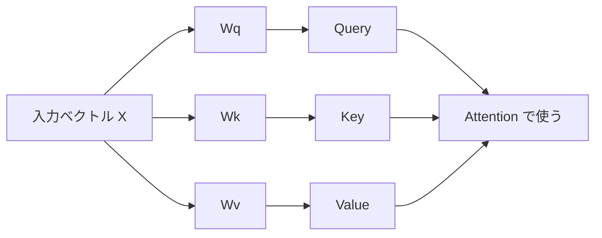

## 第12章　ニューラルネットワークへの橋渡し

**この章でわかること**

- 線形モデルだけでは表しにくい関係があること
- ニューラルネットワークが層を重ねて表現を作ること
- 順伝播、逆伝播、活性化関数、重み行列の基本
- Transformer もニューラルネットワークの一種であること

### 12.1　線形モデルの限界

ここまで、モデル、パラメータ、損失関数、勾配降下法、分類、回帰、特徴量、確率を見てきました。この章では、いよいよニューラルネットワークにつなげます。

まず、単純な線形モデル（入力特徴量に重みを掛けて足し合わせるモデル）をもう一度考えます。

```text
価格 = 広さ × w1 + 築年数 × w2 + 駅距離 × w3 + バイアス
```

これは単純で解釈しやすく、今でも多くの場面で有用です。しかし、入力と出力の関係を直線的にしか表せない、という限界があります。

現実の問題では関係がもっと複雑なことが多いです。広さが2倍になれば価格も必ず2倍になるとは限りません。駅距離の影響も、徒歩1分と5分の差は大きくても、徒歩25分と29分の差は小さいかもしれません。つまり、現実のデータでは入力と出力の関係が曲線的だったり、特徴量同士が複雑に組み合わさったりします。線形モデルだけでは、こうした複雑な関係を十分に表現できません。

この限界を超えるために、非線形なモデルが必要になります。ニューラルネットワークは、入力を何段階も変換して、より扱いやすい表現を作るモデルとして見られます。


### 12.2　非線形性が必要になる理由

線形モデル（入力を重み付きで足し合わせるモデル）だけでは、表せる関係に限界があります。

たとえば「x が小さすぎても大きすぎても悪く、中くらいが一番よい」という関係は、単純な直線では表せません（線形では x が増えるほど出力が増えるか減るかのどちらか）。

また、特徴量の組み合わせも重要です。ゲームのプレイヤー行動予測で、「プレイ時間が長い・課金履歴がある・最近ログイン頻度が下がっている」という特徴量は、単独でも意味がありますが、組み合わさると「離脱リスクが高い」という別の意味を持つことがあります。これは特徴量同士の相互作用です。

画像認識でも、隣り合うピクセルの組み合わせで線やエッジが、その組み合わせで形が、形の組み合わせで物体が認識されます。自然言語でも、「銀行でお金を下ろす」と「川の bank に座る」のように、単語は文脈の中で意味が決まります。こうした複雑な関係を扱うには非線形性が必要です。ニューラルネットワークは、線形変換と非線形変換を組み合わせることで、複雑な関係を表現できるようになります。

### 12.3　ニューラルネットワークの基本構造

ニューラルネットワークは、入力を受け取り、複数の層を通して変換し、出力を返すモデルです。各層では、入力に重みを掛け、バイアスを足し、活性化関数を通します。

```text
線形モデル          ：出力 = 入力 × 重み + バイアス
ニューラルネットワーク：出力 = 活性化関数(入力 × 重み + バイアス)
```

線形モデルとよく似ていますが、活性化関数が加わり、さらにこの処理を何層も重ねます。各層は前の層の出力を入力として受け取ります。

```text
入力 → 線形変換+活性化 → 線形変換+活性化 → 線形変換+活性化 → 出力
```

このように層を重ねることで、複雑な関係を表現できます。最初の層は単純な特徴を取り出し、次の層はそれを組み合わせてより複雑な特徴を作り、深い層はより抽象的な表現を作ります。画像認識なら、低い層が線やエッジ、中間の層が模様や部品、深い層が顔や物体のような概念を捉えることがあります。この「層を重ねて表現を作る」という考え方が、ニューラルネットワークの中心です。

### 12.4　ニューロンの直感

ニューラルネットワークという名前は生物の神経細胞から着想を得ていますが、理解する上で生物学的な細部は不要です。ここではニューロンを「複数の入力を受け取り、計算して、1つの出力を返す小さな計算単位」と考えれば十分です。

1つのニューロンは、複数の入力に重みを掛けて足し合わせ、バイアスを足し、活性化関数を通します。

```text
z = 入力1 × 重み1 + 入力2 × 重み2 + 入力3 × 重み3 + バイアス
出力 = 活性化関数(z)
```

ニューラルネットワークは、このようなニューロンをたくさん並べて層として構成します。1つの層には複数のニューロンがあり、各ニューロンは同じ入力を受け取りながら異なる重みを持つため、それぞれ違う特徴に反応するように学習できます。画像認識では、あるニューロンは縦線に、別のニューロンは横線に、別のニューロンは特定の色の変化に反応するかもしれません。このように、多数のニューロンを組み合わせることで、モデルは複雑な特徴を扱えるようになります。

### 12.5　層を重ねるという考え方

ニューラルネットワークの重要な特徴は、層を重ねることです。1層でも入力を変換できますが、層を重ねることで、より複雑な表現を段階的に作れます。

画像認識を例にすると、低レベルなピクセルから始まり、層を通るたびに表現が変わります。

```text
ピクセル → 線・エッジ → 模様・部品 → 物体・概念
```

自然言語でも似たことが起こります。最初はトークンIDや埋め込みベクトルとして入力され、浅い層では近くの単語との関係を、深い層では文全体の意味・照応関係・文脈などを捉えるかもしれません。

```text
トークン表現 → 局所的な関係 → 文脈を反映した表現 → より抽象的な意味表現
```

Transformer も複数の層を重ね、各層で Self-Attention と Feed Forward Network を使ってトークンの表現を更新していきます。つまり、Transformer も広い意味では、層を重ねて表現を作るニューラルネットワークです。

### 12.6　活性化関数

ニューラルネットワークで非常に重要なのが、活性化関数です。線形変換の後に適用する非線形な関数で、`z = 入力 × 重み + バイアス` を計算したあと、`出力 = 活性化関数(z)` とします。

活性化関数の役割は、モデルに非線形性を与えることです。もし活性化関数がなければ、層を何層重ねても、全体としてはただの線形変換になってしまいます（線形変換を2回重ねても結局1つの線形変換にまとめられる）。非線形な活性化関数を挟むことで、複雑な関係を表せるようになります。

代表的な活性化関数には sigmoid、tanh、ReLU、GELU があります。sigmoid は入力を0〜1の範囲に変換し、二値分類の出力などで使われます。ReLU は `max(0, x)`（0より小さい値を0に、大きい値はそのまま通す）で、単純で計算しやすく、深層学習で広く使われてきました。GELU は Transformer 系でよく使われます。厳密な式を覚える必要はなく、活性化関数はニューラルネットワークに非線形性を与え、複雑な関係を表現できるようにする部品だと理解すれば十分です。

### 12.7　重み行列

ニューラルネットワークでは、入力や出力は多くの場合ベクトルです。ある層で入力ベクトル `x` を別のベクトルに変換するために、重み行列を使います。

```text
z = xW + b
（x：入力ベクトル、W：重み行列、b：バイアスベクトル、z：変換後のベクトル）
```

単純な線形モデルでは入力が1つなら重みも1つ（`y = wx + b`）でしたが、ニューラルネットワークでは入力も出力も複数の値を持つため、重みは行列になります。重み行列は、入力の各成分をどう組み合わせて出力の各成分を作るかを決めます（入力3次元・出力2次元なら、3次元から2次元への変換）。この重み行列の各要素が、学習で調整されるパラメータです。

Transformer でも、重み行列は大量に出てきます。Self-Attention では、入力ベクトルから Query・Key・Value を作ります。

```text
Q = XWq / K = XWk / V = XWv
（Wq, Wk, Wv は重み行列）
```



Feed Forward Network にも出力層にも重み行列があります。つまり、ニューラルネットワークの多くの計算は、ベクトルや行列の変換として表せます。このため、線形代数、特にベクトルと行列の考え方が重要になります。

### 12.8　順伝播

順伝播（forward propagation）とは、入力をモデルに通して、出力と損失を計算する処理です。ニューラルネットワークでは、入力から出力に向かって計算が進みます。

```text
画像 → ニューラルネットワーク → カテゴリごとのスコア → softmax → 確率 → 正解と比較 → 損失
```

言語モデルでも同じで、トークン列 → 埋め込み → Transformer 層 → 出力層 → 次トークンの確率分布 → 正解トークンと比較 → 損失、という流れです。

順伝播では、現在のパラメータを使ってモデルがどんな予測をするかを計算します。ただし、順伝播だけでは学習は進みません。順伝播は、今のモデルがどれくらい間違っているかを知るための処理です。学習のためには、その損失を小さくするようにパラメータを更新する必要があります。そのために使うのが逆伝播です。

#### PyTorchで確認してみる

小さなニューラルネットワークで、順伝播、損失計算、逆伝播をまとめて確認します。

```python
import torch
from torch import nn

torch.manual_seed(0)

model = nn.Sequential(
    nn.Linear(2, 4),
    nn.ReLU(),
    nn.Linear(4, 3),
)

x = torch.tensor([[0.2, 0.8], [0.9, 0.1]])
target = torch.tensor([2, 0])

logits = model(x)
loss = nn.CrossEntropyLoss()(logits, target)
loss.backward()

print("logits shape:", logits.shape)
print("loss:", loss.item())

for name, parameter in model.named_parameters():
    print(name, "grad shape:", parameter.grad.shape)
```

`logits` は各クラスのスコアです。`loss.backward()` を呼ぶと、各パラメータに対して勾配が計算されます。

### 12.9　逆伝播の直感

逆伝播（backpropagation）とは、損失から逆向きにたどって、各パラメータの勾配を計算する方法です。

順伝播では入力から出力へ計算しましたが、逆伝播では損失から逆向きに考えます。

```text
順伝播：入力 → 層1 → 層2 → 層3 → 出力 → 損失
逆伝播：損失 → 層3 → 層2 → 層1 → 入力側
```

目的は、各パラメータが損失にどれくらい影響したかを調べることです（ある重みを少し増やしたら損失は増えるのか減るのか、どれくらい変わるのか＝勾配）。ニューラルネットワークには非常に多くのパラメータがあり、すべてについて損失への影響を効率よく計算する必要があります。逆伝播は、そのためのアルゴリズムで、数学的には合成関数の微分（連鎖律）を使っています。

最初は数式を完全に理解する必要はありません。重要なのは、「順伝播で入力から出力と損失を計算する → 逆伝播で損失から各パラメータの勾配を計算する → 更新で勾配を使ってパラメータを少し動かす」という流れです。この3つが、ニューラルネットワークの学習の中心です。

### 12.10　ニューラルネットワークも損失を小さくしているだけ

ニューラルネットワークは複雑に見えます。層がたくさんあり、重み行列があり、活性化関数があり、順伝播や逆伝播があります。しかし、学習の目的はこれまでと同じで、損失を小さくすることです。

分類問題なら正解クラスに高い確率を出せるように、回帰問題なら予測値が正解値に近くなるように、言語モデルなら次の正解トークンに高い確率を出せるようにします。つまり、ニューラルネットワークでも基本は変わりません。

```text
入力を入れる → 予測を出す → 正解と比べる → 損失を計算する → 損失が小さくなるように重みを更新する
```

ニューラルネットワークは、この基本的な機械学習の流れを、非常に表現力の高いモデルで実行しているだけです。Transformer も同じで、構造は複雑ですが、学習時には次トークン予測の損失を小さくするように内部の重みを更新しています。

### 12.11　深層学習とは何か

深層学習（deep learning）とは、多くの層を持つニューラルネットワークを使った機械学習です。「深い」とは層が多いという意味です。

```text
浅いネットワーク：入力 → 隠れ層 → 出力
深いネットワーク：入力 → 隠れ層1 → 隠れ層2 → 隠れ層3 → 隠れ層4 → 出力
```

層を重ねることで、入力から段階的に複雑な表現を作れます（画像ではピクセル→線→部品→物体、言語ではトークン→局所的な関係→文脈→意味）。深層学習が強力なのは、特徴量を人間が細かく設計しなくても、モデルがデータから有用な表現を学習できる点です。

もちろん、完全に何も設計しなくてよいわけではありません。モデル構造、データ、損失関数、学習方法、評価方法は人間が設計します。しかし、画像・音声・文章のような複雑なデータでは、深層学習によって大きな性能向上が得られました。Transformer も深層学習モデルで、Self-Attention や Feed Forward Network を含む層を何段も重ねることで、トークン列から文脈を反映した表現を作ります。

### 12.12　ニューラルネットワークの出力

ニューラルネットワークの出力は、解きたい問題によって変わります。

```text
分類：入力 → ネットワーク → カテゴリごとのスコア → softmax → 確率分布
回帰：入力 → ネットワーク → 予測値
言語モデル：入力トークン列 → Transformer → 語彙全体のスコア → softmax → 次トークンの確率分布
```

言語モデルでは、語彙が50,000トークンあるなら、出力は50,000個の確率になります。

このように、ニューラルネットワークの本体は入力を内部表現に変換し、その上にタスクに応じた出力層（分類用、回帰用、次トークン予測用）を付けます。同じようなニューラルネットワークの本体でも、出力層を変えることでさまざまなタスクに使えます。Transformer も、分類、回帰、生成など多くのタスクに応用できます。

### 12.13　ニューラルネットワークと特徴量

古典的な機械学習では、人間が特徴量を作ることが重要でした（スパム判定でURLの数、特定単語の有無、送信元の信頼度などを設計）。ニューラルネットワークでは、特徴量をモデルが内部で学習できる部分が大きくなります。画像認識では「耳の形」などを明示的に作らなくてもモデルが有用な特徴を学習し、自然言語処理でも文法規則や意味特徴をすべて設計しなくても Transformer が大量のテキストから文脈表現を学習します。

ただし、ニューラルネットワークでも入力の設計は重要です。画像なら画像サイズ・色の扱い・前処理、文章ならトークン化・語彙・文脈長、表形式データなら数値特徴量・カテゴリ特徴量・欠損値処理が関係します。

```text
古典的な機械学習：人間が特徴量をかなり設計する
深層学習：モデルが内部表現を学習する
共通点：入力データの設計は依然として重要
```

Transformer を理解するときも、この視点は重要です。Transformer は、人間が文法特徴や意味特徴を細かく設計する代わりに、モデルがデータから表現を学習しているのです。

### 12.14　Transformer への橋渡し

この章の目的は、ニューラルネットワークから Transformer へ橋渡しすることです。Transformer はニューラルネットワークの一種ですが、普通の全結合ネットワークとは違い、トークン列を扱うために特別な構造を持っています。

```text
トークン列 → 埋め込みベクトル → Transformer 層 → 文脈を反映した表現 → 出力層 → 次トークンの確率分布
```

Transformer 層の中には、主に Self-Attention、Feed Forward Network、Layer Normalization、Residual Connection があります。Self-Attention は各トークンが他のトークンを参照する仕組み、Feed Forward Network は各トークンの表現をさらに変換する小さなニューラルネットワーク、Layer Normalization は内部の値を安定させる正規化、Residual Connection は深いネットワークを学習しやすくする接続です。

これらは複雑に見えますが、基本はここまで学んだ話の延長です。入力をベクトルにする、重み行列で変換する、非線形変換を入れる、層を重ねる、損失を計算する、逆伝播で重みを更新する。Transformer も、この基本から外れているわけではありません。違うのは、トークン同士の関係を扱うために Self-Attention という強力な仕組みを使っている点です。

### 12.15　本章のまとめ

**Transformer への接続**

Transformer は、Self-Attention と Feed Forward Network を含むニューラルネットワークです。入力トークンの埋め込みを受け取り、各層で重み行列による変換、非線形変換、正規化、残差接続などを使いながら、文脈を反映した表現を作ります。ここで学んだ順伝播、逆伝播、重み行列の考え方は、そのまま Transformer の理解につながります。

**ミニ演習**

- この章の PyTorch コードで、隠れ層の次元 `4` を `8` に変えるとパラメータの shape がどう変わるか確認してみましょう。
- `ReLU` を外すと、ニューラルネットワークの表現力にどんな影響がありそうか考えてみましょう。
- Transformer の中で「重み行列」が出てくる場所を3つ挙げてみましょう。

この章では、ニューラルネットワークへの橋渡しを行いました。線形モデル（`出力 = 入力 × 重み + バイアス`）は単純で解釈しやすいですが、複雑な非線形関係を表すには限界があります。ニューラルネットワークでは、線形変換に活性化関数を組み合わせ、さらに層を重ねます。活性化関数によって非線形性が入り、複雑な関係を表現できるようになります。

学習の流れは、これまでと同じです。

```text
入力を入れる → 順伝播で予測を出す → 正解と比べて損失を計算する → 逆伝播で勾配を計算する → 勾配降下法で重みを更新する
```

深層学習とは、多くの層を持つニューラルネットワークを使った機械学習で、層を重ねることで入力から段階的に抽象的な表現を作れます。

この章で一番重要な考え方は、次の一文です。

**ニューラルネットワークとは、線形変換と非線形変換を層として重ねることで、入力から予測に役立つ表現を学習するモデルである。**

Transformer もニューラルネットワークの一種です。トークン列を埋め込みベクトルに変換し、Self-Attention と Feed Forward Network を含む層を重ね、文脈を反映した表現を作り、その表現を使って次のトークンの確率分布を出します。つまり、Transformer を理解するためには、まずニューラルネットワークを「重み行列による変換」「活性化関数」「層の積み重ね」「損失を小さくする学習」として理解しておくことが重要です。

---

<!-- chapter-nav:start -->

[← 第11章　確率として見る機械学習](Chapter%2011%20Machine%20Learning%20as%20Probability.md) ｜ [目次](Table%20of%20Contents.md) ｜ [第13章　機械学習の全体像 →](Chapter%2013%20The%20Big%20Picture%20of%20Machine%20Learning.md)

<!-- chapter-nav:end -->
