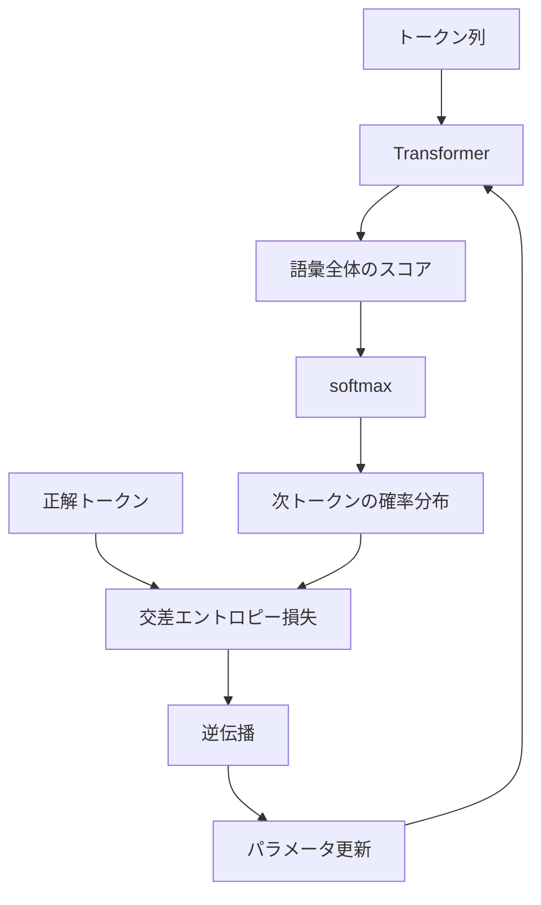
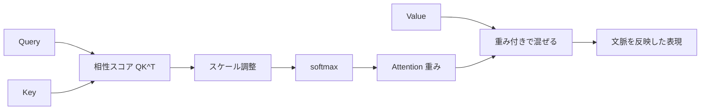

## 第14章　Transformer を読むために必要な機械学習知識

**この章でわかること**

- Transformer を機械学習モデルとして見る方法
- 次トークン予測、softmax、交差エントロピーの接続
- Self-Attention の式を処理の流れとして読む方法
- `Attention Is All You Need` を読むための最初の道筋

### 14.1　Transformer も機械学習モデルである

ここまで、機械学習の基本（入力と出力、モデルとパラメータ、損失関数、勾配降下法、訓練・検証・テストデータ、過学習と汎化、分類と回帰、特徴量と表現、確率、ニューラルネットワーク、システム全体の流れ）を見てきました。これらはすべて、Transformer を理解するための土台になります。

Transformer は一見、特殊なモデルに見えます。Attention、Query、Key、Value、Multi-Head Attention、Positional Encoding、Layer Normalization、Residual Connection など、多くの部品が出てきます。しかし、根本にあるのは、ここまで学んだ機械学習の基本です。

Transformer も、入力を受け取り、出力を返すモデルです。言語モデルとして使う場合、入力はトークン列、出力は次に来るトークンの確率分布です。

```text
入力「吾輩は」 → 猫：0.35 / 犬：0.08 / 人間：0.04 / ...
```

学習時には、正解トークンに高い確率を出せるように損失を小さくします。つまり、Transformer も「入力を入れる → 予測を出す → 正解と比較する → 損失を計算する → 逆伝播で勾配を計算する → パラメータを更新する」という、これまで学んできた機械学習そのものの流れで学習します。



### 14.2　次の単語を予測するというタスク

大規模言語モデルの基本的な学習タスクは、次のトークンを予測することです（わかりやすく「次の単語」と言ってもよいですが、実際には単語ではなくトークン単位です）。

「吾輩は猫である」という文章から、次のような学習データを作れます。

```text
入力：吾輩は      正解：猫
入力：吾輩は猫    正解：で
入力：吾輩は猫で  正解：ある
```

文章の途中までを入力し、その次に実際に現れたトークンを正解とします。これは入力と正解のペアがある点で教師あり学習に似ていますが、人間が一つ一つラベルを付ける必要はなく、文章そのものから自動的にペアを作れます。このような学習を自己教師あり学習と呼びます。

次トークン予測は単純なタスクに見えますが、大量のテキストで学習すると、モデルは文法・語彙・意味・文脈・知識・推論のパターンなどを身につけます。次のトークンをうまく予測するには、文脈を理解し、世界についての知識を使い、文の構造を捉える必要があるからです。たとえば「フランスの首都は」の次に「パリ」が来やすいと予測するには地理的知識が、「if x > 0:」の次を予測するにはプログラムの構文の知識が必要です。つまり、単純な形の中に多くの言語理解の要素が含まれています。

#### PyTorchで確認してみる

次トークン予測では、同じトークン列を1つずらして、入力と正解を作ります。

```python
import torch

vocab = {"wagahai": 0, "wa": 1, "neko": 2, "de": 3, "aru": 4}
token_ids = torch.tensor([
    vocab["wagahai"],
    vocab["wa"],
    vocab["neko"],
    vocab["de"],
    vocab["aru"],
])

input_ids = token_ids[:-1]
target_ids = token_ids[1:]

print("input ids:", input_ids)
print("target ids:", target_ids)
```

`input_ids` の各位置に対して、`target_ids` の同じ位置が「次に来るべきトークン」になります。大規模言語モデルの学習でも、このずらした入力と正解の考え方が基本になります。

### 14.3　トークンを入力、次トークンを正解と見る

Transformer を読むには、文章がどのように入力になるのかを理解する必要があります。コンピュータは文章をそのまま理解するわけではありません。

まず、文章をトークンに分けます（「吾輩は猫である」→ 吾輩/は/猫/で/ある。実際のトークナイザでは単語単位とは限らず、サブワードや文字に分かれることもあります）。次に、各トークンを数値IDに変換します（吾輩→4210、は→102、猫→1532、...）。

```text
[4210, 102, 1532, 305, 918]
```

ただし、トークンIDそのものは単なる番号で、大小に意味はありません（猫=1532、犬=1820 でも犬が猫より大きいわけではない）。そこで、トークンIDを埋め込みベクトルに変換します（猫→[0.12, -0.45, 0.88, ...]）。このベクトル列が Transformer に入力されます。

学習時には、ある位置までのトークンを使って次のトークンを予測します。モデルは語彙全体に対して確率を出し、その中で正解トークンの確率が高くなるように学習します。つまり、「トークン列を入力する → 次トークンの確率分布を出す → 実際の次トークンと比較する → 損失を計算する → パラメータを更新する」という流れです。

### 14.4　出力は語彙全体に対する確率分布

言語モデルの出力は、次に来るトークンそのものではなく、語彙全体に対する確率分布です。語彙とは、モデルが扱えるトークンの集合です（語彙サイズが50,000なら、次トークン候補として50,000個のトークンを持つ）。

入力「今日はとても」に対して、モデルは50,000個のトークンそれぞれにスコアを出します。このスコアはまだ確率ではない（マイナスにもなり、合計も1にならない）ので、softmax で確率分布に変換します。

```text
スコア      暑い：8.2 / 寒い：7.5 / 楽しい：5.1 / 猫：-1.3 ...
softmax後   暑い：0.30 / 寒い：0.18 / 楽しい：0.07 ...（全トークンの合計 = 1）
```

この確率分布をもとに、次のトークンを選びます（一番確率の高いトークンを選ぶ、確率分布に従ってランダムに選ぶ、など。temperature や top-p などの生成設定はこの選び方に関係します）。

ここで重要なのは、モデルの出力は「一つの答え」ではなく「候補全体に対する確率分布」だということです。これは分類問題と同じ構造です。画像分類では犬・猫・鳥などのカテゴリに対する確率を出しましたが、言語モデルでは語彙中のすべてのトークンに対する確率を出します。つまり、次トークン予測は、巨大な多クラス分類問題として理解できます。

### 14.5　softmax と交差エントロピー

Transformer の学習では、softmax と交差エントロピーが重要です。

まず、モデルは語彙中の各トークンに対してスコア（logits）を出します。logits は確率ではない（マイナスにもなり、合計も1にならない）ので、softmax で確率分布に変換します。

次に、正解トークンと比較します。正解が「猫」のとき、「猫」に高い確率（0.35）を出していれば良い予測、低い確率（0.001）しか出していなければ悪い予測です。この良し悪しを数値化するのが交差エントロピー損失で、正解トークンに対する確率を `p` とすると、損失はおおよそ `-log(p)` です。

```text
正解トークンの確率が高い → 損失が小さい
正解トークンの確率が低い → 損失が大きい
```

つまり、交差エントロピー損失を小さくすることは、正解トークンに高い確率を割り当てることを意味します。これは最大尤度推定の考え方ともつながっており、観測されたテキスト（実際に現れたトークン列）がモデルにとってもっともらしくなるように学習しているのです。

### 14.6　勾配降下法で重みを更新する

損失を計算したら、その損失を小さくするようにモデルのパラメータを更新します。Transformer には大量のパラメータがあります（トークン埋め込みの重み、Self-Attention の Q/K/V を作る重み行列、Feed Forward Network の重み、出力層の重み、Layer Normalization のパラメータなど）。これらは最初から意味のある値ではなく、学習によって調整されます。

学習の流れは、ニューラルネットワークと同じです。まず順伝播（入力トークン列 → 埋め込み → Transformer 層 → 出力層 → softmax → 次トークンの確率分布 → 損失）、次に逆伝播で各パラメータの勾配を計算し、最適化アルゴリズムでパラメータを更新します（`新しいパラメータ = 現在のパラメータ - 学習率 × 勾配`）。

実際の Transformer の学習では、単純な勾配降下法ではなく Adam や AdamW がよく使われますが、基本は「損失を小さくする方向へパラメータを少しずつ動かす」で同じです。この更新を膨大な量のテキストに対して繰り返すことで、Transformer は次トークン予測がうまくなるように内部の重みを調整していきます。

### 14.7　巨大な関数としてのニューラルネットワーク

Transformer は、巨大な関数として見ることができます。

```text
次トークンの確率分布 = Transformer(トークン列)
```

入力はトークン列（吾輩 / は）、出力は語彙全体に対する確率分布です。この関数の中には非常に多くのパラメータがあります（小さなモデルで数百万〜数億、大きな言語モデルでは数十億〜数百億以上）。この膨大なパラメータによって、入力から出力への非常に複雑な変換を表現します。ただし、基本構造は「入力 → 重みを使った計算 → 非線形変換 → 層の積み重ね → 出力」でこれまでと同じです。

Transformer の特徴は、Self-Attention によってトークン同士の関係を扱えることです。単純な全結合ネットワークでは入力の各要素の関係を明示的に扱うのが難しい場合がありますが、Transformer では各トークンが他のトークンを参照しながら自分の表現を更新します。これにより、文中の離れた単語同士の関係も扱いやすくなります。たとえば「太郎は花子に本を渡した。彼女はそれを読んだ。」で「彼女」が花子を、「それ」が本を指す、といった関係を扱うには、離れた位置にあるトークン同士の関係を見る必要があります。

### 14.8　機械学習の基本から Transformer への接続

ここまでの章で学んだ内容は、すべて Transformer につながっています。

- **教師あり学習**：Transformer の言語モデル学習は、入力トークン列（吾輩は）と正解トークン（猫）のペアを使う点で、教師あり学習の基本と同じ構造です。
- **モデルとパラメータ**：Transformer は入力トークン列を次トークンの確率分布に変換するモデルで、内部には Q/K/V を作る重み、FFN の重み、出力層の重みなど、学習される大量のパラメータがあります。
- **損失関数**：正解トークンに対する交差エントロピー損失を使い、正解の確率が高いほど損失が小さくなります。
- **勾配降下法**：損失を小さくするために、逆伝播で勾配を計算し、パラメータを更新します。
- **特徴量と表現**：トークンIDを埋め込みベクトルに変換し、各層で文脈を反映した表現へ更新します。
- **確率**：次トークン候補全体に対する確率分布 `P(次のトークン | これまでのトークン列)`、つまり文脈を条件とした条件付き確率を学習しています。

このように、Transformer は特別な魔法ではありません。ここまで学んだ機械学習の基本を、大規模なニューラルネットワークとして実現したものです。

### 14.9　Attention 論文を読むときに必要な前提

`Attention Is All You Need` を読むときには、いくつかの前提知識が必要です。

まず、ニューラルネットワークの基本（ベクトル、行列、重み、バイアス、層、活性化関数、順伝播、逆伝播、損失関数）です。次に、自然言語処理の基本（トークン、語彙、埋め込み、系列データ、言語モデル、機械翻訳）です。元論文の Transformer は主に機械翻訳を対象にしているため、入力文を読み、出力文を生成する Encoder-Decoder 構造が出てきます。

次に、Attention の基本です。Transformer は RNN や LSTM を使わず、Attention を中心に構成されています。なぜ Attention が必要だったのかを理解するには、以前の系列モデルの課題（RNN は逐次処理なので並列化しにくい、長い依存関係を扱いにくい）も少し知っておくとよいです。さらに、確率と損失関数（softmax、交差エントロピー、最尤推定）の理解もあると読みやすくなります。

論文には Scaled Dot-Product Attention、Multi-Head Attention、Positional Encoding、Feed Forward Network、Residual Connection、Layer Normalization、Dropout などの言葉が出てきますが、最初から全部理解する必要はありません。最初に押さえるべきは、Transformer の中心が Self-Attention（各トークンが文中の他のトークンを参照しながら自分の表現を更新する仕組み）であることです。

### 14.10　元論文の Transformer と現代の LLM の違い

`Attention Is All You Need` の Transformer と現代の大規模言語モデルは、同じ Transformer 系の技術ですが、構成が少し違います。

元論文の Transformer は、主に機械翻訳のためのモデルです。機械翻訳（「I love cats.」→「私は猫が好きです。」）では、入力文を読む部分と出力文を生成する部分が必要なため、元論文は Encoder-Decoder 構造を持っています。Encoder が入力文を読んで文脈表現を作り、Decoder がその表現を参照しながら出力文を1トークンずつ生成します。

一方、GPT 系の大規模言語モデルは主に Decoder-only Transformer で、ここまでの文脈を見て次のトークンを予測します。BERT 系モデルは主に Encoder-only Transformer で、文章分類や検索などに強い構造です。

```text
Encoder-Decoder：機械翻訳などに使われる。入力系列を読み、出力系列を生成する
Encoder-only：文章理解に向く。文全体の表現を作る
Decoder-only：文章生成に向く。次トークンを順に予測する
```

`Attention Is All You Need` を読むときには、元論文が Encoder-Decoder 型であることを理解しておくと混乱しにくく、現代のチャット型LLMは主に Decoder-only の発展形として理解するとよいです。

### 14.11　数式を読むための最小限の見方

Transformer の論文には数式が出てきます。最初に見るべき最重要の式は、Scaled Dot-Product Attention の式です。

```text
Attention(Q, K, V) = softmax(QK^T / sqrt(d_k)) V
```

この式は難しく見えますが、意味は分けて考えられます。Q（Query）は「自分が何を探しているか」、K（Key）は「各トークンが持つ目印」、V（Value）は「実際に取り出す中身」です。

```text
QK^T                        各 Query が各 Key とどれくらい合っているかのスコア
QK^T / sqrt(d_k)            値が大きくなりすぎないようスケールを調整
softmax(QK^T / sqrt(d_k))   どのトークンをどれくらい見るかの重みに変換
softmax(...) V              重みに応じて Value（情報）を混ぜる
```

つまり、この式の意味は「各トークンについて、他のトークンとの関連度を計算し、関連度に応じて情報を集める」と言えます。数式全体を一気に理解しようとする必要はなく、まずはこの対応を押さえるだけで十分です。



#### PyTorchで確認してみる

Scaled Dot-Product Attention は、PyTorch では次のように書けます。

```python
import math
import torch
import torch.nn.functional as F

torch.manual_seed(0)

batch_size = 1
seq_len = 4
d_model = 8

x = torch.randn(batch_size, seq_len, d_model)
Wq = torch.randn(d_model, d_model)
Wk = torch.randn(d_model, d_model)
Wv = torch.randn(d_model, d_model)

Q = x @ Wq
K = x @ Wk
V = x @ Wv

scores = Q @ K.transpose(-2, -1)
scores = scores / math.sqrt(d_model)
weights = F.softmax(scores, dim=-1)
output = weights @ V

print("attention weights shape:", weights.shape)
print("output shape:", output.shape)
```

`weights` の形は `[batch_size, seq_len, seq_len]` で、各トークンが他の各トークンをどれくらい見るかを表します。

### 14.12　Attention を直感で理解する

Attention は、「入力のどこを見るべきか」を決める仕組みです。文章を読むとき、人間も常にすべての単語を同じ重みで見ているわけではなく、ある単語の意味を理解するために、文中の特定の単語に注目します。

```text
太郎は花子に本を渡した。彼女はそれを読んだ。
（「彼女」を理解するには「花子」を、「それ」を理解するには「本」を見る必要がある）
```

つまり、あるトークンの意味を更新するには、文中の別のトークンを参照する必要があります。Self-Attention は、この参照を計算で行います。各トークンが、他のトークンに対して「どれくらい見るべきか」という重みを計算します。

実際には、モデルが人間と同じように明示的に「指示語を解決している」とは限りません。しかし、Self-Attention の仕組みとしては、各位置が他の位置の情報を重み付きで取り込めます。これにより、Transformer は離れた単語同士の関係を扱いやすくなります。RNN のように左から右へ順番に情報を伝えるのではなく、各トークンが直接他のトークンを参照できる——これが Transformer の大きな強みの一つです。

### 14.13　機械学習の基本を押さえると論文が読みやすくなる

`Attention Is All You Need` は Transformer の構造を提案した論文ですが、機械学習の基本を一から説明してくれるものではなく、ニューラルネットワークや最適化、自然言語処理の知識が前提になっています。そのため、基礎知識なしで読むと非常に難しく感じますが、それは自然なことです。

ここまでの章で学んだ内容（モデルとは何か、パラメータ、損失関数、勾配降下法、分類問題、softmax、交差エントロピー、埋め込み、ニューラルネットワーク、表現学習）は、論文を読むための準備です。これらがわかってくると、論文の言葉が意味を持ち始めます。`softmax` は「スコアを確率的な重みに変換するもの」、`Multi-Head Attention` は「Attention を複数の観点で並列に行うもの」、`Layer Normalization` は「深いネットワークの学習を安定させるための正規化」、`Residual Connection` は「層を深くしても学習しやすくするための接続」だと見えてきます。このように、基礎を押さえると、論文の各部品が孤立した謎の単語ではなく、ニューラルネットワークを構成する意味のある部品として見えてきます。

### 14.14　最初に論文で読むべき場所

`Attention Is All You Need` を読むとき、最初から最後まで順番に精読しようとすると難しいかもしれません。最初は読む場所を絞るのがおすすめです。

- **Abstract**：論文全体の主張が短くまとめられています。「RNN や CNN を使わず、Attention だけで系列変換モデルを作った」という主張を押さえれば十分です。
- **Introduction**：なぜ Transformer が必要だったのかが説明されます。従来の RNN 系モデルには逐次処理の制約があり並列化しにくかった点が重要です。
- **Figure 1**：Transformer の全体構造を示す図。最初は細部まで理解できなくてもよく、Encoder、Decoder、Multi-Head Attention、Feed Forward、Add & Norm、Positional Encoding があることを確認します。
- **Section 3**：モデル構造の説明で、ここが Transformer の中心です。3.1 Encoder and Decoder Stacks、3.2 Attention、3.3 Position-wise Feed-Forward Networks、3.4 Embeddings and Softmax、3.5 Positional Encoding の順で見るとよく、特に 3.2 の Attention が最重要です。

数式で詰まったら、いったん飛ばして図や説明に戻ってよいです。論文は一度で理解するものではなく、基礎を学びながら何度も戻って読むものです。

### 14.15　本章のまとめ

**Transformer への接続**

この章そのものが、機械学習の基本から Transformer への接続です。ここまでの章で学んだ入力、出力、パラメータ、損失、最適化、確率分布、表現学習、ニューラルネットワークの考え方を重ねると、Transformer は特別な魔法ではなく、次トークン予測のために設計された強力なニューラルネットワークとして見えてきます。

**ミニ演習**

- この章の Attention コードで、`seq_len` を `4` から `6` に変えると `weights` の shape がどう変わるか確認してみましょう。
- `QK^T`、`softmax`、`V` が Attention の式の中でそれぞれ何をしているか、1行ずつ説明してみましょう。
- `Attention Is All You Need` を読むとき、まず Abstract、Introduction、Figure 1、3.2 Attention のどれから読むか、自分の順番を決めてみましょう。

この章では、Transformer を読むために必要な機械学習知識を整理しました。Transformer も基本的には機械学習モデルで、入力トークン列を受け取り、次トークンの確率分布を返します。言語モデルでは、文章の途中まで（吾輩は）を入力し、次のトークン（猫）を予測します。モデルは語彙全体に対する確率分布を出し、正解トークンに高い確率を出せるように交差エントロピー損失を小さくし、逆伝播と最適化アルゴリズムによって内部の大量のパラメータを更新します。

Transformer を理解するには、入力と出力、モデルとパラメータ、損失関数、勾配降下法、softmax、交差エントロピー、埋め込みベクトル、ニューラルネットワーク、表現学習、確率分布、といった基礎が重要です。`Attention Is All You Need` の中心は Self-Attention（各トークンが文中の他のトークンを参照し、文脈を反映した表現を作る仕組み）で、最重要の式は次のものです。

```text
Attention(Q, K, V) = softmax(QK^T / sqrt(d_k)) V
（Query と Key の相性を計算 → softmax で重みにする → その重みに応じて Value を混ぜる）
```

この章で一番重要な考え方は、次の一文です。

**Transformer は、トークン列を入力し、Self-Attention によって文脈を反映した表現を作り、次トークンの確率分布を予測するニューラルネットワークである。**

ここまでの機械学習の基本を押さえておくと、Transformer の論文はかなり読みやすくなります。最初から完全に理解する必要はなく、まずは Transformer も「入力、モデル、出力、損失、パラメータ更新」という機械学習の基本構造の上にある、と見えることが大切です。

---

<!-- chapter-nav:start -->

[← 第13章　機械学習の全体像](Chapter%2013%20The%20Big%20Picture%20of%20Machine%20Learning.md) ｜ [目次](Table%20of%20Contents.md)

<!-- chapter-nav:end -->
