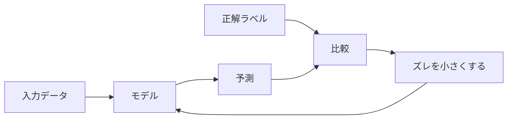

## 第2章　教師あり学習の基本

**この章でわかること**

- 教師あり学習が入力と正解のペアから学ぶ方法であること
- 訓練データ、正解ラベル、予測の関係
- 分類問題と回帰問題の違い
- 次トークン予測を教師あり学習に近い形で見られること

### 2.1　教師あり学習とは何か

機械学習にはいくつかの種類があります。その中でもっとも基本的で理解しやすいのが「教師あり学習」です。

教師あり学習とは、入力と正解のペアを使って、入力から正解を予測するモデルを学習する方法です。

たとえば犬と猫の画像を分類したいとき、画像だけを集めても、それぞれが犬か猫かわからなければモデルは何を学べばよいかわかりません。そこで、入力と正解のペアを用意します。

```text
画像1 → 犬
画像2 → 猫
画像3 → 犬
```

この「犬」「猫」が正解です。教師あり学習では、モデルの予測と正解を比較し、間違いが小さくなるようにモデルを調整します。これを大量のデータで繰り返すことで、少しずつ正しい出力を出せるようになります。

ここでいう「教師」とは、人間の先生ではなく、「この入力の正解はこれである」と教える正解データのことです。つまり教師あり学習とは、正解付きのデータを使って学習する方法です。スパム判定、画像分類、価格予測、次トークン予測、音声認識など、入力と正解の対応関係を学ぶ問題は、すべて教師あり学習として扱えます。



#### PyTorchで確認してみる

教師あり学習では、入力 `x` と正解 `y` のペアを使います。次のコードは、2つの特徴量から2クラス分類を行う小さな例です。

```python
import torch
from torch import nn

torch.manual_seed(0)

x = torch.tensor([
    [0.0, 0.1],
    [0.2, 0.0],
    [0.8, 0.9],
    [1.0, 0.7],
])
y = torch.tensor([0, 0, 1, 1])

model = nn.Linear(2, 2)
loss_fn = nn.CrossEntropyLoss()
optimizer = torch.optim.SGD(model.parameters(), lr=0.5)

logits = model(x)
loss = loss_fn(logits, y)

optimizer.zero_grad()
loss.backward()
optimizer.step()

print("input shape:", x.shape)
print("target:", y)
print("logits shape:", logits.shape)
print("loss:", loss.item())
```

`x` が入力、`y` が正解ラベルです。モデルの予測と `y` を比較して損失を計算し、その損失が小さくなるようにパラメータを更新します。

### 2.2　訓練データと正解ラベル

教師あり学習で、学習に使うデータを「訓練データ」と呼びます。訓練データは、入力と正解のペアからできています。

```text
スパム判定 : メール本文 → スパム / スパムではない
画像分類   : 画像 → 犬 / 猫 / 車 ...
価格予測   : 広さ・築年数・駅距離など → 実際の販売価格
```

この正解のことを「ラベル」と呼ぶことがあります。特に分類問題では、正解カテゴリのことをラベルと呼びます。データに正解を付ける作業を「ラベリング」または「アノテーション」と呼びます。

教師あり学習では、このラベルの品質が非常に重要です。犬の画像に間違って「猫」というラベルが付いていれば、モデルは間違った情報を学習してしまいます。たくさんのデータがあることも大事ですが、それ以上に、正しいラベルが付いていることが重要です。つまり、モデルの性能はデータの質に強く依存します。

### 2.3　分類問題と回帰問題

教師あり学習の代表的な問題に、「分類」と「回帰」があります。

**分類**は、入力をいくつかのカテゴリのどれかに分ける問題です。出力はカテゴリです。

```text
画像 → 犬 / 猫
メール本文 → スパム / スパムではない
記事本文 → 政治 / 経済 / スポーツ ...
```

**回帰**は、数値を予測する問題です。出力は連続値です。

```text
家の情報 → 価格（5,200万円 など）
気象情報 → 明日の気温（23.5度 など）
過去の売上・天気・広告費 → 売上金額
```

分類と回帰の違いは、出力がカテゴリか連続値かです。この違いは、あとで出てくる損失関数や評価指標にも関係します。分類と回帰では、間違い方の測り方が違うからです。

### 2.4　例：メールをスパム判定する

教師あり学習の具体例として、メールのスパム判定を考えます。目的は、メール本文を入力して、スパムかどうかを予測することです。

まず過去のメールを集め、それぞれに正解ラベル（スパム / スパムではない）を付けます。モデルはメール本文を入力として受け取りますが、コンピュータは文章をそのまま理解できないので、実際には文章を数値に変換します（どの単語が含まれるか、など）。そのうえで、スパムである確率を出します。

```text
このメールがスパムである確率：0.92  → かなりスパムらしい
このメールがスパムである確率：0.03  → スパムではなさそう
```

学習中は、この予測と正解ラベルを比較します。実際にはスパムなのにモデルが「0.10」と出したら大きく間違っているので、次からは高い確率を出せるようにパラメータを調整します。逆も同様です。これを大量のメールで繰り返すと、スパムらしい表現や通常のメールらしい表現を学習していきます。

ただし、モデルは「スパムとは何か」を人間のように理解しているわけではなく、過去のデータの中のパターンを学んでいるだけです。だから、学習データにない新しいタイプのスパムには弱く、通常のメールでもスパムに似た表現があると誤判定することがあります。常に間違える可能性がある、という前提は忘れてはいけません。

### 2.5　例：家の価格を予測する

回帰問題の例として、家の価格予測を考えます。目的は、家の情報から、いくらぐらいで売れそうかを予測することです。

入力には、広さ・築年数・駅からの距離・地域・部屋数などを使い、正解は実際の販売価格です。モデルは、こうした入力と正解の関係を学びます。一般には「広い家ほど高い」「駅に近いほど高い」「築年数が古いほど下がる」といった傾向がありますが、現実の価格は単純ではありません。同じ広さでも地域が違えば価格は変わり、築古でもリノベーション済みなら高いこともあります。つまり、複数の要因が組み合わさって決まります。

学習中は、予測した価格と実際の価格を比較します。

```text
実際の価格：5,200万円
予測価格：4,700万円
誤差：500万円
```

この誤差が小さくなるようにパラメータを調整し、大量の物件データで繰り返します。ただし、価格には景気・金利・売主の事情など、データに入っていない要因も影響します。モデルが出すのは、過去のデータから見た「もっともらしい値」であって、絶対ではありません。

### 2.6　入力特徴量とは何か

機械学習では、モデルに与える入力情報を「特徴量」と呼びます。特徴量とは、予測に使う手がかりです。

```text
家の価格予測 : 広さ・築年数・駅距離・地域・部屋数 ...
スパム判定   : 本文の単語・件名の表現・URLの数・送信元 ...
画像分類     : 各ピクセルの値（深層学習では段階的な特徴も）
```

よい特徴量があれば、単純なモデルでもよい予測ができることがあります。逆に、重要な特徴量が欠けていると、どれだけ高度なモデルでも限界があります。たとえば家の価格を「広さ」だけで予測すると、地域や駅距離がわからないので精度に限界があります。東京都心の50平米と地方の50平米では価格が大きく違うからです。予測に重要な情報が入力に含まれていなければ、モデルはそれを使えません。

古典的な機械学習では、人間が特徴量を設計することが多く、これを「特徴量エンジニアリング」と呼びます。一方、深層学習では、特徴量そのものをモデルが自動的に学習する部分が大きくなりました。画像認識では「耳の形」などを人間が設計しなくても有用な特徴を学習し、自然言語処理では単語やトークンをベクトルとして表現し学習します。これが後で出てくる「埋め込み」や「表現学習」につながります。

### 2.7　正解とのズレを小さくするという考え方

教師あり学習の中心にある考え方は、とても単純です。

**モデルの予測と正解のズレを小さくする。**

これだけです。

```text
回帰   : 予測 4,700万円 / 正解 5,200万円 → ズレ 500万円
分類   : 予測 スパム確率 0.10 / 正解 スパム → 大きく間違い
```

分類でも回帰でも、基本は同じです。モデルの答えと正解の差を測り、その差が小さくなるようにモデルを調整し、大量のデータで繰り返す。この「ズレ」を数値として表すものが、後で学ぶ「損失関数」です。学習とは、損失関数の値を小さくすることだと考えられます。

この見方を持っておくと、機械学習の多くの話が見通しやすくなります。Transformer も同じです。言語モデルでは、ある文脈に対して次に来るトークンを予測します。

```text
入力：吾輩は
正解：猫
```

モデルが「猫」に高い確率を出せばよい予測で、「犬」や「車」に高い確率を出すとズレが大きくなります。このズレを小さくするように、内部の大量の重みを調整します。この意味で、大規模言語モデルも教師あり学習の考え方と深くつながっています。

### 2.8　「学習できる」とはどういうことか

少し根本的な問いを考えます。モデルが「学習できる」とは、どういうことでしょうか。

それは、入力と出力の間に、何らかの規則性があるということです。家の価格は広さ・地域・築年数などに影響され、スパムにはよく出る表現があり、犬には犬らしい形や質感があります。だから学習できます。

一方、入力と出力の間にまったく規則性がなければ、学習はできません。もしラベルが画像の内容と関係なくサイコロで決められているなら、学習データを丸暗記できても、未知のデータには予測できません。つまり、機械学習が成立するには、データの背後に規則性が必要です。

ただし、その規則性は人間にとって明確である必要はありません。人間が「犬らしさ」を完全なルールとして書くのは困難ですが、犬の画像には統計的な共通性があり、ニューラルネットワークはそれを学習できます。自然言語も、文法や意味を完全に書き切ることはできませんが、単語の並びや文脈の規則性があり、言語モデルはそれを学習します。つまり「学習できる」とは、データの背後にある規則性を、モデルがパラメータとして取り込めるということです。

### 2.9　教師あり学習の流れ

ここまでを踏まえると、教師あり学習の流れは次のようにまとめられます。

```text
1. 入力と正解のデータを用意する
2. モデルに入力を入れる
3. モデルが予測を出す
4. 予測と正解のズレを測る（＝損失）
5. ズレが小さくなるようにモデルを調整する
6. これを何度も繰り返す
```

最初のモデルは何も学習しておらず、ニューラルネットワークなら重みはランダムに初期化されています。そこから上の流れを大量のデータで繰り返すと、少しずつ正解に近い予測を出せるようになります。

この流れは、機械学習全体の中心です。Transformer を学習するときも本質的に同じで、トークン列を入れ、次のトークンの確率分布を出し、正解トークンと比較し、損失を計算し、重みを更新する。これを巨大なテキストで繰り返します。モデルの構造が複雑になっても、基本の流れは変わりません。

### 2.10　教師あり学習と生成AIの関係

生成AI、特に大規模言語モデルは、一見すると教師あり学習とは違うものに見えるかもしれません。「犬」「猫」のような明示的なラベルではなく、文章を生成しているからです。

しかし、言語モデルの基本的な学習は、教師あり学習に近い形で理解できます。「吾輩は猫である。」という文章は、次のような入力と正解のペアに分解できます。

```text
入力：吾輩は      正解：猫
入力：吾輩は猫    正解：で
入力：吾輩は猫で  正解：ある
```

文章そのものから「ここまでの文脈を入力し、次のトークンを正解とする」データを、大量に作れます。人間が一つ一つラベルを付ける必要はなく、文章の次に実際に現れているトークンが、そのまま正解になります。このような学習を「自己教師あり学習」と呼ぶことがあります。名前は違いますが、入力があり、正解があり、予測と正解のズレを小さくする、という構造は教師あり学習と同じです。

重要なのは、言語モデルは最初から「会話をするAI」として学習しているわけではない、という点です。まず大量のテキストから次トークン予測を学び、その後、人間の指示に従いやすくするための追加学習（指示と回答のペアを使う教師あり学習や、人間の好みに合わせる手法など）が行われます。しかし根本には、「入力から出力を予測し、正解とのズレを小さくする」という機械学習の基本があります。

### 2.11　本章のまとめ

**Transformer への接続**

大規模言語モデルの事前学習は、文章そのものから入力と正解のペアを作る点で、教師あり学習に近い構造を持っています。「吾輩は猫である」から「吾輩は」→「猫」という学習データを作れます。Transformer はこのような大量のペアを使って、次のトークンを予測する力を身につけます。

**ミニ演習**

- 「今日はとても暑いです」という文から、次トークン予測用の入力と正解のペアを3つ作ってみましょう。
- スパム判定、家の価格予測、画像分類を、分類問題と回帰問題に分けてみましょう。
- この章の PyTorch コードで、`x` や `y` の値を変えると損失がどう変わるか確認してみましょう。

この章で一番重要な考え方は、次の一文です。

**教師あり学習とは、入力と正解のペアを使って、予測と正解のズレが小さくなるようにモデルを調整する方法である。**

分類ではカテゴリを、回帰では数値を予測します。いずれもモデルの予測と正解を比較し、そのズレ（損失）を小さくするように調整します。また、機械学習がうまく働くには、入力と出力の間に何らかの規則性が必要です。

Transformer や大規模言語モデルも、この延長にあります。文章の途中までを入力し、次のトークンを正解として学習し、ズレが小さくなるように重みを更新します。したがって、教師あり学習を理解することは、Transformer を理解するための最初の大きな土台になります。
