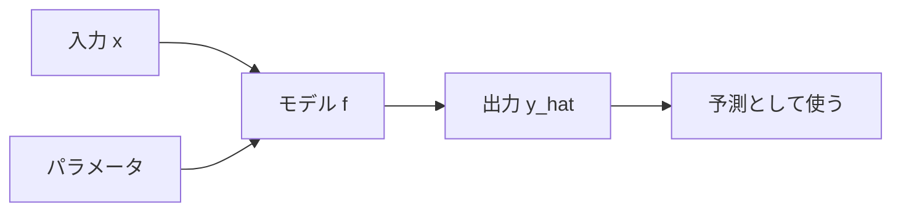

## 第3章　モデルとパラメータ

**この章でわかること**

- モデルを入力から出力を返す関数として見る考え方
- パラメータ、重み、バイアスの意味
- パラメータとハイパーパラメータの違い
- Transformer の中にも大量の学習される重みがあること

### 3.1　モデルは「関数」である

機械学習でいう「モデル」とは、入力を受け取って、何らかの出力を返す仕組みです。もっとも基本的には、関数として考えることができます。

```text
出力 = モデル(入力)
（価格 = モデル(家の情報)、犬か猫か = モデル(画像)、次に来る単語 = モデル(ここまでの文章)）
```

ここでいう関数は、プログラミング言語の関数に似ています。`税込価格 = 税抜価格 * 1.1` のように、入力を受け取り、出力を返します。ただし大きな違いがあります。普通のプログラムでは関数の中身を人間が直接書きますが、機械学習のモデルでは、中身の一部または大部分が、データから決まります。

たとえば家の価格予測なら、`価格 = 広さ × 係数1 + 駅距離 × 係数2 + ...` のような形を考えられます。このとき「各要素をどれくらい重視するか」という係数は、人間が手で決めるのではなく、データから学習します。つまり、機械学習のモデルとは、データによって中身が調整される関数です。

この見方は重要です。Transformer も大規模言語モデルも、基本的には巨大な関数です。入力としてトークン列を受け取り、出力として次のトークンの確率分布を返します。

```text
次トークンの確率分布 = Transformer(トークン列)
```

内部は Attention、Feed Forward Network、Layer Normalization、残差接続など複雑ですが、基本に戻れば「入力を出力に変換する関数」である、という理解が土台になります。



### 3.2　入力を受け取り、出力を返す

モデルを関数として見るとき、まず重要なのは「入力」と「出力」です。

家の価格予測なら、入力は広さ・築年数・駅距離などの情報で、出力は予測価格です。スパム判定なら、入力はメール本文で、出力はスパムである確率です。

ここで大事な点があります。機械学習モデルが直接扱うのは、基本的には数値です。画像も文章も音声もカテゴリも、最終的には数値に変換されます。ニューラルネットワークは、数値を受け取り、数値を出力する計算の塊です。だから、入力と出力を考えるときは、人間にとっての意味と、コンピュータ内部での数値表現を区別する必要があります。

たとえば言語モデルで「今日はいい天気です」を入力するとき、まずトークンに分けられ、それぞれが数値IDに変換され、さらにベクトルに変換されます。

```text
今日は → 1532 → ベクトル
いい   → 842  → ベクトル
天気   → 2191 → ベクトル
```

モデルはその数値を計算し、出力も数値として返します。言語モデルの場合、出力は「語彙全体に対する確率分布」です。

```text
入力「今日はいい」に対して：
天気：0.42 / 日：0.18 / 感じ：0.07 / ですね：0.05 ...
```

つまり、モデルは次のトークンを一つだけ直接答えるのではなく、「各候補がどれくらいありそうか」を数値で出します。出力が分類ラベルでも、価格のような数値でも、次トークンの確率分布でも、基本構造は「入力 → モデル → 出力」で同じです。

### 3.3　パラメータとは何か

機械学習で非常に重要なのが「パラメータ」です。パラメータとは、モデル内部にある、学習によって調整される数値です。

非常に単純な家の価格予測モデル（価格が広さだけで決まると仮定）を考えます。

```text
価格 = 広さ × 重み + バイアス
（例：価格 = 広さ × 100万円 + 500万円）
```

ここで「重み」と「バイアス」がパラメータです。このモデルに広さ50平米を入れると `50 × 100万 + 500万 = 5,500万円` です。

最初からこの重みやバイアスが正しいとは限りません。実際のデータを見ると1平米80万円の地域かもしれないし150万円の地域かもしれない。そこで、データを使ってこの重みとバイアスを調整します。これが学習です。

より一般的には、モデルは `出力 = f(入力, パラメータ)` と書けます。つまり出力は、入力だけでなくパラメータによっても変わります。同じ80平米の家でも、重みが80万円なら6,700万円、120万円なら1億100万円、というように、パラメータが違えば出力は大きく変わります。だから「よいパラメータを見つける」ことが重要になります。

ニューラルネットワークでは、パラメータは大量の重み行列やバイアスとして存在します。小さなものでも数千〜数万、大規模言語モデルでは数十億〜数百億のパラメータを持ちます。「70Bパラメータのモデル」といえば約700億個の調整可能な数値を持つという意味です。重要なのは、これらを人間が一つ一つ設計しているのではない、という点です。人間が設計するのはモデルの構造（どんな層を重ねるか等）で、具体的なパラメータの値は学習によって決まります。

#### PyTorchで確認してみる

PyTorch では、`nn.Linear` の中に重みとバイアスがパラメータとして入っています。

```python
import torch
from torch import nn

model = nn.Linear(in_features=1, out_features=1)

with torch.no_grad():
    model.weight.fill_(100.0)
    model.bias.fill_(500.0)

x = torch.tensor([[80.0]])
y_hat = model(x)

print("weight:", model.weight)
print("bias:", model.bias)
print("prediction:", y_hat.item())
print("num parameters:", sum(p.numel() for p in model.parameters()))
```

入力が `80`、重みが `100`、バイアスが `500` なので、予測は `8500` です。ここで表示される `weight` と `bias` が、学習によって調整されるパラメータです。

### 3.4　パラメータを調整するとは何か

学習とは、モデルのパラメータを調整することです。具体的にどういうことか、単純な例で見ます。

`価格 = 広さ × 重み + バイアス` で、最初に重み50万・バイアス0と適当に決めると、80平米の予測は4,000万円です。しかし実際の価格が8,000万円なら、安く予測しすぎています。重みが小さすぎるので、少し大きくします。重みを100万にすると、`80 × 100万 = 8,000万円` でぴったり合いました。

ただし、実際にはデータは一つではありません。

```text
50平米 → 5,000万円
80平米 → 8,000万円
100平米 → 9,000万円
```

すべてに完全に合う重みは存在しないかもしれません。現実の価格は広さだけでは決まらないからです。そこで、全体としてなるべくズレが小さくなるように調整します。この「ひとつのデータにぴったり合わせるのではなく、多くのデータに対して平均的にうまく予測できるようにする」という考え方が重要です。

ニューラルネットワークでも同じです。最初、重みはほぼランダムなので予測は適当です。そこから「入力を入れる → 予測を出す → 正解と比べる → どれくらい間違っているか計算する → 間違いが少し小さくなる方向に重みを少し変える」を何度も繰り返します。

この「少しずつ変える」が大事です。パラメータが膨大で複雑に関係しているため、一気に正解へ飛ばすことはできません。だから、損失が小さくなる方向へ少しずつ更新します。この更新方法の代表が、後の章で扱う「勾配降下法」です。

### 3.5　手作業で決めるルールと、学習で決まる重み

普通のプログラムと機械学習の違いを、もう少し掘り下げます。

普通のプログラムでは人間がルールを決めます。「5,000円以上は送料無料」のようなルールは、明確な場合には非常に強い方法で、税金計算や在庫更新などは人間が書くべきです。

一方、ルールを人間が明確に書けない問題があります。犬猫分類を if 文で書こうとすると「耳が尖っていたら猫？鼻が長ければ犬？」とすぐ例外だらけになり破綻します。そこで機械学習では、明示的なルールの代わりに、データから重みを学習します。画像分類モデルでは、最初の層は線や角のような単純な特徴を、深い層は目や顔の形のような抽象的な特徴を捉える重みが学習されます。人間が「この線がこうなら犬」と書くのではなく、モデルが大量の画像から分類に役立つ特徴を獲得します。自然言語処理でも、昔は人間が文法ルールを作りましたが、現代の言語モデルは単語や文脈の関係を大量のテキストから学習します。

つまり機械学習とは、「ルールに相当するものをパラメータとしてデータから学習する」方法だと見られます。ただし、人間の役割がなくなるわけではありません。何を入力にするか、何を正解にするか、どのモデルを使うか、何をもって良い予測とするか、どんな失敗が許されないか——これらは人間が設計します。機械学習は、人間が設計した枠組みの中で、データからパラメータを調整する技術です。

### 3.6　単純な直線モデル

もっとも単純なモデルの一つ「直線モデル」を見ます。家の広さから価格を予測するとき、広さが大きいほど価格も高くなる傾向があるなら、データ全体を一本の直線で近似できるかもしれません。

直線は `y = ax + b` で表せます（x が入力、y が出力、a が傾き、b が切片）。家の価格予測なら `価格 = a × 広さ + b` で、a と b がパラメータです。a は「広さが1単位増えたとき価格がどれくらい増えるか」、b は直線の上下位置を調整する役割です。

学習とは、データにもっともよく合う a と b を見つけることです。a が小さすぎると広い家を低く見積もり、大きすぎると高く見積もりすぎます。b は全体の高さを上下させます。

直線モデルは単純ですが、重要な概念をすべて含んでいます。入力・出力・パラメータ・予測・正解とのズレがあり、ズレが小さくなるようにパラメータを調整する。この構造は、ニューラルネットワークでも Transformer でも変わりません。違うのは、関数の形がはるかに複雑になり、パラメータの数が膨大になることだけです。

### 3.7　重みとバイアス

機械学習やニューラルネットワークでは、「重み」と「バイアス」がよく出てきます。これは直線モデルの a と b に対応します。機械学習では `y = wx + b` と書くことが多く、w が重み（weight）、b がバイアス（bias）です。

重みは、入力をどれくらい強く出力に反映するかを決めます。入力が複数ある場合は、それぞれに重みが付きます。

```text
価格 = 広さ × 重み1 + 駅距離 × 重み2 + 築年数 × 重み3 + バイアス
```

広さが価格に強く関係するなら広さの重みは大きく、駅から遠いほど価格が下がるなら駅距離の重みはマイナスになるかもしれません。バイアスは全体の基準値を調整する項で、入力がすべて0でも出力を0以外にでき、出力全体を上下させる役割も持ちます。

ニューラルネットワークでも基本は同じで、各層では入力に重みを掛け、バイアスを足し、活性化関数を通します。

```text
出力 = 活性化関数(入力 × 重み + バイアス)
```

ただし実際には入力も出力もベクトルや行列なので、重みも重み行列になります。Transformer でも内部では大量の重み行列が使われます。たとえば Self-Attention では、入力ベクトルから Query、Key、Value を作るときに重み行列を使います。

```text
Query = 入力 × Wq
Key   = 入力 × Wk
Value = 入力 × Wv
```

Wq、Wk、Wv は学習されるパラメータです。つまり、複雑なモデルでも基本的には「重みを掛ける」「バイアスを足す」「非線形変換する」を大量に組み合わせています。

### 3.8　モデルの表現力

モデルには「表現力」という考え方があります。これは、モデルがどれくらい複雑な関係を表せるか、という意味です。

単純な直線モデルは、直線的な関係しか表せません。現実のデータがだいたい直線的なら十分ですが、現実にはもっと複雑なことが多いです。たとえば、広さが大きくなるほど価格は上がるが、ある程度を超えると上がり方が鈍る、といった関係は、一本の直線では表しにくいです。

そこで、より表現力の高いモデルが必要になります。ニューラルネットワークは、層を重ねることで複雑な関係を表現できます。単純な線形変換だけでは表せない関係も、非線形な活性化関数を挟んで層を重ねることで表せるようになります。Transformer は、特に系列データ（トークン列）の関係を扱う表現力が高いモデルで、Self-Attention によって、文中のあるトークンが離れたトークンを参照できます。たとえば「太郎は花子に本を渡した。彼女はそれを読んだ。」で「彼女」が花子を、「それ」が本を指すと理解するには、離れた単語同士の関係を扱う必要があります。

ただし、表現力が高ければ常によいわけではありません。表現力が高いモデルは、学習データに過剰に合わせてしまう危険もあります。これが過学習です。非常に複雑な曲線を使えば訓練データの全点を通せますが、未知のデータにもよく当てはまるとは限りません。よいモデルとは、解きたい問題に十分な表現力を持ち、かつ未知のデータにもよく対応できるモデルです。

### 3.9　モデル構造とパラメータの違い

ここで、「モデル構造」と「パラメータ」の違いを整理しておきます。これは非常に重要です。

モデル構造とは、モデルがどのような計算をするかという設計です。一方、パラメータとは、その構造の中に入る具体的な数値です。

```text
y = wx + b    ← モデル構造（形）
w = 100, b = 500  ← パラメータ（具体的な値）
```

ニューラルネットワークでは、各層のニューロン数、活性化関数、層数、正規化や残差接続をどこに入れるか、などがモデル構造です。一方、各層の重みやバイアスの具体的な値はパラメータです。

Transformer でも同じで、Embedding、Self-Attention、Feed Forward Network、Layer Normalization などの部品をどう組み合わせるかがモデル構造、Self-Attention の Wq・Wk・Wv などの重み行列がパラメータです。

```text
人間が主に設計するのは、モデル構造。
データから学習されるのが、パラメータ。
```

この区別を知っておくと、「Transformer は何を学習しているのか」が見えやすくなります。構造そのものは人間が設計しますが、その中の膨大な重みの値はデータから学習されます。だから、同じ Transformer 構造でも、学習データやパラメータ数や学習方法が違えば、まったく違う性質のモデルになります。

### 3.10　ハイパーパラメータとは何か

パラメータと似た言葉に「ハイパーパラメータ」があります。名前は似ていますが、意味は違います。

- **パラメータ**：学習によってデータから決まる数値（重み、バイアスなど）。
- **ハイパーパラメータ**：学習の前に人間が設定する値。

ハイパーパラメータには、学習率、バッチサイズ、エポック数、隠れ層の数・幅、Attention head の数、Dropout 率などがあります。これらは通常の学習で自動的に決まるのではなく、人間が事前に決めるか、実験で選びます。

たとえば学習率は、パラメータを一回の更新でどれくらい動かすかを決める値です。大きすぎると動きすぎてうまく学習できず、小さすぎると学習が非常に遅くなります。

```text
パラメータ：重み / バイアス / Attention の重み行列 / FFN の重み行列
ハイパーパラメータ：学習率 / バッチサイズ / 層数 / 隠れ次元数 / head 数 / Dropout 率
```

Transformer の論文に出てくる d_model、d_k、d_v、h、N などの多くはハイパーパラメータです。一方、学習によって変化する重み行列そのものはパラメータです。この違いを押さえておくと、論文を読むときにかなり楽になります。

### 3.11　なぜ大量のパラメータが必要なのか

大規模言語モデルでは、数十億〜数百億、あるいはそれ以上のパラメータが使われます。なぜそんなに必要なのでしょうか。一言でいえば、非常に複雑な関係を表現するためです。

自然言語は、単語の意味・文法・文脈・比喩・曖昧性・専門知識・会話の流れ・世界に関する知識など、とても複雑です。これらを扱うには、単純な直線モデルでは足りません。たとえば「銀行」は文脈によって金融機関にも川べり（英語の bank）にもなり、「太郎は次郎に本を渡した。彼はそれを読んだ。」では「彼」「それ」が何を指すかを文脈から判断する必要があります。さらに、コード・法律文書・日常会話・詩では、使われる言葉も構造も違います。こうした多様なパターンを扱うには、モデルに十分な容量が必要で、パラメータが多いほど一般には表現力が高くなります。

ただし、多ければ必ずよいわけではありません。大量のパラメータを学習するには、大量のデータと計算資源が必要で、データが少ないのにパラメータだけ多いと過学習しやすくなります。したがって、モデルサイズ・データ量・計算量のバランスが重要です。大規模言語モデルが強力なのは、単にパラメータ数が多いからではなく、大量のテキスト・大きなモデル・膨大な計算資源・適切な学習方法・人間の指示に従わせる追加学習が組み合わさっているからです。それでも基本は同じで、モデル内部の大量のパラメータをデータから調整することで、入力から出力への複雑な関数を作っています。

### 3.12　モデルは「知識」をどこに持っているのか

大規模言語モデルについて、「モデルは知識をどこに持っているのか」という疑問が出てきます。

機械学習モデルにおける知識は、主にパラメータの中に分散して保存されています。言語モデルが「東京は日本の首都である」という知識を持っているように見えても、内部のどこかに `東京 = 日本の首都` という文字列がそのまま保存されているわけではありません。大量の学習データを通じて、「東京」「日本」「首都」などの語の関係が、パラメータ全体の中に分散して反映されている、と考える方が近いです。

この性質には利点と欠点があります。利点は、柔軟に一般化できることです。学習データに完全に同じ文がなくても、似た文脈や関連する知識から、もっともらしい答えを生成できます。欠点は、知識の所在がわかりにくいことです。データベースなら明示的なレコードがありますが、ニューラルネットワークでは、どのパラメータがどの知識を表すかを簡単に特定できません。

また、知識がパラメータに埋め込まれているということは、更新も難しいということです。古い情報を覚えている場合、その一つの知識だけを安全に修正するのは簡単ではなく、再学習や追加学習、あるいは外部検索との組み合わせが必要になります。このため、モデルは大量の知識を持っているように見えても、その知識は常に正確・最新とは限りません。重要な情報や最新情報が必要な場合には、検索やデータベース、外部ツールと組み合わせる必要があります。

### 3.13　本章のまとめ

**Transformer への接続**

Transformer は巨大な関数であり、その内部には多くのパラメータがあります。Self-Attention の Query・Key・Value を作る重み行列、Feed Forward Network の重み、出力層の重みなどは、すべて学習によって調整されるパラメータです。Transformer が言語パターンを扱えるのは、この大量のパラメータがデータから調整されるからです。

**ミニ演習**

- この章の PyTorch コードで、`weight` と `bias` の値を変えて、同じ入力の予測がどう変わるか確認してみましょう。
- 「学習率」「層の数」「重み行列」が、パラメータとハイパーパラメータのどちらに近いか分類してみましょう。
- `nn.Linear(3, 2)` には何個のパラメータがあるか、コードを実行する前に予想してみましょう。

この章で一番重要な考え方は、次の一文です。

**モデルとは、入力を出力に変換する関数であり、学習とは、その関数の中にあるパラメータをデータによって調整することである。**

直線モデル `y = wx + b` の w が重み、b がバイアスで、ニューラルネットワークや Transformer では、この重みとバイアスが大量にあります。学習とは、予測と正解のズレが小さくなるようにこれらを調整することです。また、パラメータ（学習で決まる値）とハイパーパラメータ（人間が事前に設定する値）は区別する必要があります。

Transformer も大規模言語モデルも、この延長にあります。どれほど巨大で複雑に見えても、基本的には、入力を受け取り、重みを使って計算し、出力を返すモデルであり、その重みは大量のデータを使って予測が正解に近づくように調整されています。
