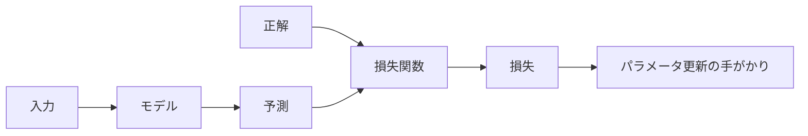
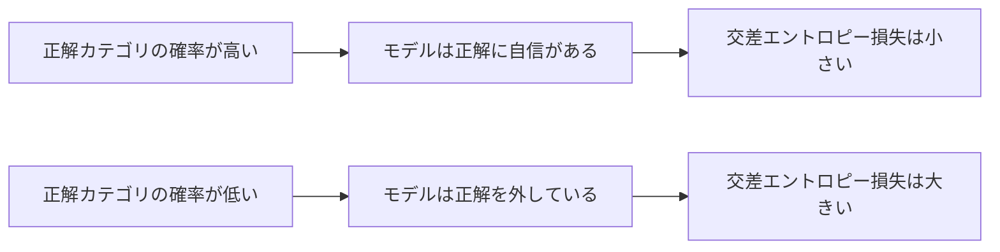

## 第4章　損失関数

**この章でわかること**

- 損失が予測の悪さを数値化するものであること
- 回帰で使う MSE と分類で使う交差エントロピーの違い
- 正解に高い確率を出すほど交差エントロピーが小さくなること
- 言語モデルの次トークン予測も損失を小さくして学習すること

### 4.1　予測がどれくらい間違っているかを測る

機械学習では、モデルが入力に対して予測を出します。しかし学習のためには、予測を出すだけでは足りません。その予測がどれくらい正解からズレているかを、測る必要があります。

```text
予測：7,500万円 / 正解：8,000万円 → 500万円のズレ（まあまあ）
予測：4,000万円 / 正解：8,000万円 → 4,000万円のズレ（ずっと悪い）
```

人間が見れば「500万円のズレより4,000万円のズレの方が悪い」とすぐわかりますが、機械学習では、この「どれくらい悪いか」を数値として定義する必要があります。モデルの学習は、その数値を小さくするように進むからです。

この「予測がどれくらい間違っているか」を表す数値を**損失**と呼び、計算する関数を**損失関数**と呼びます。

```text
損失 = 損失関数(予測, 正解)
損失が大きいほど予測は悪い、小さいほど予測はよい
```

学習とは、モデルの予測によって発生する損失を小さくすることです。ニューラルネットワークでも Transformer でも、「予測を出す → 正解と比較する → 損失を計算する → 損失が小さくなるようにパラメータを更新する」という流れが中心にあります。



### 4.2　損失関数とは何か

損失関数とは、モデルの予測と正解のズレを数値化する関数です。

単純に差を取ると、予測が低いとマイナス、高いとプラスになります。たとえば「予測7,500・正解8,000」（差 -500）と「予測8,500・正解8,000」（差 +500）は、向きは違いますが間違いの大きさは同じです。そのため、損失関数ではズレの向きではなく大きさを扱うことが多いです。

そのための単純な方法は、絶対値を取るか、差を二乗することです。

```text
損失 = |予測 - 正解|     （絶対値）
損失 = (予測 - 正解)^2    （二乗）
```

ここが重要です。損失関数は単なる計算式ではなく、モデルに「こういう間違いを減らせ」と指示するものです。価格のズレを損失にすれば価格のズレを小さくするように学習し、正解カテゴリの確率が低いことを損失にすれば正解カテゴリに高い確率を出すように学習します。つまり、損失関数は、モデルが何を最適化するかを決める中心的な部品です。

### 4.3　平均二乗誤差

回帰問題でよく使われる損失関数に、平均二乗誤差（Mean Squared Error, MSE）があります。

まず二乗誤差から考えます。予測7,500・正解8,000なら、差は -500、その二乗は 250,000 です。差を二乗することで、ズレがマイナスでもプラスの値になります。複数のデータがある場合、それぞれの二乗誤差を計算し、平均を取ります。

```text
データ1：予測 7,500、正解 8,000、二乗誤差 250,000
データ2：予測 5,200、正解 5,000、二乗誤差 40,000
データ3：予測 9,000、正解 10,000、二乗誤差 1,000,000
平均二乗誤差 = (250,000 + 40,000 + 1,000,000) / 3
```

この値が小さいほど、予測は全体として正解に近いと考えます。

MSE の特徴は、大きな誤差を強く罰することです。誤差が100なら二乗誤差は10,000、誤差が1,000なら1,000,000。誤差は10倍ですが、二乗誤差は100倍になります。つまり「少しのズレ」よりも「大きなズレ」をかなり強く嫌うモデルになります。家の価格予測で「100万円のズレは許容できても5,000万円のズレは困る」場合などに都合がよい性質です。

一方、外れ値に弱いという欠点もあります。極端に高い豪邸が一つ混ざっていると、その大きな誤差が二乗で非常に大きくなり、モデルがその外れ値に引っ張られすぎることがあります。このように、どの損失関数を使うかで、モデルがどんな間違いを避けようとするかが変わります。

### 4.4　絶対誤差

平均二乗誤差と似た考え方に、絶対誤差があります。予測と正解の差の絶対値を取るもので、複数データの平均を平均絶対誤差（Mean Absolute Error, MAE）と呼びます。

```text
絶対誤差 = |予測 - 正解|
（予測 7,500・正解 8,000 → 500、予測 8,500・正解 8,000 → 500）
```

MSE と MAE の違いは、大きな誤差をどれくらい強く罰するかです。MSE は誤差を二乗するので大きな誤差を非常に強く罰し、MAE はそのまま大きさとして扱うので罰は比較的穏やかです。だから、外れ値の影響を抑えたい場合は MAE が扱いやすいことがあります。ただし、学習では損失を微分してパラメータ更新に使うため、二乗誤差の方が数学的に扱いやすい場面もあります。どちらが常に正しいという話ではなく、損失関数の選択は「何を悪い予測とみなすか」という設計判断です。

### 4.5　分類問題における損失

ここまでは数値を予測する回帰問題を見てきました。次に分類問題を考えます。分類では出力はカテゴリですが、機械学習モデルは多くの場合、いきなり「犬」と答えるのではなく、各カテゴリの確率を出します。

```text
犬：0.90 / 猫：0.10  → 犬である可能性が高い
犬：0.40 / 猫：0.60  → 猫の方が少し高いが、自信は弱い
```

分類で学習するには、この確率分布と正解ラベルを比較します。正解が犬なら、犬に高い確率を出しているほどよい予測です。この「よい・悪い」を数値化するのに、分類問題でよく使われるのが**交差エントロピー**という損失関数です。

交差エントロピーは、直感的には「正解カテゴリにどれくらい高い確率を割り当てたか」を見る損失です。正解カテゴリに高い確率を割り当てていれば損失は小さく、低い確率しか割り当てていなければ損失は大きくなります。つまり、分類の学習は、正解カテゴリの確率を高くするようにモデルを調整することだと考えられます。

### 4.6　確率として出力する

分類モデルが確率を出すという考え方を、もう少し丁寧に見ます。

犬・猫・鳥の3分類で、ある画像に「犬：0.70 / 猫：0.20 / 鳥：0.10」と出したとします。この3つは合計1になります。このように、複数の候補に合計1になる数値を割り当てたものを**確率分布**と呼びます。

ただし、ニューラルネットワークの内部では、最初からきれいな確率が出るわけではありません。実際にはまず各カテゴリのスコアを出します（合計しても1にならず、マイナスもありえます）。

```text
スコア      犬：3.2 / 猫：1.9 / 鳥：0.5
softmax後   犬：0.75 / 猫：0.20 / 鳥：0.05
```

このスコアを確率に変換する代表的な関数が softmax です。softmax は、任意のスコアの列を合計1の確率分布に変換し、スコアが高いカテゴリほど高い確率になります（すべて0以上、合計1）。

Transformer や大規模言語モデルでも、最後の出力で softmax が使われます。言語モデルの場合、カテゴリは「語彙中のトークン」です。語彙が5万個なら、次に来るトークンについて5万個の候補それぞれにスコアを出し、softmax で確率分布に変換し、正解トークンに高い確率を出せるように学習します。つまり、言語モデルは「次のトークンを語彙全体の中から分類する問題」と見られます。

### 4.7　交差エントロピー

分類問題で非常によく使われる損失関数が、交差エントロピーです。名前は難しく見えますが、最初は直感で理解すれば十分です。

交差エントロピーは、正解に対してモデルがどれくらい低い確率を出してしまったかを罰する損失です。正解が犬のとき、3つのモデルが次のように出したとします。

```text
モデルA：犬 0.90 / 猫 0.10  → よい予測
モデルB：犬 0.55 / 猫 0.45  → 一応犬が高いが自信が弱い
モデルC：犬 0.10 / 猫 0.90  → かなり悪い予測
```

交差エントロピーでは、正解カテゴリの確率が高いほど損失が小さく、低いほど損失が大きくなります。数式で書くと、正解カテゴリに対する予測確率を p としたとき、損失はおおよそ次のようになります。

```text
損失 = -log(p)
正解確率 p が高い → -log(p) は小さい
正解確率 p が低い → -log(p) は大きい
```

たとえば、正解に0.90を出せば損失は小さく、0.10なら大きく、0.001なら非常に大きくなります。



この性質は重要です。分類では、単に正解カテゴリが一番高ければよいだけではなく、正解にどれくらい高い確率を割り当てたかも重要です。正解が犬のとき「犬 0.51 / 猫 0.49」でも分類結果は犬ですが、モデルはかなり迷っています。「犬 0.99 / 猫 0.01」なら強く犬だと判断しています。交差エントロピーはこの違いを反映し、正解に高い確率を出すほど損失が小さくなります。だから交差エントロピーで学習すると、モデルは正解カテゴリに高い確率を出すように調整されます。

#### PyTorchで確認してみる

回帰の損失には `MSELoss`、分類の損失には `CrossEntropyLoss` がよく使われます。

```python
import torch
from torch import nn
import torch.nn.functional as F

prediction = torch.tensor([7500.0])
target_value = torch.tensor([8000.0])
mse_loss = nn.MSELoss()(prediction, target_value)

logits = torch.tensor([[3.0, 0.5, -1.0]])
target_class = torch.tensor([0])
probabilities = F.softmax(logits, dim=1)
ce_loss = nn.CrossEntropyLoss()(logits, target_class)

print("mse loss:", mse_loss.item())
print("probabilities:", probabilities)
print("cross entropy loss:", ce_loss.item())
```

`CrossEntropyLoss` には、softmax 後の確率ではなく、softmax 前のスコアである `logits` を渡します。内部で softmax と負の対数尤度に相当する計算をまとめて行うためです。

### 4.8　損失が小さいほどよい、とはどういうことか

機械学習では「損失を小さくする」とよく言いますが、具体的にどういう意味でしょうか。

回帰問題では、損失が小さいとは、予測値が正解値に近いということです（正解8,000に対し予測7,950ならズレは小さく、3,000なら大きい）。分類問題では、損失が小さいとは、正解カテゴリに高い確率を出しているということです。言語モデルでも同じで、入力「吾輩は」に対し正解が「猫」なら、「猫」に高い確率を出すほど損失は小さくなります。

ただし注意があります。損失が小さいというのは、あくまで「その損失関数から見てよい」という意味です。損失関数の設計が悪ければ、損失が小さくても人間にとって望ましいモデルになるとは限りません。たとえば言語モデルで次トークン予測の損失を小さくすると文章を予測する能力は高まりますが、それだけで「正直である」「安全である」「ユーザーの意図に従う」といった性質が十分に得られるわけではありません。だから現代のAIでは、事前学習の損失だけでなく、指示への追従性・安全性・人間の好みを反映する追加学習が行われます。損失関数は、モデルに何を学ばせるかを決める重要な設計です。

### 4.9　損失関数を選ぶ意味

損失関数を選ぶことは、「何を間違いとみなすか」を決めることです。これは単なる技術的な選択ではなく、モデルの振る舞いを決める設計判断です。

MSE を使えば大きな誤差を強く減らそうとし（大きく外すことを避けたい方針）、MAE を使えば外れ値に穏やかになります（極端なデータに引っ張られたくない方針）。分類で交差エントロピーを使えば、正解カテゴリに高い確率を出すように学習します（正解への確信度を高めたい方針）。このように、損失関数はモデルに対する評価基準であり、モデルはその基準をよくするように学習します。

したがって、評価基準がズレているとモデルの学習もズレます。たとえば「クリック率」だけを最大化すると、刺激的なタイトルや不安を煽る内容を優先するかもしれません。クリックされやすいものが、ユーザーにとって本当に価値があるとは限らないからです。最適化する指標を間違えると、望ましくない結果が出ることがあります。Transformer でも、次トークン予測の損失を小さくすれば統計的な予測能力は高まりますが、それだけで人間にとって理想的な応答をするとは限りません。この問題意識が、後の instruction tuning や RLHF につながります。

### 4.10　学習とは損失を小さくすることである

機械学習の学習は、損失を小さくする作業として理解できます。

```text
入力 → モデル → 予測 → 正解と比較 → 損失を計算 → パラメータを少し調整
これを大量のデータで何度も繰り返す
```

すると、モデルはだんだん損失が小さくなるようなパラメータを持つようになります。この意味で、機械学習は「損失関数を最小化する問題」と見られます。最初から数学的に厳密に考える必要はなく、次の直感で十分です。

```text
モデルが間違える → 間違いの大きさを測る → 間違いが減る方向にモデルを少し直す → 繰り返す
```

この「間違いが減る方向にモデルを少し直す」方法が、次章で扱う勾配降下法です。損失関数は「今どれくらい悪いか」を教えてくれ、勾配降下法は「損失を減らすにはパラメータをどちらへ動かせばよいか」を教えてくれます。この2つがつながると、学習プロセスがかなり見えてきます。

### 4.11　1つのデータの損失と、全体の損失

損失には、1つのデータに対する損失と、データ全体に対する損失があります。

1件の物件で「予測7,500・正解8,000」なら、その1件の損失を計算できますが、モデルを評価するには1件だけでは不十分です。ある1件には正確でも、他の物件では大きく外すかもしれません。そのため通常は、多くのデータの損失をまとめ、平均したものを全体の損失として扱います。

```text
全体の損失 = 各データの損失の平均
```

学習では、この全体の損失を小さくすることを目指します。ただし、実際の学習ではすべての訓練データを毎回使うとは限りません。データが何百万、何億件もあると、毎回すべてで損失を計算するのは計算量が大きすぎます。そこで、訓練データの一部を取り出して損失を計算し、パラメータを更新します。この一部のまとまりを**ミニバッチ**と呼びます（たとえば64件だけ取り出して平均損失を計算し、更新する）。この話は次章の「確率的勾配降下法」「ミニバッチ学習」で詳しく扱います。ここでは、損失には「1つのデータに対する損失」と「多くのデータに対する平均的な損失」がある、と理解しておけば十分です。

### 4.12　訓練損失と検証損失

損失を見るときは、「どのデータに対する損失か」が重要です。学習に使っている訓練データに対する損失を**訓練損失**、学習には使っていない検証データに対する損失を**検証損失**と呼びます。この区別は非常に重要です。

モデルは訓練データの損失を小さくするように学習するので、学習が進むと訓練損失は下がっていきます。しかし、訓練損失が下がることと、未知のデータに強くなることは同じではありません。モデルが訓練データを丸暗記すれば訓練損失は非常に小さくなりますが、未知のデータではうまく予測できないかもしれません。この状態が**過学習**です。

```text
過学習のとき：
訓練損失は下がり続けるのに、検証損失は途中から上がる
```

このような場合、モデルは訓練データに適応しすぎて、一般的な規則性ではなく、訓練データ固有の細かい特徴まで覚えている可能性があります。モデルの目的は訓練データでよい成績を出すことではなく、未知のデータによい予測をすることなので、訓練損失だけでなく検証損失を見ることが重要です。この話は第6章・第7章でさらに詳しく扱います。

### 4.13　言語モデルにおける損失

ここまでの話を、言語モデルに接続します。

言語モデルの基本的な学習では、文脈から次のトークンを予測します。「吾輩は猫である」は、次のような学習データとして見られます。

```text
入力：吾輩は      正解：猫
入力：吾輩は猫    正解：で
入力：吾輩は猫で  正解：ある
```

モデルは入力された文脈に対して、次のトークンの確率分布を出します。入力「吾輩は」に対して「猫：0.60 / 犬：0.10 / ...」と出し、正解が「猫」なら比較的よい予測です。逆に「猫：0.001 / 犬：0.40 / ...」ならかなり悪い予測です。このとき交差エントロピーで損失を計算し、正解トークン「猫」に高い確率を出していれば損失は小さく、低ければ大きくなります。

つまり、言語モデルの事前学習とは、大量のテキストに対して、次トークン予測の損失を小さくすることです。言語モデルは一見すると文章を理解しているように見えますが、基本的な学習目的は「文脈を見て、次のトークンを予測する」ことであり、その予測が正解トークンに近づくように交差エントロピー損失を小さくします。論文や LLM の解説で「loss」「cross entropy loss」という言葉が出てきたら、これを思い出してください。

### 4.14　損失と精度は同じではない

分類問題では、「精度」という指標もよく使われます。精度とは、全体のうちどれくらい正しく分類できたかを表す指標です（100枚中90枚正解なら精度90%）。

```text
精度 = 正解数 / 全体数
```

直感的でわかりやすい指標ですが、損失と精度は同じではありません。正解が犬のとき、「犬 0.51 / 猫 0.49」と「犬 0.99 / 猫 0.01」は、どちらも分類結果は犬で、精度では同じく正解です。しかし交差エントロピー損失では、自信のある後者の方が損失は小さくなります。逆に「犬 0.49 / 猫 0.51」と「犬 0.01 / 猫 0.99」は、どちらも分類結果は猫で精度では同じく不正解ですが、損失では正解にほとんど確率を割り当てていない後者の方がずっと悪くなります。

このように、精度は「最終的に当たったか外れたか」を見る指標で、損失は「正解にどれくらい確率を割り当てたか」をより細かく見ます。学習では、精度そのものではなく損失関数を使ってパラメータを更新するのが一般的です。なぜなら、損失は連続的に変化し微分しやすいからです。精度は当たりか外れかの離散的な値で、少しパラメータを変えても変わらないことが多く、学習の方向を知るには使いにくいのです。そのため、学習には損失関数を使い、評価には精度などの指標を併用する形がよく使われます。

### 4.15　本章のまとめ

**Transformer への接続**

Transformer の言語モデル学習では、次トークンに対する交差エントロピー損失が中心になります。モデルが語彙全体のスコアを出し、softmax で確率分布に変換し、実際に続いた正解トークンにどれだけ高い確率を割り当てたかを損失で測ります。この損失を小さくすることが、Transformer の学習の基本です。

**ミニ演習**

- 正解クラスの確率が `0.9`、`0.5`、`0.1` のとき、どれが一番損失が大きいか考えてみましょう。
- この章の PyTorch コードで `target_class` を変えると、交差エントロピー損失がどう変わるか確認してみましょう。
- 回帰問題と分類問題で、使う損失関数がなぜ違うのか説明してみましょう。

この章で一番重要な考え方は、次の一文です。

**損失関数とは、モデルにとって何が悪い予測かを数値で定義するものであり、学習とはその損失を小さくすることである。**

回帰では平均二乗誤差 `(予測 - 正解)^2`（大きな誤差を強く罰する）や平均絶対誤差が、分類では交差エントロピー `-log(正解カテゴリに割り当てた確率)`（正解に高い確率を出すほど小さい）がよく使われます。言語モデルでも交差エントロピーが使われ、次の正解トークンに高い確率を出せるように学習します。

Transformer は複雑な構造を持っていますが、学習時にはやはり予測と正解を比較し、損失を計算し、その損失が小さくなるようにパラメータを更新しています。次の章では、損失を小さくするためにどうやってパラメータを動かすのか、最適化と勾配降下法を学びます。

---

<!-- chapter-nav:start -->

[← 第3章　モデルとパラメータ](Chapter%203%20Models%20and%20Parameters.md) ｜ [目次](Table%20of%20Contents.md) ｜ [第5章　最適化と勾配降下法 →](Chapter%205%20Optimization%20and%20Gradient%20Descent.md)

<!-- chapter-nav:end -->
