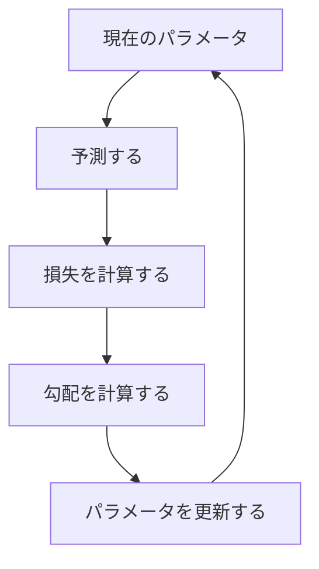
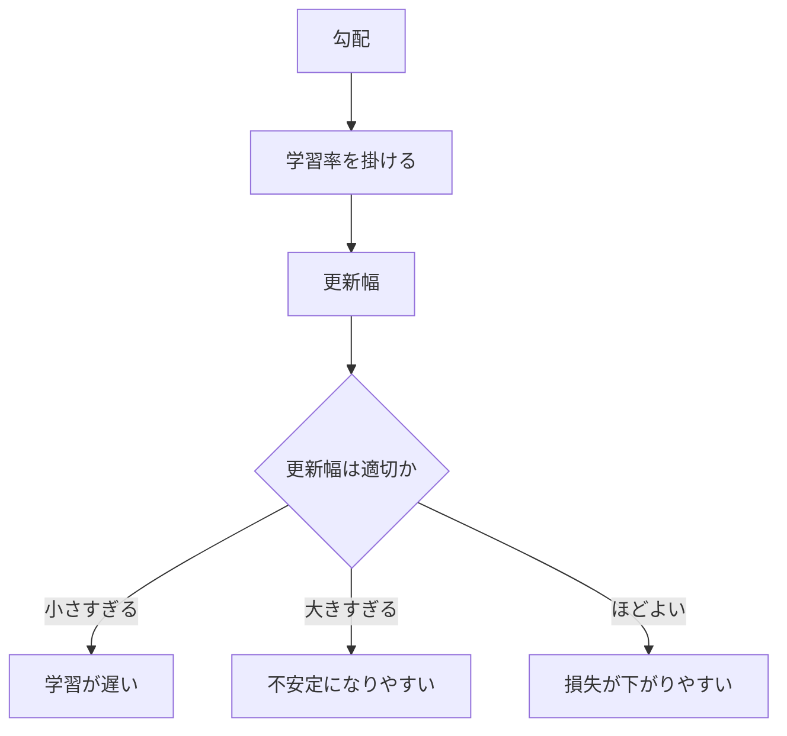

## 第5章　最適化と勾配降下法

**この章でわかること**

- 学習が損失を小さくする最適化問題であること
- 勾配降下法がパラメータを更新する基本的な方法であること
- 学習率、ミニバッチ、エポック、ステップの意味
- Transformer も逆伝播と最適化で重みを更新していること

### 5.1　どうやって損失を小さくするのか

前章で、損失関数（モデルの予測と正解のズレを数値化する関数）を学びました。機械学習では、この損失を小さくするようにモデルを学習します。では、具体的にどうやって小さくするのでしょうか。

直線モデル `y = wx + b` の予測は、`w` と `b` の値によって変わります。つまり損失も `w` と `b` によって変わります。ある値では予測が正解に近く損失が小さく、別の値では大きく外れて損失が大きい。学習とは、損失が小さくなるようなパラメータを探すことです。

このように、何かの値をできるだけ小さく（または大きく）する問題を「最適化」と呼びます。機械学習における学習は、多くの場合、損失関数を最小化する最適化問題です。この章では、その代表的な方法である「勾配降下法」を学びます。これは現代のニューラルネットワークや Transformer の学習でも基本になる考え方です。



### 5.2　最適化とは何か

最適化とは、ある目的にとって最もよい値を探すことです。

地形のたとえで考えます。高さが「損失」だとすると、高い場所は損失が大きく、低い場所は損失が小さい。パラメータの値によって損失が変わるので、パラメータの空間の中に損失の地形があると考えられます。最適化とは、この地形の中でなるべく低い場所を探すことです。

```text
パラメータの値 → 損失の高さ（よいパラメータは損失が低い場所にある）
```

ニューラルネットワークではパラメータが非常に多く、大規模言語モデルでは数十億以上になります。この場合、損失の地形は人間が直接見ることのできない超高次元の地形になります。それでも考え方は同じです。「パラメータを少し変える → 損失がどう変わるか見る → 損失が下がる方向へ動かす → 繰り返す」。この「損失が下がる方向へ少しずつ動かす」考え方が、勾配降下法です。

### 5.3　微分の直感

勾配降下法を理解するには、微分の直感が必要です。ここでは厳密な数学としてではなく、「何を知るための道具か」を理解すれば十分です。

微分とは、ある値を少し変えたときに、結果がどれくらい変わるかを調べるものです。たとえば車で走っているとき、「時間を少し変えたとき位置がどれくらい変わるか」が速度で、これは位置を時間で微分したものです。

機械学習では、次を知りたいのです。

```text
パラメータを少し変えたとき、損失がどれくらい変わるか
```

ある重み `w` を少し大きくしたら、損失が下がるのか上がるのか。これがわかれば、パラメータをどちらに動かせばよいかがわかります。`w` を大きくすると損失が下がるなら大きくする方向に、上がるなら小さくする方向に動かせばよいのです。微分は「損失を下げるにはパラメータをどちらに動かせばよいか」を知るために使います。

### 5.4　傾きとは何か

微分の直感を「傾き」として考えます。横軸にパラメータ `w`、縦軸に損失を取ります。

ある位置でグラフが右上がりなら、`w` を大きくすると損失が増えるので、損失を下げたいなら `w` を小さくする方向に動かすべきです。右下がりなら逆で、`w` を大きくする方向に動かすべきです。この「右上がり・右下がり」を数値で表したものが傾きです。

```text
傾きが正 → 右へ行くと損失が増える
傾きが負 → 右へ行くと損失が減る
傾きがゼロ → その地点では平ら
```

重要なのは、損失を下げるには「傾きと逆方向」に動くということです。傾きが正なら左へ、負なら右へ。つまり、常に傾きの反対方向へ動けば、損失を下げる方向に進めます。これが勾配降下法の基本です。

### 5.5　勾配とは何か

ここまではパラメータが1つの場合でした。しかし実際のモデルにはパラメータがたくさんあります。

```text
価格 = 広さ × w1 + 駅距離 × w2 + 築年数 × w3 + b
（パラメータは w1, w2, w3, b の4つ）
```

パラメータが複数ある場合、それぞれについて「少し変えたら損失がどう変わるか」を知る必要があります。これらをまとめたものが「勾配」です。

```text
勾配 = [ w1 に関する傾き, w2 に関する傾き, w3 に関する傾き, b に関する傾き ]
```

勾配は、損失が最も急に増える方向を表します。逆に言えば、勾配の反対方向は、損失が最も急に減る方向です。だから、損失を小さくしたいときは、パラメータを勾配の反対方向に動かします。この考え方が、勾配降下法です。

### 5.6　勾配降下法

勾配降下法とは、損失が小さくなるように、パラメータを勾配の反対方向へ少しずつ動かす方法です。基本的に次の形になります。

```text
新しいパラメータ = 現在のパラメータ - 学習率 × 勾配
```

マイナスが付いているのが重要です。勾配は損失が増える方向を表すので、損失を減らすにはその反対方向へ進みます。だから引き算になります。ただし、勾配をそのまま引くと動きすぎるかもしれないので、「学習率」という値を掛けて、一回の更新でどれくらい動かすかを調整します。

具体例で見ます。現在 `w = 10`、学習率 `0.1` のとき、勾配が `2` なら新しい `w = 10 - 0.1×2 = 9.8`（小さくする方向）、勾配が `-3` なら `w = 10 - 0.1×(-3) = 10.3`（大きくする方向）です。このように、勾配の符号と大きさを使って損失が下がる方向へ更新し、これを何度も繰り返すことで損失がだんだん小さくなることを期待します。

#### PyTorchで確認してみる

次のコードは、`y = 2x` に近づくように1つの重み `w` を勾配降下法で更新します。

```python
import torch

x = torch.tensor([1.0, 2.0, 3.0])
y = torch.tensor([2.0, 4.0, 6.0])

w = torch.tensor([0.0], requires_grad=True)
optimizer = torch.optim.SGD([w], lr=0.1)

for step in range(5):
    y_hat = w * x
    loss = ((y_hat - y) ** 2).mean()

    optimizer.zero_grad()
    loss.backward()
    optimizer.step()

    print(step, "w:", w.item(), "loss:", loss.item())
```

`loss.backward()` で勾配を計算し、`optimizer.step()` でパラメータを更新します。この流れは、ニューラルネットワークや Transformer の学習でも基本的に同じです。

### 5.7　学習率

学習率は、勾配降下法における非常に重要なハイパーパラメータで、パラメータを一回の更新でどれくらい動かすかを決めます。

谷底へ向かって坂を下るイメージで考えます。学習率がちょうどよければ安定して下っていけます。しかし大きすぎると、一歩が大きすぎて谷底を飛び越え、左右を行ったり来たりしてなかなか落ち着かず、場合によっては損失がどんどん大きくなって学習が壊れます。逆に小さすぎると、一歩が小さすぎてなかなか進まず、学習に非常に時間がかかります。つまり、大きすぎると不安定、小さすぎると遅い、というバランスが必要です。

現代の深層学習では、学習率を一定にするだけでなく、途中で変化させることもよくあります（最初は大きめにして徐々に小さくする、最初だけ徐々に上げてその後下げる、など）。これを学習率スケジュールと呼びます。Transformer の学習でも学習率の設定は重要で、モデルが大きくなるほど学習の安定性に大きく影響します。



### 5.8　学習率が大きすぎる場合、小さすぎる場合

学習率の影響をもう少し詳しく見ます。

学習率が大きすぎると、一歩が大きすぎて谷底を通り過ぎ、反対側の斜面まで行ってしまいます。次の更新でまた逆方向に大きく動き、谷の周辺を行ったり来たりして損失が安定して下がりません。さらに悪い場合、谷からどんどん離れて損失が発散します（損失がどんどん大きくなり学習がうまくいかなくなること）。

```text
学習率が大きすぎる → 更新幅が大きすぎる → 損失が下がらない → 場合によっては発散
学習率が小さすぎる → 更新幅が小さすぎる → 損失は下がるが遅い → 学習に時間がかかる
```

実際の機械学習では、学習率を変えて実験し、損失の下がり方を見ながら調整します。訓練損失がまったく下がらない、損失が激しく上下する、途中で急に損失が大きくなる、学習が異常に遅い——こうした症状があるとき、学習率が原因のことがあります。

### 5.9　局所最小と大域最小

最適化では「局所最小」と「大域最小」という言葉が出てきます。

大域最小は、全体の中で最も損失が小さい場所（一番低い谷底）です。局所最小は、その周辺だけ見ると一番低いけれど、全体で見るともっと低い場所が他にある場所（小さな谷底）です。

勾配降下法は、基本的に今いる場所から坂を下っていく方法です。そのため、近くの谷底にたどり着けますが、それが全体で一番低い谷底とは限りません。ニューラルネットワークのような複雑なモデルでは、損失の地形は非常に複雑で、局所最小・平らな場所・鞍点（ある方向には谷底に見えるが別の方向にはまだ下れる場所）などが多数あります。高次元の最適化では、局所最小よりも鞍点や平坦な領域の方が問題になることもあります。

ただし、初心者の段階では次の理解で十分です。勾配降下法は損失が下がる方向へ進むが、必ずしも全体で最もよい場所に到達するとは限らない。それでも、実用上十分によい場所に到達できればよい。機械学習では、数学的に完全な最小値を見つけることよりも、未知のデータによく予測できるモデルを得ることが重要です。

### 5.10　確率的勾配降下法

ここまでの勾配降下法では、損失を計算するのにすべての訓練データを使うイメージでした。しかし実際にはデータが非常に大きいことがあり（画像が数百万枚、巨大なテキストコーパスなど）、パラメータを一回更新するたびに全データで損失を計算するのは非常に重いです。

そこで使われるのが、確率的勾配降下法（Stochastic Gradient Descent, SGD）です。すべてのデータではなく、一部のデータを使って勾配を計算します。

```text
100万件すべてではなく、その一部を使って更新する
```

毎回使うデータが違うため、勾配は少しノイズを含み、「正確な全体の勾配」ではなく「だいたいこちらに行けばよさそう」という推定になります。一見悪く見えますが、計算が軽くなる、ノイズによって狭い局所最小から抜けやすくなる、大規模データでの学習が現実的になる、という利点があります。そのため、確率的勾配降下法は深層学習の基本的な学習方法として広く使われています。現代では1件ずつではなく、複数件をまとめたミニバッチを使うのが一般的です。

### 5.11　ミニバッチ学習

ミニバッチ学習とは、訓練データの一部をまとめて使い、その平均損失に基づいてパラメータを更新する方法です。

たとえば訓練データから64件を取り出し、それぞれの予測と損失を計算し、平均を取ります。

```text
ミニバッチの損失 = 64件の損失の平均
```

このミニバッチの損失を使って勾配を計算し、更新します。次にまた別の64件で同じことをします。このように、訓練データを小さなまとまりに分けて少しずつ学習を進めます。ミニバッチのサイズをバッチサイズと呼びます。

バッチサイズが小さいと、一回の計算は軽いが勾配のノイズは大きくなります。大きいと、勾配は安定するが計算は重くメモリも多く使います。深層学習では、GPU を効率よく使うためにも、複数のデータをまとめて行列計算として処理するミニバッチ学習が重要です。Transformer の学習でも、複数のトークン列をまとめて入力し、それぞれの次トークン予測の損失の平均に基づいて更新します。

### 5.12　エポックとステップ

学習過程では「エポック」と「ステップ」がよく出てきます。

**ステップ**とは、パラメータを一回更新することです。ミニバッチを一つ取り出し、損失を計算し、勾配を求め、更新する。これが1ステップです。

**エポック**とは、訓練データ全体を一通り使うことです。訓練データが10,000件、バッチサイズが100なら、全体を一通り使うには100ステップ必要で、これが1エポックです。

```text
訓練データ数：10,000 / バッチサイズ：100 / 1エポック：100ステップ
```

通常、モデルは1エポックでは十分に学習できないので、同じ訓練データを何度も使って何エポックも学習します。ただし大規模言語モデルでは、データ量が非常に大きいため、「何エポック」というより「何トークン学習したか」「何ステップ学習したか」で管理されることも多いです。重要なのは、学習は一回で終わるものではなく、ミニバッチごとに少しずつ更新を繰り返すものだ、という点です。

### 5.13　逆伝播の入り口

勾配降下法では、パラメータごとの勾配が必要です。つまり、それぞれの重みやバイアスを少し変えたときに損失がどう変わるかを知る必要があります。しかし、ニューラルネットワークや Transformer には大量のパラメータがあります。どうやってすべてについて勾配を計算するのでしょうか。

ここで出てくるのが「逆伝播」（backpropagation）です。逆伝播とは、モデルの出力側から入力側へ向かって、損失に対する各パラメータの影響を効率よく計算する方法です。

ニューラルネットワークでは、入力から出力へ計算が進みます（順伝播）。順伝播で予測を出して損失を計算したあと、損失から逆向きに情報を流します。

```text
順伝播：入力 → 層1 → 層2 → 層3 → 出力 → 損失
逆伝播：損失 → 層3 → 層2 → 層1 → 入力側（各パラメータの勾配を求める）
```

この逆向きの計算によって、各パラメータが損失にどれくらい影響したかを求めます。数学的な中身には合成関数の微分（連鎖律）が使われますが、最初は厳密な式を覚える必要はありません。重要なのは「順伝播で予測と損失を計算する → 逆伝播で各パラメータの勾配を計算する → 勾配降下法でパラメータを更新する」という3つの流れです。これがニューラルネットワークの学習の基本です。

### 5.14　最適化アルゴリズムの種類

勾配降下法は基本ですが、実際の深層学習では、より工夫された最適化アルゴリズムがよく使われます。代表的なものに Momentum、RMSProp、Adam があります。

- **Momentum**：過去の勾配の方向を少し覚えておき、慣性のように使う方法。損失の地形がギザギザして進む方向が毎回ぶれるとき、過去の進行方向を考慮することで、細かい揺れを抑えながら進みやすくなります。
- **RMSProp**：パラメータごとに更新幅を調整する方法。すべてに同じ学習率を使うと、ある方向では動きすぎ別の方向では動かなさすぎることがあるので、勾配の大きさに応じて更新幅を調整します。
- **Adam**：Momentum と RMSProp を組み合わせたような方法。過去の勾配の平均と勾配の大きさの情報を使って、パラメータごとの更新を調整します。

現代のニューラルネットワークでは、Adam やその派生である AdamW が非常によく使われ、Transformer の学習でも Adam 系がよく使われます。ただし、最初に理解すべきはあくまで勾配降下法です。Adam も AdamW も、基本的には「勾配を使って損失が下がる方向にパラメータを動かす」方法の発展形です。

### 5.15　勾配降下法の限界

勾配降下法は強力ですが、万能ではありません。

ニューラルネットワークの損失地形は非常に高次元で複雑です。場所によっては勾配が非常に小さくなり学習が進みにくくなることがあり、これを勾配消失と呼びます。逆に勾配が非常に大きくなり更新が不安定になることもあり、これを勾配爆発と呼びます。特に深いネットワークでは、勾配が層を逆向きに伝わる途中で小さくなりすぎたり大きくなりすぎたりしやすいです。この問題に対処するため、適切な初期化、正規化、残差接続、勾配クリッピングなどの工夫があります。Transformer でも、Layer Normalization や残差接続は学習の安定性に大きく関係しています。

また、損失を小さくすることが、必ずしも人間にとって望ましい振る舞いを意味するとは限りません。次トークン予測の損失を小さくすれば文章の続きを予測する能力は上がりますが、それだけで常に正確で安全で有用な回答をするとは限りません。最適化は「与えられた目的関数をよくする」ことに過ぎず、目的関数の設計が間違っていれば、最適化が成功しても望ましい結果にはなりません。この点は、AIを実用システムとして考える上で重要です。

### 5.16　本章のまとめ

**Transformer への接続**

Transformer も、損失を小さくするようにパラメータを更新して学習します。実際には単純な SGD だけでなく Adam や AdamW がよく使われますが、根本の考え方は同じです。予測し、損失を計算し、逆伝播で勾配を求め、重みを少しずつ更新します。

**ミニ演習**

- この章の PyTorch コードで、学習率 `lr` を `0.01`、`0.1`、`1.0` に変えて、損失の下がり方を比べてみましょう。
- `optimizer.zero_grad()` を呼ばないと何が起きそうか、予想してから調べてみましょう。
- ミニバッチサイズが大きい場合と小さい場合の長所と短所を1つずつ書いてみましょう。

この章で一番重要な考え方は、次の一文です。

**勾配降下法とは、損失を小さくするために、パラメータを勾配の反対方向へ少しずつ動かす方法である。**

```text
新しいパラメータ = 現在のパラメータ - 学習率 × 勾配
```

学習率は一回の更新でどれくらい動かすかを決める重要なハイパーパラメータで、大きすぎると不安定、小さすぎると遅くなります。また実際の深層学習では、すべてのデータを一度に使うのではなく、ミニバッチで「損失を計算 → 逆伝播で勾配を計算 → パラメータを更新」を何度も繰り返します。

Transformer や大規模言語モデルも、基本的にはこの考え方で学習されています。次トークン予測の損失を計算し、逆伝播で勾配を求め、最適化アルゴリズムで大量の重みを少しずつ更新する。この繰り返しによって、巨大なモデルは言語のパターンを学習していきます。

---

<!-- chapter-nav:start -->

[← 第4章　損失関数](Chapter%204%20Loss%20Functions.md) ｜ [目次](Table%20of%20Contents.md) ｜ [第6章　訓練データ、検証データ、テストデータ →](Chapter%206%20Training%20Data%2C%20Validation%20Data%2C%20and%20Test%20Data.md)

<!-- chapter-nav:end -->
