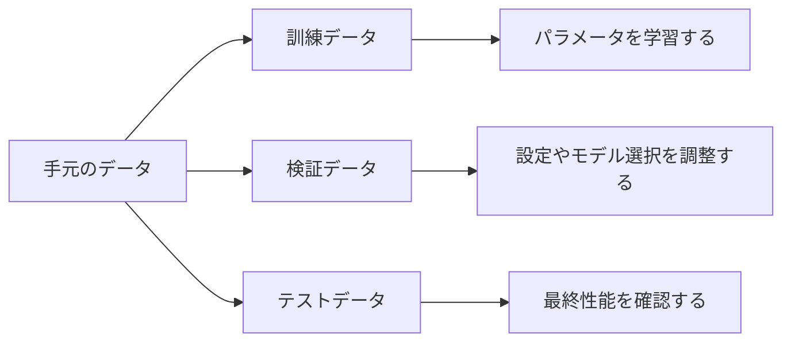

## 第6章　訓練データ、検証データ、テストデータ

**この章でわかること**

- データを訓練、検証、テストに分ける理由
- それぞれのデータが学習や評価で持つ役割
- データ漏洩や検証データへの合わせすぎが危険な理由
- 大規模言語モデルでも評価用データの設計が重要であること

### 6.1　なぜデータを分けるのか

機械学習では、データを使ってモデルを学習します。ここで大事なのは、モデルの目的は「学習に使ったデータにだけ正しく答えること」ではない、という点です。本当に重要なのは、まだ見たことのないデータに対しても、よい予測ができることです。

家の価格予測なら、過去の物件データだけに正しく答えても意味がなく、これから売り出される新しい物件の価格を予測できる必要があります。言語モデルも、学習データ中の文章を覚えているだけでは不十分で、未知の文脈に対してもっともらしい次のトークンを予測できる必要があります。

そのため、機械学習では手元のデータを3つに分けます。

```text
訓練データ  ：モデルを学習させるために使う
検証データ  ：学習中の確認やハイパーパラメータ調整に使う
テストデータ：最終的な性能評価に使う
```

このように分けることで、モデルが本当に未知のデータに対応できるかを確認できます。



#### PyTorchで確認してみる

手元のデータを訓練・検証・テストに分ける簡単な例です。

```python
import torch

torch.manual_seed(0)

x = torch.arange(20).reshape(10, 2).float()
y = torch.tensor([0, 1, 0, 1, 0, 1, 0, 1, 0, 1])

indices = torch.randperm(len(x))
train_idx = indices[:6]
val_idx = indices[6:8]
test_idx = indices[8:]

train_x, train_y = x[train_idx], y[train_idx]
val_x, val_y = x[val_idx], y[val_idx]
test_x, test_y = x[test_idx], y[test_idx]

print("train:", train_x.shape, train_y.shape)
print("validation:", val_x.shape, val_y.shape)
print("test:", test_x.shape, test_y.shape)
```

10件のデータを6件、2件、2件に分けています。訓練データでパラメータを更新し、検証データで設定を調整し、テストデータで最後に性能を確認します。

### 6.2　訓練データ

訓練データ（training data）とは、モデルのパラメータを更新するために使うデータです。

モデルは、訓練データを入力し、予測を出し、正解と比べて損失を計算し、逆伝播で勾配を求め、パラメータを更新します。これを何度も繰り返すことで、訓練データに対してよりよい予測を出せるようになります。言語モデルなら、大量の文章から「入力：今日はとても → 正解：暑い」のような学習データを作り、正解トークンに高い確率を出せるように学習します。

ここで注意すべきは、訓練データに対する性能だけを見ても不十分だということです。モデルは訓練データを直接使って更新するので、訓練データに対してはだんだん良い結果を出しやすくなりますが、それは未知のデータに強くなったことを意味しません。訓練データにだけ適応しすぎると、過学習が起きるからです。

### 6.3　検証データ

検証データ（validation data）とは、学習中にモデルの性能を確認するためのデータです。パラメータ更新には直接使いません。では何のために使うのでしょうか。

第一に、モデルが未知のデータにどれくらい対応できているかを、学習中に確認するためです。訓練を進めると訓練損失は下がっていきますが、検証損失（検証データに対する損失）は途中から下がらなくなることがあります。

```text
訓練損失：下がり続ける / 検証損失：途中から上がる
→ 過学習の典型的な兆候
```

第二に、ハイパーパラメータの調整に使います。学習率、バッチサイズ、層の数、Dropout率などを変えると学習結果が変わるので、複数の設定で学習し、検証データで性能を比較します（設定A→0.45、設定B→0.38、設定C→0.52 なら設定Bがよさそう）。

このように、検証データは学習中の判断に使うデータです。ただし、検証データを使って何度も設定を調整していると、間接的には検証データに合わせていることになります。そのため、最終評価には別のテストデータを使う必要があります。

### 6.4　テストデータ

テストデータ（test data）とは、最終的なモデル性能を評価するためのデータです。学習にもハイパーパラメータ調整にも使うべきではなく、最後までできるだけ触らずに取っておきます。「本当に未知のデータに対してどれくらい性能が出るか」を確認するためのものだからです。

モデルを訓練データで学習し、検証データを見ながら設定を調整し、最終的に選んだモデルをテストデータで評価します。このテストデータでの性能が、そのモデルの最終的な評価になります。

もしテストデータを何度も見ながらモデルを調整すると、テストデータはもはや「未知のデータ」ではなくなります。「テスト性能が悪い → 設定を変える → またテストで評価」を繰り返すと、モデルや実験者の判断がテストデータに適応してしまい、テストでの性能はよく見えても本当に新しいデータではそこまで良くない、ということが起きます。機械学習では、「テストデータを汚染しない」ことが非常に重要です。

### 6.5　未知のデータに強いとは何か

機械学習で本当に求めたいのは、未知のデータに対してよい予測をする能力です。この能力を「汎化性能」と呼びます。

犬猫分類なら、実際に使うときには訓練データに含まれていない新しい画像が入力されます。この新しい画像に正しく分類できるなら汎化性能が高く、訓練データの画像だけ正しく分類できて新しい画像で間違えるなら汎化性能が低い、ということです。言語モデルでも、学習データ中の文章をそのまま覚えているだけでは不十分で、未知の文脈に対して文法的にも意味的にも自然な続きを予測できる必要があります。

汎化性能が高いモデルは、訓練データの背後にある規則性をうまく捉えています。一方、低いモデルは、訓練データに表面的に合わせすぎていたり、データのノイズまで覚えてしまっていたりします。つまり、機械学習で重要なのは、訓練データを丸暗記することではなく、未知のデータにも通用する規則性を学ぶことです。

### 6.6　汎化性能

汎化性能とは、モデルが学習に使っていないデータに対して、どれくらいうまく予測できるかを表す能力です。

訓練データに対する性能は、ある意味簡単に上げられます。モデルを大きくし長く学習させれば、訓練損失はどんどん下がることがあります。しかし、それで未知のデータへの性能が上がるとは限りません。

```text
よい学習：訓練損失も検証損失も下がる（未知のデータにも通用する規則性を学んでいる）
過学習  ：訓練損失は下がり続けるが、検証損失は上がり始める
```

汎化性能を見るには、訓練データ以外のデータで評価する必要があります。そのために検証データやテストデータを分けておくのです。どれほど訓練データで良い数字が出ていても、本番環境のデータで性能が出なければ、そのモデルは役に立ちません。

### 6.7　データ漏洩

データ漏洩（data leakage）とは、本来は学習時に使ってはいけない情報が、訓練データや特徴量の中に入ってしまうことです。データ漏洩が起きると、評価結果が実際よりも良く見えてしまいます。

たとえば病気を予測するモデルで、入力特徴量の中に「最終診断名」が入っていたらどうでしょうか。

```text
入力：年齢、血液検査値、体温、最終診断名 → 出力：病気の有無
```

最終診断名は予測したい答えそのものに近いので、モデルは簡単に高い精度を出せます。しかし実際に予測したい時点では、最終診断名はまだわからないはずです。このようなモデルは本番では使えません。同様に、株価や売上の予測で予測時点より後の情報が特徴量に入ると、不自然に高い性能が出ます。

また、訓練データとテストデータの分け方によっても漏洩が起きます。同じユーザーの非常に似たデータが両方に入っていると、テスト性能が過大に評価されます。言語モデルでも、評価データが学習データに含まれていると、本当の汎化性能を測れません。モデルが評価問題をすでに見ていた場合、高得点を取っても未知の問題に答えられることを意味しません。データを分けるときには、「本番で使える情報だけを入力にしているか」「評価データが学習に混ざっていないか」を慎重に確認する必要があります。

### 6.8　評価の設計

評価の仕方を間違えると、モデルの性能を正しく理解できません。

まず、評価データは本番で出てくるデータに近い必要があります。昼間の明るい画像だけで評価しているのに、本番では夜間や雨の日の画像も入力されるなら、高い精度が出ても本番で使えるとは限りません。評価データは、実際に使いたい状況を反映している必要があります。

次に、評価指標を適切に選ぶ必要があります。分類問題では単純な精度だけでは不十分なことがあります。病気の人が全体の1%しかいない場合、すべての人を「病気ではない」と予測するモデルは精度99%になりますが、病気の人を一人も見つけられません。

```text
全員を「病気ではない」と予測 → 精度 99%（しかし病気を一人も見つけられない）
```

このような場合、精度だけを見るのは危険で、適合率、再現率、F値などの問題に応じた評価指標が必要です。何を重視するかは用途によって変わります（見逃しを避けたいなら再現率、誤検知を減らしたいなら適合率）。評価指標は、モデルに何を求めるかを反映するものであり、評価設計は機械学習システム全体の目的設計そのものです。

### 6.9　データの分け方

データを分ける方法はいくつかあります。もっとも単純なのはランダムに分割する方法で、「訓練80% / 検証10% / テスト10%」のように分けます。比率に絶対的な正解はなく、データ量や問題の性質によって変わります。

ただし、ランダムに分ければ常に良いわけではありません。

- **時系列データ**：未来を予測したいなら、過去データで学習し、その後のデータで評価すべきです。ランダム分割すると、未来に近いデータが訓練側に入り、評価が甘くなります。
- **ユーザー単位**：同じユーザーのデータが訓練とテストの両方に入ると、そのユーザー固有の傾向を覚えてしまいます。新しいユーザーへの性能を測りたいなら、ユーザー単位で分けるべきです。
- **文書単位**：同じ文書の一部が訓練、別の一部がテストに入ると、評価が甘くなります。

重要なのは、評価したい状況に合わせて分割方法を設計することです。この判断を間違えると、モデルの性能を過大評価してしまいます。

### 6.10　データ量が少ない場合

データ量が少ないと、訓練・検証・テストに分けるのが難しくなります。データが100件しかなく、テストが10件だと、たまたま簡単なデータが多ければ性能が高く見え、難しいデータが多ければ低く見えて、結果が非常に不安定になります。

このような場合に使われる方法の一つが、交差検証（cross validation）です。代表的なのが k分割交差検証で、データを5つ（A〜E）に分け、検証用を1つずつ替えながら5回学習・評価し、結果を平均します。

```text
1回目：Aで検証、B C D Eで訓練
2回目：Bで検証、A C D Eで訓練
...（5回繰り返して平均）
```

これにより、少ないデータを比較的効率よく使って評価できます。ただし、深層学習や大規模言語モデルのように学習コストが非常に大きい場合、交差検証は現実的でないこともあります。また、時系列データでは普通の交差検証をそのまま使うと未来の情報が訓練に入ってしまうので、問題の性質に応じた分割方法を選ぶ必要があります。

### 6.11　検証データに合わせすぎる問題

テストデータだけでなく、検証データにも注意が必要です。検証データはハイパーパラメータの調整やモデル選択に使い、検証損失が一番小さいものを選ぶ、という使い方は普通です。

しかし、何十回、何百回も検証データを見ながら調整していると、だんだん検証データに合わせすぎます。検証データはパラメータ更新には直接使っていなくても、人間が検証結果を見てモデル構造やハイパーパラメータを変えているなら、間接的には検証データに適応しています。その結果、検証データでの性能は良いがテストや本番ではそれほど良くない、ということが起こります。これを検証データへの過適合と見ることができます。だから最終評価用のテストデータを別に取っておくことが重要です。

特に研究やベンチマークでは、多くの開発者が同じベンチマークで改善し続けると、そのベンチマークに強いモデルが作られますが、それが実世界のあらゆる状況で強いとは限りません。評価データは使えば使うほど「見慣れたデータ」になっていきます。この点は、大規模言語モデルの評価でも重要です。

### 6.12　本番データとのズレ

訓練・検証・テストをきれいに分けても、それだけで十分とは限りません。本番環境で出てくるデータが、それらと違う可能性があるからです。

訓練・検証・テストがすべて明るい高画質な画像でも、本番では暗い場所、手ブレ、低解像度、部分的に隠れた対象などが入力されるかもしれません。この場合、テストで高い性能が出ても本番では下がる可能性があります。これをデータ分布のズレ（distribution shift）と考えられます。家の価格予測では金利上昇や景気変化、スパム判定では手口の変化、言語モデルでは新しい知識や流行語の出現などで、古いデータで学習したモデルは弱くなることがあります。

したがって、テストデータで一度評価して終わりではありません。本番環境での性能を監視し、必要に応じて再学習やデータ更新を行う必要があります。

```text
学習 → テストで評価 → 本番投入 → 本番データで性能監視 → 必要なら再学習
```

機械学習システムは、作って終わりではなく、運用しながら保守するものです。

### 6.13　大規模言語モデルにおけるデータ分割

大規模言語モデルでも、訓練・検証・テストの考え方は重要です。言語モデルは大量のテキストで学習し、「入力：機械学習とは → 正解：データ」のように次トークン予測の損失を小さくします。

このとき、訓練用と評価用のテキストを分ける必要があります。もし評価用の文章が訓練データに含まれていたら、モデルはその文章をすでに見ている可能性があり、評価で高い性能が出ても未知の文章に対する能力を測っているとは言えません。特に大規模言語モデルは、Webページ・書籍・論文・コード・会話データなど学習データが非常に広範囲に及ぶため、評価データが学習データに混入していないか確認することは非常に重要です。

また、言語モデルの評価にはいくつかの種類があります。次トークン予測の損失を測る評価、質問応答・要約・翻訳・推論・コード生成などの具体的なタスクでの評価、人間が回答品質を評価する場合などです。言語モデルでは、単純な損失だけでは人間にとっての有用性や安全性を十分に測れないことがあるので、複数の評価方法を組み合わせる必要があります。ただし、どの評価でも基本は同じで、「学習に使っていないデータでモデルの能力を測る」ことが重要です。

### 6.14　データ分割と「本当に測りたいもの」

データを分けるときに一番大事なのは、「何を測りたいのか」を明確にすることです。

たとえば、あるユーザーの過去行動から同じユーザーの次の行動を予測したいのか、それともまったく新しいユーザーの行動を予測したいのか。この2つでは分け方が変わります。同じユーザーの未来を予測したいならユーザーごとの時系列で、新しいユーザーへの性能を測りたいならユーザー単位で分けるのが自然です。

ランダム分割は簡単ですが、それが常に正しいとは限りません。評価したい状況が「未来への予測」なら時間で、「未知のユーザーへの対応」ならユーザーで、「未知の文書への対応」なら文書単位で分けるべきです。つまり、データ分割は単なる作業ではなく、モデルに何を期待しているのかを反映する設計です。

### 6.15　本章のまとめ

**Transformer への接続**

Transformer の学習でも、訓練データと評価データの分離は重要です。大量のテキストで学習したあと、モデルが学習データを覚えただけなのか、未知の文脈にも対応できるのかを確認する必要があります。特に言語モデルでは、評価データに訓練データが混ざると、実力を過大評価してしまいます。

**ミニ演習**

- この章の PyTorch コードで、訓練、検証、テストの件数を変えてみましょう。
- 「テストデータを見ながら何度もモデルを調整する」ことがなぜ問題か説明してみましょう。
- 言語モデルの評価データに訓練データと同じ文章が入っていたら、どんな問題が起きるか考えてみましょう。

この章では、訓練データ・検証データ・テストデータについて学びました。手元のデータをすべて学習に使うのではなく、目的に応じて分けます。訓練データはパラメータ更新、検証データは学習中の確認やハイパーパラメータ調整、テストデータは最終評価に使います。

訓練データに対する性能だけを見ても、モデルが本当に役に立つかはわかりません。重要なのは、学習に使っていない未知のデータに対してよい予測ができること（汎化性能）です。また、データ漏洩（予測時に使えない情報の混入や、評価データの訓練データへの混入）にも注意が必要です。データの分け方も、何を測りたいかによって決まります。

この章で一番重要な考え方は、次の一文です。

**機械学習で本当に評価したいのは、訓練データに対する成績ではなく、未知のデータに対する汎化性能である。**

Transformer や大規模言語モデルでも同じです。大量のテキストで学習したモデルでも、評価データが学習データに混ざっていれば本当の能力は測れません。未知のデータにどれくらい予測できるか、本番で出てくる入力にどれくらい対応できるか、評価したい能力に合ったデータで測れているか——この視点が、機械学習モデルを正しく理解し、正しく使うために必要です。

---

<!-- chapter-nav:start -->

[← 第5章　最適化と勾配降下法](Chapter%205%20Optimization%20and%20Gradient%20Descent.md) ｜ [目次](Table%20of%20Contents.md) ｜ [第7章　過学習と汎化 →](Chapter%207%20Overfitting%20and%20Generalization.md)

<!-- chapter-nav:end -->
