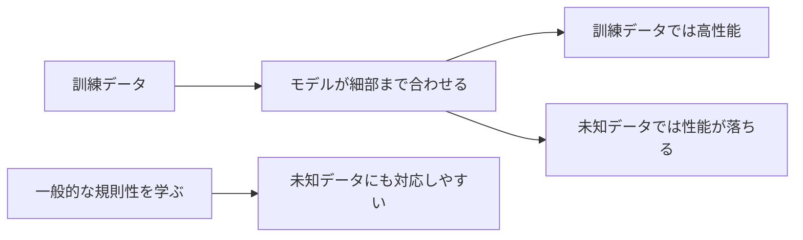
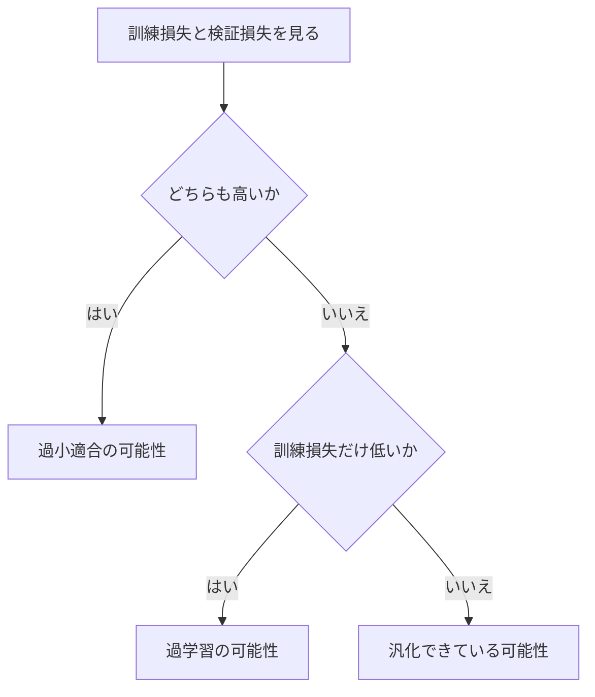

## 第7章　過学習と汎化

**この章でわかること**

- 過学習が訓練データに適応しすぎる状態であること
- 汎化性能が未知データへの強さを表すこと
- 正則化、Dropout、早期終了の直感
- 訓練損失と検証損失からモデルの状態を読む方法

### 7.1　過学習とは何か

機械学習で非常に重要な問題に、「過学習」（overfitting）があります。過学習とは、モデルが訓練データに適応しすぎて、未知のデータに対する性能が悪くなる状態です。

機械学習の目的は、訓練データに正しく答えることだけではなく、訓練に使っていない新しいデータにもよい予測ができることです。たとえば犬猫分類で、モデルが訓練データの画像を丸暗記しただけなら、訓練データには正しく答えられても、新しく撮影された画像にはうまく答えられないかもしれません。これが過学習です。言語モデルでも、学習データの文章の続きは正確に再現できるが、未知の文脈に自然な続きを生成できないなら、望ましい学習ではありません。

過学習を避けるには、訓練データそのものを覚えるのではなく、その背後にある一般的な規則性を学ぶ必要があります。



### 7.2　「訓練データでは正解するが、本番では弱い」状態

過学習を直感的にいうと、「練習問題だけは解けるが、初見問題には弱い」状態です。過去問の答えを丸暗記した人が、同じ問題なら高得点でも、少し言い方が変わると解けない、というのに似ています。本質を理解しているのではなく、問題と答えの対応を覚えているだけだからです。

モデルが訓練データの細かい特徴や偶然のパターンまで覚えると、訓練データでは高性能になりますが、その特徴は新しいデータには通用しないかもしれません。たとえば、訓練データの犬がたまたま屋外、猫がたまたま室内で撮影されていると、モデルは「屋外なら犬、室内なら猫」と学んでしまうかもしれません。訓練データでは高精度でも、室内の犬や屋外の猫には弱くなります。モデルは犬と猫の本質的な違いではなく、訓練データにたまたま存在した偏りを学んでしまったのです。このように、過学習は単なる丸暗記だけでなく、訓練データにだけ存在する偶然のパターン・偏り・ノイズに適応しすぎることも含みます。

### 7.3　モデルが複雑すぎる場合

過学習が起きる大きな原因の一つは、モデルが複雑すぎることです。

モデルの表現力が高いほど複雑な関係を表せます。これは良い面もあり、画像認識や自然言語処理のような問題では、単純な直線モデルでは足りず、表現力の高いモデルが必要です。しかし、表現力が高いモデルは、訓練データに過剰に合わせることもできます。点が並んだグラフで、単純な直線はすべての点を正確には通れないかもしれませんが、非常に複雑な曲線なら全点を通れます。一見すると複雑な曲線の方が優秀に見えますが、その曲線は訓練データのノイズまで拾っているかもしれず、新しいデータには単純な直線の方がよい予測をすることもあります。

つまり、表現力は高ければよいというわけではありません。大事なのは、問題に対して十分な表現力を持ちながら、訓練データに合わせすぎないことです。大規模言語モデルはパラメータ数が非常に多く、理論的には訓練データを大量に記憶する能力もありますが、十分に大きく多様なデータと適切な正則化により、丸暗記ではなく広く使える規則性を学習させようとします。

### 7.4　データが少なすぎる場合

過学習のもう一つの大きな原因は、データが少なすぎることです。データが少ないと、そのデータに含まれる偶然の偏りと本質的な規則性を区別しにくくなります。

犬の画像が10枚、猫の画像が10枚しかなく、犬がすべて屋外、猫がすべて室内なら、モデルは「屋外なら犬、室内なら猫」と学んでしまうかもしれません。データが多ければ、屋外の犬・室内の犬・屋外の猫・室内の猫などさまざまな例が含まれやすくなり、モデルは撮影場所ではなく犬と猫そのものの特徴に注目しやすくなります。言語モデルでも、少ない文章だけで学習すると、特定の文体・語彙・話題に偏りやすくなります。

十分なデータがあることは汎化性能を高めるために重要ですが、多ければ何でもよいわけではありません。質の低いデータ、間違ったラベル、偏ったデータが大量にあると、モデルもその影響を受けます。重要なのは量と質の両方です。

### 7.5　ノイズまで覚えてしまう問題

過学習では、モデルがデータに含まれるノイズまで覚えてしまうことがあります。ノイズとは、本来学ぶべき規則性ではない、偶然の揺らぎや誤りのことです。

家の価格は広さ・地域・築年数などである程度決まりますが、実際の価格には偶然の要因も入ります（売主が急いで売りたかった、一時的に市場が過熱していた、データ入力に誤りがあった、など）。このズレがノイズです。モデルが単純なら、こうしたノイズを無視して大まかな傾向を学ぶかもしれませんが、複雑すぎるとノイズまで説明しようとし、訓練データには非常によく合うが新しいデータには合わないモデルになります。

画像（ブレ、ラベルの誤り、背景の偶然の特徴）にも、言語データ（誤字脱字、古い情報、誤った情報、重複）にもノイズがあります。大規模言語モデルもこうしたデータから影響を受けるので、データの品質管理も過学習や汎化に関係します。モデルに学ばせたいのは、ノイズではなく、未知のデータにも通用する規則性です。

### 7.6　正則化

過学習を抑える代表的な方法に、正則化（regularization）があります。正則化とは、モデルが訓練データに過剰に適応しすぎないようにする工夫で、基本的な考え方は「複雑すぎるモデルを少し抑える」ことです。

モデルの重みが非常に大きくなると、入力の小さな変化に対して出力が大きく変わることがあります。これは訓練データの細かい揺らぎに敏感になりすぎている状態かもしれません。そこで、重みが大きくなりすぎないように罰則を加えます。損失関数に、予測誤差だけでなく、重みの大きさに対する罰則を足します。

```text
全体の損失 = 予測の損失 + 重みの大きさに対する罰則
```

こうすると、モデルは予測を正しくするだけでなく、重みを必要以上に大きくしないように学習し、なめらかで安定した予測をしやすくなります。代表的なものに L1正則化や L2正則化（深層学習では weight decay とも呼ばれる）があります。ただし、正則化を強くしすぎると、今度はモデルが十分に学習できなくなることがあり、バランスが必要です。

### 7.7　Dropout の直感

深層学習でよく使われる正則化の一つに、Dropout があります。Dropout は、学習中にニューラルネットワークの一部のユニットをランダムに無効化する方法です。

ある層に100個のユニットがあるとき、学習中にそのうち一部（たとえば50個）をランダムに無効化し、次のミニバッチではまた別のユニットを無効化します。つまり、学習のたびに少し違うネットワークで学習しているような状態になります。

なぜこれが過学習を防ぐのでしょうか。直感的には、特定のユニットに頼りすぎることを防ぐからです。ユニットがランダムに消えると、モデルはどのユニットが消えてもある程度うまく動くように学習する必要があり、より分散した頑健な表現を学びやすくなります。人間の組織でいえば、特定の一人にしか仕事ができない状態を避けるようなものです。

ただし、Dropout は通常、学習中だけに使い、推論時にはすべてのユニットを使います。Transformer でも、Attention の重みや Feed Forward Network の出力などに Dropout を入れて、過学習を抑える効果を狙うことがあります。

### 7.8　早期終了

過学習を防ぐ方法に、早期終了（early stopping）があります。検証データでの性能が悪化し始めたら、学習を止める方法です。

学習が進むと訓練損失は下がっていきますが、ある時点から検証損失が下がらなくなったり上がり始めたりすることがあります。

```text
訓練損失：下がり続ける / 検証損失：上がり始める
→ モデルが訓練データに適応しすぎ始めている兆候
```

このとき学習を続けると訓練損失はさらに下がるかもしれませんが、未知のデータへの性能は悪化する可能性があります。そこで、検証損失が最も低かった時点のモデルを採用します。これが早期終了です。

早期終了は非常に実用的で、特別なモデル構造を必要とせず、検証損失を監視するだけで使えます。ただし、検証データが信頼できるものである必要があります。大規模言語モデルの事前学習では、単純な早期終了だけでなく、学習計画全体・データ量・計算予算・評価指標を含めて判断しますが、「訓練データへの適応が進みすぎて未知データへの性能が悪化する前に止める」という基本の考え方は同じです。

### 7.9　データ拡張

過学習を防ぐもう一つの方法に、データ拡張（data augmentation）があります。既存のデータに変換を加えて、新しい訓練例を作る方法です。

画像分類でよく使われます。犬の画像に「少し回転する、左右反転する、明るさを変える、色味を変える」などの変換を加え、元の画像から複数の訓練例を作ります。犬は少し回転していても左右反転していても明るさが違っても犬です。このような変換を加えて学習させると、モデルは画像の細かい違いに対して頑健になり、丸暗記ではなく本質的な特徴を学びやすくなります。

音声認識でも（ノイズを加える、速度を変える、残響を加える）使われます。自然言語処理でも、同じ意味の文を言い換える、同義語に置き換える、などの考え方はありますが、言語では意味が少し変わってしまう危険があるため、画像より慎重に扱う必要があります。データ拡張は、モデルに「本質的でない変化」に惑わされないように学習させる方法です。

### 7.10　過小適合

過学習の反対側にある問題として、過小適合（underfitting）があります。過小適合とは、モデルが訓練データに対しても十分に学習できていない状態です。

過学習が「訓練データには強いが未知データに弱い」のに対し、過小適合は「訓練データにも未知データにも弱い」状態です。家の価格予測で、実際の価格はさまざまな要因で決まるのに、モデルが「広さ」だけを使う単純な直線モデルなら、十分な予測ができないかもしれません。

```text
過小適合：訓練損失も検証損失も高い
理想  ：訓練損失も検証損失も低い
```

過小適合は、モデルの表現力が足りない、特徴量が足りない、学習が十分でない、などの原因で起きます。モデルが単純すぎると過小適合しやすく、複雑すぎると過学習しやすい。ただし実際にはデータ量・正則化・学習方法・モデル構造などが絡むため、単純に「大きいモデルは必ず過学習する」とは言えません。大事なのは、訓練損失と検証損失の両方を見ることです。

### 7.11　バイアスとバリアンス

過学習と過小適合を理解するために、「バイアス」と「バリアンス」という考え方があります。

ここでのバイアスは、日常語の偏見ではなく、モデルが持つ単純化によるズレのことです。バイアスが高いモデルは問題を単純に捉えすぎ（複雑な関係を直線だけで表そうとするなど）、訓練データにも十分に合わず、過小適合しやすいです。一方、バリアンスは、訓練データの違いに対してモデルの結果がどれくらい大きく変わるかを表します。バリアンスが高いモデルは訓練データの細かい違いに敏感で、少しデータが変わると学習されるモデルが大きく変わり、過学習しやすいです。

```text
バイアスが高い ：モデルが単純すぎる → 訓練データにも合わない → 過小適合しやすい
バリアンスが高い：訓練データに敏感すぎる → 未知データに弱い → 過学習しやすい
```

機械学習では、このバイアスとバリアンスのバランスを取る必要があります。よいモデルは、問題に必要な複雑さを持ちつつ、未知データに対して安定した予測ができるモデルです。

### 7.12　訓練損失と検証損失の見方

過学習や過小適合を判断するには、訓練損失と検証損失を見ることが重要です。この2つの関係から、モデルの状態をある程度判断できます。

```text
訓練損失も検証損失も高い → 過小適合の可能性（単純すぎ、特徴量不足、学習不足など）
訓練損失は低いが検証損失が高い → 過学習の可能性（複雑すぎ、データ不足、正則化が弱いなど）
訓練損失も検証損失も低い → 比較的よい状態（訓練にも未知データにも対応できている）
```

ただし、最後の場合も、検証データが本番データをよく代表していることが前提です。検証データが偏っていれば、検証損失が低くても本番で良いとは限りません。訓練損失と検証損失の組み合わせは、モデルの状態を読むための手がかりになります。



#### PyTorchで確認してみる

訓練損失と検証損失のログを見ると、過学習の兆候を見つけやすくなります。

```python
import torch

train_loss = torch.tensor([0.90, 0.62, 0.40, 0.25, 0.15, 0.09])
val_loss = torch.tensor([0.95, 0.70, 0.52, 0.48, 0.55, 0.70])

best_epoch = torch.argmin(val_loss).item()
generalization_gap = val_loss - train_loss

print("best epoch:", best_epoch)
print("best validation loss:", val_loss[best_epoch].item())
print("generalization gap:", generalization_gap)

if val_loss[-1] > val_loss[best_epoch] and train_loss[-1] < train_loss[best_epoch]:
    print("validation loss is getting worse while training loss improves")
```

この例では、訓練損失は下がり続けているのに、検証損失は途中から上がっているので、過学習の兆候として読めます。

### 7.13　よいモデルとは何か

よいモデルとは、単に訓練データで高い性能を出すモデルではなく、未知のデータに対しても安定してよい予測をするモデル、つまり汎化性能が高いモデルです。

注意したいのは、よいモデルは必ずしも最も複雑なモデルではないことです。複雑なモデルは多くのパターンを表現できますが、訓練データに過剰に適応する危険もあります。一方、単純すぎるモデルは基本的な規則性さえ捉えられないかもしれません。よいモデルには、十分な表現力を持ちつつ訓練データに適応しすぎない、というバランスが必要です。

さらに、実用上は性能だけでは不十分なこともあります。推論速度、メモリ使用量、説明可能性、保守性、安全性、コストなども重要です。非常に高性能でも推論に時間がかかりすぎるならリアルタイム用途には使いにくく、少し性能が低くても軽量で安定して動くモデルの方が実用的な場合もあります。大規模言語モデルでも、ベンチマークスコアが高いだけでは十分ではなく、実際のユーザー入力に対して安定して有用で安全で意図に沿った出力ができるかが重要です。よいモデルとは、目的に対して適切に汎化し、実用上の制約にも合っているモデルです。

### 7.14　本章のまとめ

**Transformer への接続**

Transformer は非常に表現力が高いため、訓練データを覚える能力も持っています。そのため、大量で多様なデータ、適切な正則化、検証データによる監視が重要になります。現代の大規模言語モデルでも、単に訓練損失を下げるだけではなく、未知の入力に対して有用な出力を返せるかが重要です。

**ミニ演習**

- この章の PyTorch コードで、検証損失が一番小さい epoch を探してみましょう。
- 訓練損失だけが下がり続ける状況を、過学習の観点から説明してみましょう。
- Dropout、データ拡張、早期終了のうち、言語モデルにも関係しそうなものを選んで理由を書いてみましょう。

この章では、過学習と汎化について学びました。過学習とは、モデルが訓練データに適応しすぎて未知のデータに弱くなる状態で、モデルが複雑すぎる場合・データが少ない場合・ノイズまで覚えてしまう場合などに起きます。一方、過小適合とは、モデルが訓練データに対しても十分に学習できていない状態です。よいモデルは、訓練データにある規則性を学びつつ、未知データにも通用するモデル（汎化性能が高いモデル）です。

過学習を抑える方法には、データを増やす・質を高める、正則化、Dropout、早期終了、データ拡張、モデルの複雑さの調整などがあります。訓練損失と検証損失を見ることで、過学習や過小適合の兆候を判断できます。

この章で一番重要な考え方は、次の一文です。

**機械学習で重要なのは、訓練データを丸暗記することではなく、未知のデータにも通用する規則性を学ぶことである。**

Transformer や大規模言語モデルでも同じです。どれほど大きなモデルでも、訓練データに過剰に適応して未知データに弱ければよいモデルとは言えません。逆に、未知の文脈や新しい入力に対して安定して有用な予測ができるなら、そのモデルは高い汎化性能を持っていると言えます。

---

<!-- chapter-nav:start -->

[← 第6章　訓練データ、検証データ、テストデータ](Chapter%206%20Training%20Data%2C%20Validation%20Data%2C%20and%20Test%20Data.md) ｜ [目次](Table%20of%20Contents.md) ｜ [第8章　分類問題 →](Chapter%208%20Classification%20Problems.md)

<!-- chapter-nav:end -->
