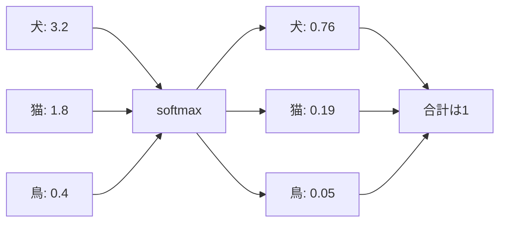

## 第8章　分類問題

**この章でわかること**

- 分類がカテゴリを予測する問題であること
- 二値分類、多クラス分類、softmax の基本
- 精度、適合率、再現率、F値、混同行列の見方
- 言語モデルの次トークン予測を巨大な分類問題として見られること

### 8.1　分類とは何か

分類とは、入力をいくつかのカテゴリのどれかに分ける問題です。機械学習の中でも、分類は非常に基本的で重要です。

```text
画像 → 犬 / 猫
メール本文 → スパム / スパムではない
記事本文 → 政治 / 経済 / スポーツ / 技術
```

分類では、出力は連続的な数値（回帰）ではなく、あらかじめ決められたカテゴリです。家の価格予測のように「5,000万円」を出すのが回帰、「犬」「猫」のようなラベルを出すのが分類です。

ただし、モデルは多くの場合、いきなりカテゴリ名を出すのではなく、まず各カテゴリのスコアや確率を出します。たとえば犬猫分類なら「犬：0.87 / 猫：0.13」と出し、最終的にもっとも確率が高いカテゴリ（犬）を予測結果として選びます。

分類を理解することは、Transformer の理解にもつながります。言語モデルの次トークン予測も、見方を変えれば「語彙の中から次に来るトークンを分類する問題」だからです。


### 8.2　二値分類

分類の中でもっとも単純なのが、二値分類（出力カテゴリが2つだけ）です。スパム判定（スパム / スパムではない）、病気の有無、犬であるかどうか、などです。

二値分類では、モデルは多くの場合、一方のカテゴリである確率を出します（例：スパムである確率0.92）。ただし、確率が出たら自動的にカテゴリが決まるわけではなく、通常はしきい値を決めます。しきい値を0.5にすると、スパム確率0.92はスパム、0.20はスパムではない、と判定されます。

しきい値は必ず0.5でなくてもよいです。正常なメールを誤ってスパム扱いするのを避けたいなら高め（0.9以上でスパム）に、怪しいメールをできるだけ拾いたいなら低め（0.3以上でスパム）にします。このように、二値分類では、モデルが出す確率と、最終判断に使うしきい値を分けて考えることが重要です。

### 8.3　多クラス分類

多クラス分類とは、出力カテゴリが3つ以上ある分類問題です（画像に写っているものの分類、ニュースのジャンル分類、手書き数字認識など）。

多クラス分類では、モデルは各カテゴリに対する確率を出します。

```text
犬：0.70 / 猫：0.20 / 鳥：0.05 / 車：0.03 / 花：0.02   → 予測：犬
合計は1（0.70 + 0.20 + 0.05 + 0.03 + 0.02 = 1.00）
```

このような確率分布を作るために、ニューラルネットワークでは softmax がよく使われます。多クラス分類で重要なのは、「どれか1つに分類する」という前提です。1つの入力に複数のラベルが同時に付く場合（画像に犬・人・車が同時に写っているなど）は、多ラベル分類と呼ばれ、出力や損失関数の設計が少し違います。

### 8.4　ロジスティック回帰

二値分類の基本的なモデルに、ロジスティック回帰があります。名前に「回帰」と入っていますが、分類に使われます。入力特徴量を使って、あるクラスに属する確率を予測するモデルです。

まず、特徴量に重みを掛けて足し合わせ、スコアを計算します。

```text
スコア = 特徴量1 × 重み1 + 特徴量2 × 重み2 + ... + バイアス
```

このスコアはまだ確率ではなく、マイナスにも1より大きくもなります。そこで、シグモイド関数で 0〜1 の範囲に変換します（大きな正の値→1に近い、0→0.5、大きな負の値→0に近い）。

```text
入力特徴量 → 重み付き和でスコア → シグモイドで確率 → しきい値で分類
```

ロジスティック回帰は単純ですが、分類の基本を理解するのに重要です。ニューラルネットワークの分類も、最終的には「スコアを出し、確率に変換し、正解とのズレを小さくする」という考え方に基づいています。

### 8.5　softmax

多クラス分類で非常によく使われる関数が softmax です。複数のスコアを確率分布に変換します。

モデルが犬・猫・鳥に「3.2 / 1.8 / 0.4」というスコアを出したとします。これはまだ確率ではありません（合計5.4、マイナスにもなりうる）。softmax を使うと、次のような確率に変換されます。

```text
スコア      犬：3.2 / 猫：1.8 / 鳥：0.4
softmax後   犬：0.76 / 猫：0.19 / 鳥：0.05（すべて0以上、合計1）
```

softmax の重要な性質は、スコアが高いカテゴリほど高い確率になることです。単にスコアを合計で割るのではなく、スコアの差が確率の差として強調されます。



Transformer や大規模言語モデルでも softmax は重要です。語彙が50,000トークンあるなら、モデルは50,000個のスコアを出し、softmax で50,000個のトークンに対する確率分布を作り、その分布をもとに次のトークンを選びます。つまり、言語モデルの出力も大きな多クラス分類として見られます。

#### PyTorchで確認してみる

```python
import torch
import torch.nn.functional as F

labels = ["dog", "cat", "bird"]
logits = torch.tensor([[3.2, 1.8, 0.4]])

probabilities = F.softmax(logits, dim=1)
predicted_id = torch.argmax(probabilities, dim=1).item()

print("probabilities:", probabilities)
print("predicted label:", labels[predicted_id])
print("sum:", probabilities.sum().item())
```

`logits` は確率になる前のスコアです。`softmax` 後の値はすべて0以上になり、合計は1になります。

### 8.6　確率として出力する

分類モデルが確率を出すことには、重要な意味があります。単に「犬」と出すだけでなく確率を出すことで、モデルの自信の度合いを表せます。

```text
犬：0.99 / 猫：0.01  → かなり強く犬だと判断
犬：0.51 / 猫：0.49  → 犬と猫でほとんど迷っている
```

どちらも予測は犬ですが、意味はかなり違います。この違いは実用上重要です。確率を出すことで、しきい値を調整したり、自信のないケースを人間の確認に回したりできます（例：スパム確率0.95以上は自動で迷惑メールへ、0.50〜0.95は注意表示）。

ただし、モデルが出す確率が、必ずしも現実の確率として正確とは限りません。「90%の確率で正しい」と出していても、本当に同じようなケースで90%正しいとは限らないのです。この「モデルの出す確率が現実の正しさの確率とどれくらい合っているか」を calibration と呼びます。確率を出すことは便利ですが、その確率をどこまで信頼できるかも重要です。

### 8.7　しきい値

二値分類では、モデルが出した確率をもとに最終カテゴリを決めます。このときに使う境界値が、しきい値です。

同じ「スパム確率0.72」でも、しきい値0.5ならスパム、しきい値0.9ならスパムではない、と判定されます。同じモデルの出力でも、しきい値によって最終判断は変わります。

```text
しきい値を低くする → 検出しやすくなるが、誤検出も増えやすい
しきい値を高くする → 誤検出は減りやすいが、見逃しも増えやすい
```

これは用途によって調整します。病気の検査で見逃しを減らしたいならしきい値を低めに、誤って病気だと判定する負担が大きいなら高めにします。スパム判定でも、正常メールの誤分類を強く避けたいなら高く、少しでも怪しいメールを隔離したいなら低くします。つまり、しきい値はモデルの性質だけでなく、業務上の判断やリスク設計に関係します。分類モデルを使うときは、モデルが出す確率と、最終判断のしきい値を分けて考えることが大切です。

### 8.8　分類の評価指標（精度・混同行列・適合率・再現率・F値）

分類でよく使われる評価指標の一つに、精度（accuracy）があります。全体のうちどれくらい正しく分類できたかを表します。

```text
精度 = 正解した数 / 全体の数   （100枚中90枚正解なら精度0.90）
```

精度は直感的ですが、注意点があります。クラスの偏りが大きい場合、精度だけを見ると危険です。病気の人が全体の1%しかいないとき、すべての人を「病気ではない」と予測すれば精度99%になりますが、病気の人を一人も見つけられません。だから、分類問題では、適合率、再現率、F値、混同行列なども使います。

**混同行列**

分類モデルの結果を詳しく見るために、混同行列（confusion matrix）という表を使います。二値分類では、結果を4種類に分けられます。

```text
                    予測：病気あり   予測：病気なし
実際：病気あり        真陽性          偽陰性
実際：病気なし        偽陽性          真陰性
```

- 真陽性：実際に陽性で、モデルも陽性と予測した
- 偽陰性：実際に陽性なのに、モデルは陰性と予測した（病気なのに見逃した）
- 偽陽性：実際には陰性なのに、モデルは陽性と予測した（病気ではないのに病気かもと判定）
- 真陰性：実際に陰性で、モデルも陰性と予測した

どちらの誤りがより問題かは用途によって変わります。見逃しが危険な病気なら偽陰性を減らすことが、偽陽性によって不要な検査や不安が増える場合は偽陽性を減らすことが重要です。混同行列を見ると、単なる精度だけではわからない誤り方を確認できます。分類モデルを評価するときは、何件当たったかだけでなく、どのように間違えたかを見ることが重要です。

**適合率**

適合率（precision）は、モデルが陽性と予測したもののうち、実際に陽性だった割合です。

```text
適合率 = 真陽性 / (真陽性 + 偽陽性)
（100件を「病気あり」と予測し、80件が本当に病気なら適合率0.80）
```

適合率が高いとは、陽性と判定したものが実際に正しいことが多い、つまり誤検出が少ないという意味です。スパム判定なら、正常なメールを誤ってスパム扱いすることが少ない。誤って陽性と判定するコストが高い場合に重視します。ただし、適合率だけを高くしようとすると、モデルが非常に慎重になりすぎ、多くの陽性を見逃す可能性があります。そこで再現率も見る必要があります。

**再現率**

再現率（recall）は、実際に陽性であるもののうち、モデルが陽性と見つけられた割合です。

```text
再現率 = 真陽性 / (真陽性 + 偽陰性)
（実際に病気の人100人中90人を見つけられたら再現率0.90）
```

再現率が高いとは、見逃しが少ないという意味です。見逃しが重大な結果につながる病気のスクリーニングなどで重要になります。ただし、再現率だけを高くしようとすると、何でも陽性と判定するモデルになりかねません（すべてのメールをスパムと判定すれば再現率は100%になるが、実用上困る）。

適合率と再現率は、しばしばトレードオフの関係になります。適合率を上げようとすると再現率が下がり、逆もまた起こります。分類モデルを評価するときは、何を重視するかに応じて、適合率と再現率を見分ける必要があります。

**F値**

F値（F-score / F1-score）は、適合率と再現率をまとめて評価する指標です。片方だけを見ると偏った評価になるので、バランスを見るために使います。代表的なのが F1値で、適合率と再現率の調和平均です。

```text
F1 = 2 × 適合率 × 再現率 / (適合率 + 再現率)
```

調和平均は、直感的には「低い方の値に強く引っ張られる平均」です。適合率0.90・再現率0.90ならF1も0.90ですが、適合率0.90・再現率0.10ならF1は低くなります。つまり、F1値を高くするには適合率と再現率の両方がある程度高い必要があります。F1値はクラスの偏りがある分類問題でよく使われますが、常に最適というわけではなく、用途によっては適合率や再現率を重視すべき場合もあります。

### 8.9　分類モデルの評価

分類モデルを評価するときは、単一の指標だけに頼らないことが重要です。

精度は直感的ですが、クラスの偏りがある場合は危険です（病気1%のデータで全員を「病気なし」と予測すれば精度99%でも病気を一人も見つけられない）。そこで、混同行列でどの種類の間違いがどれだけ起きているかを見て、適合率（陽性予測の正しさ）、再現率（実際の陽性の検出率）、F1値（両者のバランス）を見ます。

分類モデルを評価するときは、次の問いを考える必要があります。

```text
どのクラスを間違えやすいか / 偽陽性と偽陰性のどちらが多いか
見逃しを減らしたいのか、誤検出を減らしたいのか / しきい値は適切か
本番データでも同じ性能が出そうか
```

評価指標は、モデルの目的に合わせて選ぶ必要があります。病気のスクリーニング、スパム判定、画像分類、異常検知では、それぞれ重視すべき指標が違います。分類問題では「正解率が高いからよい」と単純には言えず、どのような間違いが許され、どのような間違いが重大で、どの指標が本来の目的に近いのかを考えることが重要です。

### 8.10　分類と損失関数

分類問題では、学習時に損失関数を使います。特によく使われるのが交差エントロピーです。二値分類では二値交差エントロピー、多クラス分類では softmax と交差エントロピーを組み合わせて使うことが多いです。

分類における交差エントロピーは、直感的には「正解クラスにどれくらい高い確率を割り当てたか」を見ています。正解が犬のとき「犬：0.90 / 猫：0.10」はよい予測（損失小）、「犬：0.10 / 猫：0.90」は悪い予測（損失大）です。

ここで重要なのは、分類の最終結果だけでなく、確率の大きさが学習に影響することです。正解が犬のとき「犬：0.51」も「犬：0.99」も最終分類は犬ですが、後者の方が正解クラスに高い確率を出しているので損失は小さくなります。つまり、交差エントロピーを使うと、モデルは単に正解を一番にするだけでなく、正解クラスに高い確率を割り当てるように学習します。この仕組みは言語モデルでもそのまま使われ、次トークン予測では語彙中の正解トークンに高い確率を出すように損失を小さくします。

### 8.11　言語モデルは巨大な分類問題として見られる

Transformer や大規模言語モデルを理解する上で、分類問題の考え方は非常に重要です。

言語モデルは、文脈を入力として、次に来るトークンを予測します。入力「吾輩は」に対し、正解の次トークンが「猫」だったとき、モデルは語彙全体に対して確率を出します。

```text
猫：0.35 / 犬：0.08 / 人間：0.04 / ...
```

語彙に50,000個のトークンがあるなら、50,000個の候補それぞれに確率を出します。これは50,000クラスの分類問題と見られます（入力：ここまでのトークン列、出力：次に来るトークンのカテゴリ）。

生成時には、予測したトークンを入力に追加し、次のトークンをまた予測します。

```text
吾輩は → 猫 → 吾輩は猫 → で → 吾輩は猫で → ある
```

このように、次トークン分類を繰り返すことで文章が生成されます。つまり、言語生成は一回の分類で終わるのではなく、分類を連続して行うプロセスと見られます。大規模言語モデルは複雑に見えますが、学習の基本は「文脈を入力 → 次トークンの確率分布を出す → 正解トークンと比較 → 交差エントロピー損失を計算 → 損失が小さくなるように重みを更新」で、これは分類問題の基本と同じ構造です。

### 8.12　本章のまとめ

**Transformer への接続**

言語モデルは、各位置で「語彙の中から次のトークンを選ぶ」巨大な多クラス分類問題として見られます。語彙が50,000個あれば、モデルは50,000個の候補にスコアを出し、softmax で確率分布にします。分類問題の softmax と交差エントロピーを理解しておくと、言語モデルの出力がかなり見えやすくなります。

**ミニ演習**

- この章の PyTorch コードで、`logits` の値を変えて softmax の出力がどう変わるか確認してみましょう。
- しきい値を `0.5` から `0.8` に変えると、二値分類の結果はどう変わりそうか考えてみましょう。
- 言語モデルの語彙数が50,000の場合、次トークン予測は何クラス分類として見られるか答えてみましょう。

この章では、分類問題について学びました。分類とは、入力をあらかじめ決められたカテゴリのどれかに分ける問題です。出力カテゴリが2つなら二値分類、3つ以上なら多クラス分類です。

分類モデルは、多くの場合、各カテゴリに対する確率を出します。二値分類ではシグモイドで陽性クラスの確率を、多クラス分類では softmax で確率分布を作ります。評価では、精度だけでなく、混同行列、適合率（陽性予測の正しさ）、再現率（実際の陽性の検出率）、F値（両者のバランス）を見ることが重要です。特にクラスの偏りがある問題では、精度だけを見ると誤解することがあります。

この章で一番重要な考え方は、次の一文です。

**分類問題とは、入力に対してカテゴリごとの確率を予測し、その確率に基づいて最終的なカテゴリを決める問題である。**

Transformer や大規模言語モデルも、この考え方と深くつながっています。言語モデルは文脈を入力し、語彙全体の中から次に来るトークンを予測する、巨大な多クラス分類問題として見られます。そのため、softmax、交差エントロピー、確率分布、分類評価の考え方は、Transformer を理解するための重要な土台になります。

---

<!-- chapter-nav:start -->

[← 第7章　過学習と汎化](Chapter%207%20Overfitting%20and%20Generalization.md) ｜ [目次](Table%20of%20Contents.md) ｜ [第9章　回帰問題 →](Chapter%209%20Regression%20Problems.md)

<!-- chapter-nav:end -->
