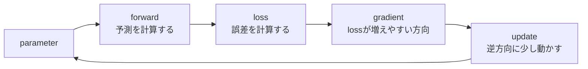

# 第11章 勾配降下法

**この章のゴール**

勾配の逆方向へパラメータを更新する考え方を理解し、`optimizer.zero_grad()`、`loss.backward()`、`optimizer.step()` の役割を説明できるようになること。

## 11.1 勾配降下法とは何か

前章で、勾配は「パラメータを少し変えたときlossがどう変わるか」をまとめたもので、lossが増えやすい方向を表すと学びました。学習でやりたいのはlossを小さくすることなので、勾配とは逆向きにパラメータを動かします。

```text
勾配の方向に動く → lossが増えやすい
勾配の逆方向に動く → lossが減りやすい
```

この考え方でパラメータを更新する方法を **勾配降下法**（gradient descent）と呼びます。基本的な更新式は次の通りです。

```text
parameter = parameter - learning_rate * gradient
```



たとえば `w = 3.0`、勾配 `2.0`、学習率 `0.1` なら `w = 3.0 - 0.1 * 2.0 = 2.8` で、勾配がプラスなので `w` は減ります（増やすとlossが増えるから減らす）。勾配が `-2.0` なら `w = 3.0 - 0.1 * (-2.0) = 3.2` で増えます。このように勾配降下法は、勾配を使ってlossが小さくなる方向にパラメータを少しずつ動かす方法です。

---

## 11.2 損失を小さくする方向に重みを更新する

勾配降下法の目的は損失を小さくすることです。例として `loss = (w - 5)^2` を考えます。この関数は `w = 5` のとき最小（loss=0）になります。

最初に `w = 2` だったとします。微分は `d loss / d w = 2(w - 5)` なので、`w = 2` での勾配は `2(2-5) = -6`（マイナス）です。学習率 `0.1` で更新すると、

```text
w = 2 - 0.1 * (-6) = 2.6
```

`w` は増え、5に近づきました。逆に `w = 7` なら勾配は `2(7-5) = 4`（プラス）で、`w = 7 - 0.1 * 4 = 6.6` と減ります。どちらもlossを小さくする方向です。

このように勾配降下法は「今の場所での勾配を計算 → 勾配の逆方向に少し動かす → lossが下がる」を何度も繰り返し、パラメータをよい値に近づけていきます。

---

## 11.3 学習率

勾配降下法では **学習率** が重要です。学習率は、1回の更新でどれくらいパラメータを動かすかを決める値です（更新式の `learning_rate`）。

勾配が `2.0` のとき、学習率 `0.1` なら更新量は `0.2`、学習率 `0.01` なら `0.02` です。学習率が大きいほど一度に大きく動き、小さいほど少しずつ動きます。

```text
学習率が大きすぎる → 最小値を飛び越える → lossが下がらない、場合によっては発散
学習率が小さすぎる → 少しずつしか動かない → lossは下がるが時間がかかる
```

そのため学習率は非常に重要なハイパーパラメータです。ハイパーパラメータとは、モデルが学習する値（重み・バイアス・embedding）ではなく、人間が設定する値（学習率・バッチサイズ・層の数・hidden sizeなど）です。

実際の大規模なTransformerでは、一定の学習率ではなく学習率スケジュール（最初に上げて warmup、その後下げる decay）を使うことが多いです。この段階では「学習率は、勾配に沿ってどれくらい動くかを決める値である」と理解できれば十分です。

---

## 11.4 更新式の意味

更新式 `parameter = parameter - learning_rate * gradient` は短いですが、ニューラルネットワークの学習の中心です。

`gradient` は「そのパラメータを少し増やしたときlossがどう変わるか」です。勾配がプラスなら増やすとlossが増えるので減らすべき。更新式は `- learning_rate * gradient` なので、勾配がプラスならパラメータは減ります。勾配がマイナスなら `- (マイナス) = +` でパラメータは増えます。つまり更新式は自動的にlossが下がる方向へ動くようになっています。

`learning_rate * gradient` が実際の更新量で、勾配が大きければ大きく、学習率が大きければ全体的に大きく動きます。直感的には「lossが下がる方向へ、少しだけ動く」です。

PyTorchでoptimizerを使う場合、この更新式は内部で実行されます。

```python
loss.backward()    # 各パラメータの勾配を計算する
optimizer.step()   # 勾配を使ってパラメータを更新する
```

---

## 11.5 勾配が大きい場合と小さい場合

勾配の大きさは、lossの変化の激しさを表します。勾配が大きいと、そのパラメータを少し変えるだけでlossが大きく変わります。小さいとあまり変わりません。

勾配 `10.0`・学習率 `0.1` なら更新量は `1.0`（大きく動く）、勾配 `0.01` なら `0.001`（少ししか動かない）です。

勾配が大きいことは必ずしも良いことではありません。大きすぎると更新が大きくなりすぎ、lossが急に大きくなって学習が壊れることがあります。これを **勾配爆発** と呼びます。逆に勾配が小さすぎるとパラメータがほとんど更新されず学習が進みません。これを **勾配消失** と呼びます。

Transformerでは、残差接続やLayer Normalizationが、深いネットワークの学習を安定させる重要な役割を持ちます。この段階では次の直感を持っていれば十分です。

```text
勾配は、lossを変える方向と強さを表す
勾配が大きいと大きく、小さいと小さく更新される
大きすぎても小さすぎても学習は難しくなる
```

---

## 11.6 局所最適と大域最適

勾配降下法はlossを小さくする方向に進みますが、常に一番よい場所にたどり着けるとは限りません。ここで **局所最適** と **大域最適** という考え方が出てきます。大域最適は全体で最もlossが小さい場所、局所最適は周辺だけ見ると一番よいが全体で一番とは限らない場所です。

lossを地形の高さ（高い＝lossが大きい）だと考えると、勾配降下法は今いる場所から坂を下っていきます。しかし複数の谷がある地形では、近くの谷（局所最適）に入ってしまうことがあります。

ニューラルネットワークのlossの地形は非常に高次元で複雑で、単純な山や谷の図で完全に説明できるものではありません（鞍点、平坦な領域、勾配のスケール、データのノイズなどさまざまな要素があります）。この教科書では次の理解で十分です。

```text
勾配降下法は、lossが下がる方向に少しずつ進む
ただし、lossの地形が複雑なので、進み方には工夫が必要である
```

---

## 11.7 ニューラルネットワークの学習との関係

ニューラルネットワークの学習は勾配降下法を中心に回っています。大まかな流れは「入力を入れる → 予測を出す → lossを計算する → 各パラメータの勾配を計算する → 勾配で更新する → 繰り返す」です。PyTorch風に書くと次のようになります。

```python
logits = model(inputs)
loss = loss_fn(logits, targets)

optimizer.zero_grad()   # 前回の勾配をリセット
loss.backward()         # 各パラメータの勾配を計算
optimizer.step()        # 勾配を使ってパラメータを更新
```

Transformerでも同じです。言語モデルなら「token_ids → Transformer → logits → cross entropy → loss → backward → parameter update」という流れで、学習されるパラメータ（embedding table、Q/K/VのLinear層、Attention出力のLinear層、FFN、LayerNorm、出力層）はたくさんあります。`loss.backward()` でこれらすべての勾配が計算され、`optimizer.step()` で各パラメータが更新されます。

実際にはSGDだけでなくAdamやAdamWを使うことが多いです。これらは勾配の履歴やスケールを使って更新量を調整しますが、基本的な考え方（勾配を使ってlossが小さくなる方向にパラメータを更新する）は同じです。

---

## 11.8 PyTorchで勾配降下法を実装する

PyTorchで勾配降下法を手で実装します。`loss = (w - 5)^2` を `w = 0` から最小化します。

```python
import torch

w = torch.tensor(0.0, requires_grad=True)
learning_rate = 0.1

for step in range(10):
    loss = (w - 5) ** 2
    loss.backward()
    with torch.no_grad():
        w -= learning_rate * w.grad
    w.grad.zero_()
    print(step, "w:", round(float(w), 3), "loss:", round(float(loss), 3))
```

```text
0 w: 1.0   loss: 25.0
1 w: 1.8   loss: 16.0
2 w: 2.44  loss: 10.24
...
9 w: 4.463 loss: 0.45
```

`w` が少しずつ5に近づき、lossも小さくなります。流れは「lossを計算する → 勾配を計算する（`backward`）→ パラメータを更新する → 勾配をリセットする（`zero_`）」です。この小さな例ではパラメータは `w` 1つだけですが、ニューラルネットワークでは同じことを大量のパラメータに対して行います。

---

## 11.9 PyTorchのoptimizerを使う

前節では更新を手で書きましたが、実際はoptimizerを使うことが多いです。SGD optimizerで同じことをします。

```python
import torch

w = torch.tensor(0.0, requires_grad=True)
optimizer = torch.optim.SGD([w], lr=0.1)

for step in range(10):
    loss = (w - 5) ** 2
    optimizer.zero_grad()
    loss.backward()
    optimizer.step()
    print(step, "w:", round(float(w), 3), "loss:", round(float(loss), 3))
```

前節と同じように `w` が5に近づきます。重要なのは次の3行で、PyTorchの学習ループで非常によく出てきます。

```python
optimizer.zero_grad()   # 前回の勾配をリセット
loss.backward()         # 現在のlossに対する勾配を計算
optimizer.step()        # 勾配を使ってパラメータを更新
```

実際のモデルでは `[w]` の代わりにモデル全体のパラメータを渡します（`torch.optim.SGD(model.parameters(), lr=0.1)`）。TransformerやLLMではAdamWを使うことが多いです（`torch.optim.AdamW(model.parameters(), lr=1e-4)`）。AdamWの中身はSGDより複雑ですが、上の3行という基本形は同じです。

---

## 11.10 小さな線形モデルを学習させる

もう少し機械学習らしい例として、`y = 2x + 1` という関係を線形モデル `y_pred = wx + b` で学習します。

```python
import torch
import torch.nn as nn
import torch.nn.functional as F

x = torch.tensor([[1.0], [2.0], [3.0], [4.0]])
y_true = torch.tensor([[3.0], [5.0], [7.0], [9.0]])

model = nn.Linear(1, 1)
optimizer = torch.optim.SGD(model.parameters(), lr=0.01)

for step in range(1000):
    y_pred = model(x)
    loss = F.mse_loss(y_pred, y_true)
    optimizer.zero_grad()
    loss.backward()
    optimizer.step()

print("weight:", model.weight.data)   # ≒ 2
print("bias:", model.bias.data)       # ≒ 1
```

学習がうまくいくと weight は2、bias は1に近づきます。流れは「xを入れる → y_predを出す → lossを計算 → backward → optimizer.stepでweightとbiasを更新」を1000回繰り返すだけです。この例は小さいですが、ニューラルネットワークの学習の基本は同じで、Transformerでもモデルが大きくなるだけで流れは変わりません。

---

## 11.11 小さな言語モデル風の学習ループ

言語モデルに近い形の学習ループを見ます。本物のTransformerではなく、embeddingと線形層だけの小さなモデルで、次トークン予測の学習ループを確認します。

```python
import torch
import torch.nn as nn
import torch.nn.functional as F

token_ids = torch.tensor([
    [1, 2, 3, 4, 5],
    [2, 3, 4, 5, 6],
])

inputs = token_ids[:, :-1]
targets = token_ids[:, 1:]

vocab_size, d_model = 10, 8
embedding = nn.Embedding(vocab_size, d_model)
output_layer = nn.Linear(d_model, vocab_size)

params = list(embedding.parameters()) + list(output_layer.parameters())
optimizer = torch.optim.AdamW(params, lr=0.01)

for step in range(100):
    hidden = embedding(inputs)
    logits = output_layer(hidden)
    B, T, V = logits.shape
    loss = F.cross_entropy(logits.reshape(B * T, V), targets.reshape(B * T))

    optimizer.zero_grad()
    loss.backward()
    optimizer.step()

    if step % 20 == 0:
        print(step, "loss:", round(float(loss), 4))
```

流れは「inputs → embedding → hidden → output_layer → logits → cross entropy → loss → backward → update」です。これは小さな例ですが、言語モデル学習の骨格（次トークン予測・cross entropy loss・backward・optimizer step）を含んでいます。本物のTransformerでは、embeddingとoutput_layerの間にTransformer blockが入りますが、勾配降下法の流れは同じです。

---

## 11.12 SGD、Adam、AdamWの直感

SGDは Stochastic Gradient Descent（確率的勾配降下法）の略で、基本はシンプルです。

```text
parameter = parameter - learning_rate * gradient
```

実際の深層学習では、AdamやAdamW（TransformerやLLMでは特にAdamW）がよく使われます。細かい数式には深入りせず直感だけ押さえます。SGDは今の勾配を見てその逆方向に動きます。Adamは勾配の移動平均や勾配の大きさの情報を使って更新量を調整します（最近の勾配の傾向を見る、スケールを考慮する、パラメータごとに更新量を調整する）。AdamWはAdamにweight decay（パラメータが大きくなりすぎるのを抑える正則化）の扱いを改善したものです。

最初に理解すべきはoptimizerの細かい違いではありません。どのoptimizerでも基本は「lossを計算 → 勾配を計算 → optimizerがパラメータを更新」という流れで、PyTorchのコードはSGDでもAdamWでも基本形が同じです。

```python
optimizer.zero_grad()
loss.backward()
optimizer.step()
```

`SGD(model.parameters(), lr=0.01)` でも `AdamW(model.parameters(), lr=1e-4)` でも、学習ループの基本形は変わりません。

---

## 11.13 まとめ

この章では、勾配降下法について学びました。勾配降下法は、lossを小さくするためにパラメータを勾配の逆方向へ更新する方法です。

```text
parameter = parameter - learning_rate * gradient
```

勾配はlossが増えやすい方向を表すので、lossを小さくするには勾配の逆方向に動きます。学習率は1回の更新でどれくらい動くかを決める値で、大きすぎると不安定になり、小さすぎると学習が遅くなります。

ニューラルネットワークの学習ループは「予測する → lossを計算する → 勾配を計算する → パラメータを更新する → 繰り返す」で、PyTorchでは次の3行が基本です。

```python
optimizer.zero_grad()   # 前回の勾配をリセット
loss.backward()         # 現在のlossに対する勾配を計算
optimizer.step()        # 勾配を使ってパラメータを更新
```

Transformerでも学習の基本（token_ids → Transformer → logits → cross entropy loss → backward → optimizer step）は同じです。この章で特に重要なのは、次の理解です。

```text
勾配降下法はlossを小さくするための更新方法である
勾配の逆方向にパラメータを動かす
学習率は更新の大きさを決める
PyTorchではoptimizerが更新を担当する
Transformerでも基本の学習ループは同じである
```

### 確認問題

次の条件で、`w` はいくつになりますか。

```text
w = 3.0, gradient = 2.0, learning_rate = 0.1
更新式: w = w - learning_rate * gradient
```

答えは `w = 3.0 - 0.1 * 2.0 = 2.8` です。

### よくある誤解

勾配は、lossが増えやすい方向を表します。学習ではlossを小さくしたいので、勾配の逆方向に動かします。

次章では、合成関数と連鎖律について学びます。ニューラルネットワークは多くの関数を重ねたもの（入力 → embedding → 線形層 → Attention → FFN → 出力層 → loss）で、何段階もの計算を通してlossが作られます。そのlossから前の層のパラメータにどうやって勾配を伝えるのか、その考え方の中心になるのが連鎖律です。

---

<!-- chapter-nav:start -->

[← 第10章 微分の直感](Chapter%2010%20-%20The%20Intuition%20Behind%20Differentiation.md) ｜ [目次](Table%20of%20Contents.md) ｜ [第12章 合成関数と連鎖律 →](Chapter%2012%20-%20Composite%20Functions%20and%20the%20Chain%20Rule.md)

<!-- chapter-nav:end -->
