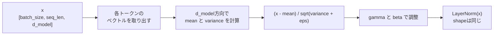

# 第13章 正規化

**この章のゴール**

平均・分散・標準偏差を使って値のスケールを整える考え方を理解し、LayerNormと残差接続がTransformerで重要な理由を説明できるようになること。

## 13.1 平均とは何か

この章では **正規化** について学びます。Transformerでは特に **Layer Normalization** が重要で、値のスケールを整えて学習を安定させるために使われます。その前提として、まず「平均」「分散」「標準偏差」を理解します。

平均とは、複数の値を足して個数で割ったものです。`[2.0, 4.0, 6.0]` なら平均は `(2+4+6)/3 = 4.0` で、データ全体の中心のような値です。

平均は便利ですが、データの広がりまでは表しません。たとえば `A = [4.0, 4.0, 4.0]` と `B = [2.0, 4.0, 6.0]` はどちらも平均4.0ですが、Aはばらつきがなく、Bはばらつきがあります。この「ばらつき」を表すのが次の分散と標準偏差です。

LayerNormでも平均を計算します。あるトークンのベクトル `x = [2.0, 4.0, 6.0]`（平均4.0）について、平均を引くと値の中心が0に近づきます。

```text
[2.0, 4.0, 6.0] - 4.0 = [-2.0, 0.0, 2.0]
```

---

## 13.2 分散とは何か

**分散** は、値が平均からどれくらい散らばっているかを表す値です。`x = [2.0, 4.0, 6.0]`（平均4.0）で計算します。各値から平均を引くと `[-2.0, 0.0, 2.0]` ですが、これをそのまま足すとプラスとマイナスが打ち消し合って0になります。そこで二乗します。

```text
(-2.0)^2 = 4.0, 0.0^2 = 0.0, 2.0^2 = 4.0
分散 = (4.0 + 0.0 + 4.0) / 3 = 2.666...
```

分散の手順は「平均を計算 → 各値から平均を引く → 二乗する → その平均を取る」で、「平均からの差の二乗の平均」です。分散が小さいほど値は平均の近くに集まり、大きいほど平均から離れています。平均が同じ `4.0` でも、`[4,4,4]` の分散は0、`[2,4,6]` は2.666、`[0,4,8]` は10.666と、ばらつきによって変わります。LayerNormではこの分散を使って値のスケールをそろえます。

---

## 13.3 標準偏差とは何か

**標準偏差** は分散の平方根です。分散は差を二乗して計算するので元の値と単位感が変わりますが、平方根を取ると元のスケールに近づきます。`x = [2.0, 4.0, 6.0]` の分散は2.666なので、標準偏差は `sqrt(2.666) ≒ 1.633` です。標準偏差は、値が平均からだいたいどれくらい離れているかを表します。

LayerNormでは、平均との差を標準偏差で割ります。

```text
正規化された値 = (x - 平均) / 標準偏差
```

`x = [2.0, 4.0, 6.0]`、平均4.0、標準偏差1.633なら、

```text
[-2.0, 0.0, 2.0] / 1.633 = [-1.225, 0.0, 1.225]
```

この操作によって値の中心が0になり、スケールもそろいます。この「中心をそろえ、スケールをそろえる」という考え方が正規化です。

---

## 13.4 正規化とは何か

**正規化** とは、値の中心やスケールをそろえる操作です。ニューラルネットワークでは値が大きすぎたり小さすぎたりすると学習が不安定になることがあるので、途中の値を扱いやすい範囲に整えます。基本形は次の通りです。

```text
正規化された値 = (x - 平均) / 標準偏差
```

この式には2つの操作が含まれます。平均を引いて値の中心を0に近づけ、標準偏差で割ってばらつきの大きさをそろえます。`x = [2.0, 4.0, 6.0]` を正規化すると `[-1.225, 0.0, 1.225]` になり、平均はほぼ0、標準偏差はほぼ1になります。

ニューラルネットワークでは、層を重ねるにつれて値のスケールが変わっていくことがあります（ある層では大きくなり、別の層では小さくなる）。このような状態だと学習が不安定になりやすいので、正規化を入れて各層の入力や出力のスケールを整えます。Transformerでは、LayerNormによって各トークンのベクトルを正規化します。

---

## 13.5 なぜ値のスケールを整えるのか

ニューラルネットワークでは値のスケールが重要です。値が大きすぎると計算が不安定になり、小さすぎると勾配が小さくなって学習が進みにくくなります。

ニューラルネットワークでは線形変換・活性化関数・softmax・正規化・残差接続といった計算が何層も重なり、途中の値の大きさが変わっていきます。ある層の出力が `[100.0, 200.0, -150.0]` のように非常に大きくなると、次の層でsoftmaxが極端になったり勾配が不安定になったりします。逆に `[0.0001, -0.0002, 0.0003]` のように非常に小さくなると、信号が弱くなり学習が進みにくくなります。

Transformerは何層ものブロックを重ねるので、各層で値のスケールを整えることが重要です。LayerNormはこのために使われ、値の中心とばらつきをそろえて学習を安定させます。正規化は勾配の流れにも関係し、値のスケールが極端だと勾配も極端になりやすいので、整えると勾配も扱いやすくなります。この章では、正規化を「ニューラルネットワークの中を流れる値のスケールを整えるための操作」と理解します。

---

## 13.6 Layer Normalizationの直感

Transformerで使われる代表的な正規化が **Layer Normalization** です。これは各トークンのベクトルごとに正規化を行います。Transformerのテンソルはよく `[batch_size, seq_len, d_model]`（文の数、トークン数、各トークンのベクトル次元）というshapeになり、LayerNormは基本的に最後の次元 `d_model` に沿って平均と分散を計算します。

たとえば2個のトークン `token_1 = [2.0, 4.0, 6.0]`、`token_2 = [10.0, 20.0, 30.0]` があるとき、LayerNormはそれぞれを別々に（各トークンのベクトルの中で）正規化します。



これがBatch Normalizationとは違う点です。Batch Normはバッチ方向の統計量を使うことがありますが、LayerNormは各サンプル・各トークンの内部で正規化します。Transformerでは可変長の系列や小さいバッチでも扱いやすいので、LayerNormがよく使われます。基本式は次の通りです。

```text
LayerNorm(x) = (x - mean) / sqrt(variance + eps)
```

`eps` はとても小さい値（`1e-5` など）で、標準偏差が0に近い場合に0で割ることを防ぎます。実際のLayerNormでは、この正規化の後に学習可能なスケールとシフトを加えます。

```text
output = gamma * normalized_x + beta
（gamma: 学習可能なスケール / beta: 学習可能なシフト）
```

正規化した後にまたスケールとシフトを入れるのは、モデルが必要に応じて表現のスケールや中心を調整できるようにするためです。正規化で安定させつつ、必要なら学習によって戻せる、というこの柔軟性が重要です。

---

## 13.7 TransformerにLayerNormが必要な理由

Transformerが深いネットワークだからLayerNormが重要です。Transformer blockは主にSelf-Attention、Feed Forward Network、Residual Connection、Layer Normalizationからできていて、これを何層も重ねます。層を重ねると途中の値の分布が変わりやすく、スケールが安定しないと学習も安定しにくくなります。LayerNormは各層で値のスケールを整え、深いネットワークでも学習しやすくします。

残差接続も重要です。残差接続では入力にサブレイヤーの出力を足します（`x + Sublayer(x)`）。このような加算を何層も繰り返すと値のスケールが変わりやすくなるので、LayerNormがそのスケールを整えます。元論文のTransformerでは次の形（**Post-LN**）が使われています。

```text
LayerNorm(x + Sublayer(x))
```

最近のTransformer実装では次の形（**Pre-LN**）もよく使われます。

```text
x + Sublayer(LayerNorm(x))
```

まず細かい違いに深入りしなくて大丈夫です。重要なのは、TransformerではLayerNormが「値のスケールを整える・深いネットワークの学習を安定させる・残差接続と組み合わせて使う」ために使われるということです。『Attention Is All You Need』を読むと `LayerNorm(x + Sublayer(x))`（サブレイヤーの出力を元の入力に足し、その結果をLayerNormで正規化する）という式が出てきます。これが読めると、Transformerの構造図がかなり読みやすくなります。

---

## 13.8 PyTorchで平均・分散・標準偏差を確認する

PyTorchで平均・分散・標準偏差を計算し、正規化を確認します。

```python
import torch

x = torch.tensor([2.0, 4.0, 6.0])
mean = x.mean()
var = x.var(unbiased=False)
std = x.std(unbiased=False)

print(mean, var, std)   # tensor(4.) tensor(2.6667) tensor(1.6330)

x_norm = (x - mean) / std
print(x_norm)                          # tensor([-1.2247,  0.0000,  1.2247])
print(x_norm.mean(), x_norm.std(unbiased=False))  # tensor(0.) tensor(1.)
```

`unbiased=False` は、値の個数 `N` で割る分散を計算するためです（LayerNormの理解ではこの形がわかりやすい）。正規化後は平均0、標準偏差1になります。

2つのトークンを持つ行列でも、各行（各トークンのベクトル）ごとに正規化できます。

```python
import torch

x = torch.tensor([[2.0, 4.0, 6.0], [10.0, 20.0, 30.0]])
mean = x.mean(dim=-1, keepdim=True)
var = x.var(dim=-1, keepdim=True, unbiased=False)
x_norm = (x - mean) / torch.sqrt(var)

print(x_norm)
# tensor([[-1.2247, 0.0000, 1.2247],
#         [-1.2247, 0.0000, 1.2247]])
```

各行ごとに平均と標準偏差を計算しており、これはLayerNormの考え方に近いです。

---

## 13.9 PyTorchでLayerNormを確認する

PyTorchには `nn.LayerNorm` があります。`nn.LayerNorm(d_model)` は最後の次元 `d_model` に沿って正規化します。

```python
import torch
import torch.nn as nn

batch_size, seq_len, d_model = 2, 4, 8
x = torch.randn(batch_size, seq_len, d_model)

layer_norm = nn.LayerNorm(d_model)
y = layer_norm(x)

print(x.shape, y.shape)   # [2, 4, 8] [2, 4, 8]
print(y.mean(dim=-1))     # 各トークンごとにほぼ 0
print(y.std(dim=-1, unbiased=False))  # 各トークンごとにほぼ 1
```

各トークンごとに最後の次元の平均が0、標準偏差が1になります。重要なのは、LayerNormは値を正規化しますがshapeは変えないことです。これはTransformer実装で重要で、残差接続 `x + Sublayer(x)` で元の `x` と足し合わせるには `x` と `Sublayer(x)` のshapeが同じである必要があるからです。LayerNormはshapeを変えないので、Transformer blockの中で使いやすいのです。

---

## 13.10 LayerNormのgammaとbeta

LayerNormでは、正規化したあとに学習可能なスケールとシフトを適用します。

```text
y = gamma * normalized_x + beta
（gamma: スケール / beta: シフト）
```

`gamma` と `beta` は最後の次元ごとに持ちます（`d_model = 8` なら両方とも `[8]`）。PyTorchでは `gamma` は `weight`、`beta` は `bias` という名前で持たれます。

```python
import torch.nn as nn

layer_norm = nn.LayerNorm(8)
print(layer_norm.weight.shape, layer_norm.bias.shape)  # [8] [8]
# 初期値: weight = 全て1, bias = 全て0
```

初期値は `gamma = 1`, `beta = 0` なので、最初は正規化した値をそのまま出します（`y = 1 * normalized_x + 0`）。学習が進むと、モデルは必要に応じて `gamma` と `beta` を調整します。これは正規化で値を整えつつ必要な表現力を失わないようにするためで、「いったん正規化して安定させ、その後必要なら学習によってスケールや中心を調整する」という形にしています。LayerNormの `weight` と `bias` も学習対象なので、`loss.backward()` で勾配が計算され、optimizerで更新されます。

---

## 13.11 残差接続とLayerNorm

Transformerでは、LayerNormは残差接続と一緒に出てきます。残差接続とは、入力をサブレイヤー（Self-AttentionやFFNなど）の出力に足す仕組みです（`x + Sublayer(x)`）。

残差接続にはいくつかの重要な役割があります。まず、変換後の情報だけでなく元の情報も次の層へ流しやすくします。また、勾配が流れやすくなる利点もあります。深いネットワークでは勾配が途中で弱くなりやすいですが、残差接続があると勾配が比較的通りやすい経路ができます。

ただし残差接続では値を足し合わせるのでスケールが変わることがあり、足し算を何層も繰り返すと値の分布が変化しやすくなります。そこでLayerNormを組み合わせます。元論文の形（Post-LN）は次の通りです。

```text
LayerNorm(x + Sublayer(x))
（サブレイヤーの出力を元の入力に足してから正規化）
```

最近の実装では次の形（Pre-LN）も多く使われます。

```text
x + Sublayer(LayerNorm(x))
（先に正規化してからサブレイヤーに通し、その結果を元の x に足す）
```

最初はこの違いを完全に理解しなくて構いません。まず重要なのは、Transformerでは Residual Connection と Layer Normalization の2つがセットでよく使われ、深いTransformerを安定して学習させるための重要な部品だということです。

---

## 13.12 PyTorchで残差接続とLayerNormを確認する

PyTorchで残差接続とLayerNormの形を確認します。サブレイヤーの代わりに簡単な線形層を使います。

```python
import torch
import torch.nn as nn

batch_size, seq_len, d_model = 2, 4, 8
x = torch.randn(batch_size, seq_len, d_model)

sublayer = nn.Linear(d_model, d_model)
layer_norm = nn.LayerNorm(d_model)

# Post-LN: LayerNorm(x + Sublayer(x))
y_post = layer_norm(x + sublayer(x))

# Pre-LN: x + Sublayer(LayerNorm(x))
y_pre = x + sublayer(layer_norm(x))

print(x.shape, y_post.shape, y_pre.shape)   # 全て [2, 4, 8]
```

`sublayer(x)` のshapeは `x` と同じ `[2, 4, 8]` なので足し算でき、LayerNormもshapeを変えません。どちらの形でも入力と出力のshapeは `[batch_size, seq_len, d_model]` で同じです。

Transformer blockを何層も重ねられるのは、各blockの入力と出力のshapeが同じだからです。

```text
Block 1: [B, T, C] → [B, T, C]
Block 2: [B, T, C] → [B, T, C]
（B = batch_size, T = seq_len, C = d_model）
```

---

## 13.13 LayerNormを手で実装する

理解のために、LayerNormに近い処理を手で実装します。最後の次元に沿って平均と分散を計算し、`eps` を足してから正規化します。

```python
import torch

x = torch.tensor([[2.0, 4.0, 6.0], [10.0, 20.0, 30.0]])
eps = 1e-5

mean = x.mean(dim=-1, keepdim=True)
var = x.var(dim=-1, keepdim=True, unbiased=False)
x_norm = (x - mean) / torch.sqrt(var + eps)

print(x_norm)
# tensor([[-1.2247, 0.0000, 1.2247],
#         [-1.2247, 0.0000, 1.2247]])
print(x_norm.mean(dim=-1), x_norm.std(dim=-1, unbiased=False))  # ほぼ 0, ほぼ 1
```

ここに gamma と beta を加えます。初期状態（`gamma = 1`, `beta = 0`）では `y` は `x_norm` と同じですが、変えるとスケールとシフトが変わります。

```python
gamma = torch.tensor([1.0, 2.0, 0.5])
beta = torch.tensor([0.0, 1.0, -1.0])
y = gamma * x_norm + beta
```

LayerNormは「平均を引く → 分散で割る → gammaでスケール → betaでシフト」という処理で、式でまとめると次の通りです。

```text
y = gamma * (x - mean) / sqrt(var + eps) + beta
```

---

## 13.14 まとめ

この章では、正規化について学びました。平均は値の中心（合計/個数）、分散は値が平均からどれくらい散らばっているか（平均からの差の二乗の平均）、標準偏差は分散の平方根です。正規化は値の中心とスケールを整える操作で、基本形は次の通りです。

```text
正規化された値 = (x - 平均) / 標準偏差
（値の平均は0、標準偏差は1に近づく）
```

ニューラルネットワークでは値のスケールが極端だと学習が不安定になるので、正規化で扱いやすい範囲に整えます。Transformerでは Layer Normalization が使われ、通常は最後の次元 `d_model` に沿って正規化します。

```text
x: [batch_size, seq_len, d_model]
↓ LayerNorm(d_model)
y: [batch_size, seq_len, d_model]（shapeは変わらない）
```

LayerNormは各トークンのベクトルごとに平均と分散を計算して正規化し、学習可能なパラメータ gamma（スケール）と beta（シフト）を持ちます（PyTorchでは `layer_norm.weight` と `layer_norm.bias`）。Transformerでは残差接続と組み合わせて使われます。

```text
Post-LN: LayerNorm(x + Sublayer(x))
Pre-LN:  x + Sublayer(LayerNorm(x))
```

この章で特に重要なのは、次の理解です。

```text
正規化は値のスケールを整える操作である
LayerNormは各トークンのベクトルごとに正規化する
LayerNormはshapeを変えない
TransformerではLayerNormと残差接続が重要である
LayerNormは深いネットワークの学習を安定させる
```

### 確認問題

`x: [2, 5, 8]` に `nn.LayerNorm(d_model)`（`d_model = 8`）をかけると、出力shapeはどうなりますか。

答えは `y: [2, 5, 8]` です。LayerNormは基本的にshapeを変えません。

### よくある誤解

LayerNormは、batch方向に平均を取る操作ではありません。Transformerでよく使うLayerNormは、各トークンの `d_model` 次元方向を正規化します。

次章では、いよいよAttentionの数式を読みます。ここまでに学んだベクトル・内積・行列積・転置・線形変換・softmax・shapeを使って、Transformerの中心式 `Attention(Q, K, V) = softmax(QK^T / sqrt(d_k))V` を分解します。この式が読めるようになると、Transformerの中心部分がかなり見えてきます。

---

<!-- chapter-nav:start -->

[← 第12章 合成関数と連鎖律](Chapter%2012%20-%20Composite%20Functions%20and%20the%20Chain%20Rule.md) ｜ [目次](Table%20of%20Contents.md) ｜ [第14章 Attentionの数式を読む →](Chapter%2014%20-%20Reading%20the%20Math%20Behind%20Attention.md)

<!-- chapter-nav:end -->
