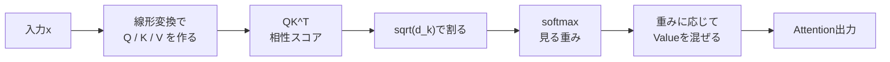
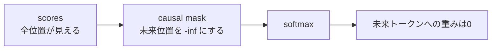

# 第14章 Attentionの数式を読む

**この章のゴール**

`Attention(Q, K, V) = softmax(QK^T / sqrt(d_k))V` を、日本語とPyTorchコードの両方で説明できるようになること。

## 14.1 Transformerの中心式

この章では、Transformerの中心にあるAttentionの数式を読みます。最初に越えるべき山は次の式です。

```text
Attention(Q, K, V) = softmax(QK^T / sqrt(d_k))V
```

初めて見ると難しそうですが、ここまで学んだ道具（ベクトル・行列・転置・行列積・内積・softmax・スカラー倍・重み付き和・shape）の組み合わせにすぎません。大まかに言うと、Attentionは次の処理をしています。

```text
QueryとKeyの内積で、トークン同士の相性スコアを作る
↓ スコアをsqrt(d_k)で割って調整する
↓ softmaxで重みに変換する
↓ その重みでValueを混ぜる
```



同じ流れをshapeの表として見ると、次のようになります。

| 段階 | 計算 | shape | 意味 |
|---|---|---|---|
| 入力 | `x` | `[batch_size, seq_len, d_model]` | 各トークンのベクトル |
| Q/K/V | `w_q(x)`, `w_k(x)`, `w_v(x)` | `q`, `k`: `[batch_size, seq_len, d_k]`<br/>`v`: `[batch_size, seq_len, d_v]` | Attention用の3種類の表現を作る |
| score | `q @ k.transpose(-2, -1)` | `[batch_size, seq_len, seq_len]` | 各Queryと各Keyの相性スコア |
| scale | `scores / sqrt(d_k)` | `[batch_size, seq_len, seq_len]` | スコアの大きさを調整する |
| weight | `softmax(scores, dim=-1)` | `[batch_size, seq_len, seq_len]` | 各Queryが各Keyをどれくらい見るか |
| 出力 | `weights @ v` | `[batch_size, seq_len, d_v]` | Valueを重みに応じて混ぜた新しい表現 |

もっと短く言えば「どのトークンをどれくらい見るかを計算して、その重みに応じて情報を混ぜる」です。この「見る重み」を作る仕組みがAttentionで、Transformerは各層で何度も使います。そのため、この式を読めることはTransformer理解の大きな土台になります。

---

## 14.2 `Attention(Q, K, V) = softmax(QK^T / sqrt(d_k))V`

式全体を見ます。左辺 `Attention(Q, K, V)` は「Q, K, V を入力として受け取り、Attentionの出力を返す」という意味です。Q・K・Vはそれぞれ Query・Key・Value で、直感的には次のように考えます。

```text
Query: 自分が探しているもの
Key:   自分が持っているラベル
Value: 実際に渡す中身
```

右辺は次のように分解できます。`QK^T` でQueryとKeyの内積をまとめて計算し（相性スコア）、`/ sqrt(d_k)` でスコアが大きくなりすぎるのを防ぎ、`softmax` で相性スコアを重みに変換し、最後に `V` を掛けて重みに応じてValueを混ぜます。

```text
score = QK^T
weight = softmax(score / sqrt(d_k))
output = weight V
```

実装では、かなり近い形で次のように書けます。これがAttentionの中心部分です。

```python
scores = q @ k.transpose(-2, -1)
scores = scores / math.sqrt(d_k)
weights = torch.softmax(scores, dim=-1)
out = weights @ v
```

---

## 14.3 Q, K, Vのshape

Attentionの式を理解するには、shapeを追うことが非常に重要です。1つの文だけを考え、トークン数を `seq_len`、QueryとKeyの次元を `d_k`、Valueの次元を `d_v` とすると、shapeは次のようになります。

```text
Q: [seq_len, d_k]
K: [seq_len, d_k]
V: [seq_len, d_v]
```

ここで、QとKの最後の次元が同じ `d_k` であることが重要です。QueryとKeyの内積を計算するには、2つのベクトルの次元数が同じである必要があるからです。一方、Valueの次元 `d_v` は理屈の上では `d_k` と違っていても構いません。Valueは相性スコアを作るためではなく、最後に重みに応じて混ぜられる中身だからです。Attentionの出力shapeはValueの最後の次元に依存し、`[seq_len, d_v]` になります。

バッチ付きの場合は先頭に `batch_size` が付きます。

```python
import torch

batch_size, seq_len, d_k, d_v = 2, 4, 3, 5
q = torch.randn(batch_size, seq_len, d_k)
k = torch.randn(batch_size, seq_len, d_k)
v = torch.randn(batch_size, seq_len, d_v)

print(q.shape, k.shape, v.shape)   # [2,4,3] [2,4,3] [2,4,5]
```

このshapeを出発点として、Attentionの式を追っていきます。

---

## 14.4 `QK^T` で何を計算しているのか

Attentionの最初の重要な計算は `QK^T` で、QueryとKeyの内積をまとめて計算しています。`Q: [seq_len, d_k]`、`K: [seq_len, d_k]` のまま `QK` は計算できません（内側の次元が一致しない）。そこで `K` を転置します（`K^T: [d_k, seq_len]`）。

```text
QK^T: [seq_len, d_k] @ [d_k, seq_len] → [seq_len, seq_len]
```

この `[seq_len, seq_len]` の行列は、各トークン同士の相性スコアです。`seq_len = 4` なら4×4の行列で、`q2・k3` は「2番目のトークンのQueryが3番目のトークンのKeyとどれくらい相性がよいか」（2番目が3番目を見るスコア）を表します。Attentionではすべてのトークンがすべてのトークンを見る可能性があり、その全組み合わせのスコアを `QK^T` で一度に計算しています。

バッチ付きでは、PyTorchで最後の2次元だけを転置します。

```python
import torch

batch_size, seq_len, d_k = 2, 4, 3
q = torch.randn(batch_size, seq_len, d_k)
k = torch.randn(batch_size, seq_len, d_k)

scores = q @ k.transpose(-2, -1)
print(k.transpose(-2, -1).shape, scores.shape)   # [2,3,4] [2,4,4]
```

この `scores: [batch_size, seq_len, seq_len]` がAttention scoreで、各バッチごとにトークン同士の相性スコア表ができています。

---

## 14.5 `sqrt(d_k)` で割る理由

Attentionの式では `QK^T` をそのままsoftmaxに入れず、`sqrt(d_k)` で割ります。これはスコアの大きさを調整するためです。

QueryとKeyの内積は次元数 `d_k` の分だけ掛け算して足し合わせます（`d_k = 3` なら3項、`d_k = 64` なら64項）。次元数が大きくなると内積の値も大きくなりやすく、スコアが大きすぎるとsoftmaxが極端になります。たとえば `[20.0, 1.0, 0.0]` にsoftmaxをかけるとほぼ1番目だけに重みが集まり（`[ほぼ1.0, ほぼ0.0, ほぼ0.0]`）、学習が不安定になりやすくなります。

そこで `sqrt(d_k)` で割ります。`d_k = 64` なら `sqrt(64) = 8` で割ります。この処理を含むAttentionを **scaled dot-product attention** と呼びます（dot-product: 内積を使う、scaled: sqrt(d_k)で割ってスケールを調整する）。

```python
import math
scores = (q @ k.transpose(-2, -1)) / math.sqrt(d_k)
```

重要なのは、`sqrt(d_k)` で割ることでsoftmaxが極端になりすぎるのを防いでいる点です。

---

## 14.6 softmaxで重みに変換する

次に、スケーリングしたスコアにsoftmaxをかけます（`softmax(QK^T / sqrt(d_k))`）。softmaxは最後の次元に沿ってかけます。`scores: [batch_size, seq_len, seq_len]` の最後の `seq_len` は「各QueryがどのKeyを見るか」を表す次元なので、`torch.softmax(scores, dim=-1)` とします。これにより各Queryごとに全Keyへの重みの合計が1になります。

```python
import torch

scores = torch.tensor([
    [2.0, 1.0, 0.0],
    [0.5, 1.5, 0.0],
    [1.0, 1.0, 2.0],
])
weights = torch.softmax(scores, dim=-1)
print(weights)
print(weights.sum(dim=-1))   # tensor([1., 1., 1.])
```

```text
tensor([[0.6652, 0.2447, 0.0900],
        [0.2312, 0.6285, 0.1402],
        [0.2119, 0.2119, 0.5761]])
```

たとえば1行目 `[0.665, 0.245, 0.090]` は「1番目のKeyを強く見る、2番目を少し見る、3番目はあまり見ない」という重みです。この `weights` がAttention weightで、`weights[i, j]` は「i番目のトークンがj番目のトークンを見る重み」を表します。

---

## 14.7 重み付き和としてValueを混ぜる

Attention weightを作ったら、最後にValueを混ぜます（`softmax(QK^T / sqrt(d_k))V`）。`weights = softmax(...)` と置くと、出力は `out = weights V` です。1つの文なら次のshapeになります。

```text
weights: [seq_len, seq_len] @ V: [seq_len, d_v] → out: [seq_len, d_v]
```

中身は、各トークンに対するValueの重み付き和です。あるトークンのAttention weightが `[0.6, 0.3, 0.1]`、Valueが `v1=[1.0,0.0]`, `v2=[0.0,2.0]`, `v3=[3.0,1.0]` なら、

```text
out = 0.6*v1 + 0.3*v2 + 0.1*v3
    = [0.6,0.0] + [0.0,0.6] + [0.3,0.1]
    = [0.9, 0.7]
```

強く見ているトークンのValueは強く反映され、あまり見ていないトークンのValueは少しだけ反映されます。すべてのトークンについてまとめて計算したものが `weights @ V` です。

```python
import torch

weights = torch.tensor([[0.6, 0.3, 0.1], [0.2, 0.7, 0.1], [0.1, 0.2, 0.7]])
V = torch.tensor([[1.0, 0.0], [0.0, 2.0], [3.0, 1.0]])

out = weights @ V
print(out.shape)   # [3, 2]
# tensor([[0.9000, 0.7000], [0.5000, 1.5000], [2.2000, 1.1000]])
```

このように、Attentionの最後ではAttention weightを使ってValueを混ぜています。

---

## 14.8 Self-Attentionを一行ずつ分解する

> ★ちょうつがい注記：ここは Attention の式を **分解して読む／一度確かめる** 段階である。関数化・モジュール化（＝作る）は 5 巻の仕事。

Self-Attentionの計算をPyTorchで一行ずつ分解し、入力 `x` からAttention出力まで一気にshapeを追います。

```python
import torch
import torch.nn as nn
import math

batch_size, seq_len, d_model, d_k, d_v = 2, 4, 8, 8, 8

x = torch.randn(batch_size, seq_len, d_model)

w_q = nn.Linear(d_model, d_k)
w_k = nn.Linear(d_model, d_k)
w_v = nn.Linear(d_model, d_v)

q, k, v = w_q(x), w_k(x), w_v(x)

scores = q @ k.transpose(-2, -1)   # [2, 4, 4]
scores = scores / math.sqrt(d_k)
weights = torch.softmax(scores, dim=-1)
out = weights @ v                  # [2, 4, 8]

print("x:", x.shape)            # [2, 4, 8]
print("q:", q.shape)            # [2, 4, 8]
print("scores:", scores.shape)  # [2, 4, 4]
print("weights:", weights.shape)# [2, 4, 4]
print("out:", out.shape)        # [2, 4, 8]
```

shapeの流れは「`q: [2,4,8]`、`k.transpose: [2,8,4]` → `scores: [2,4,4]`」「`weights: [2,4,4]`、`v: [2,4,8]` → `out: [2,4,8]`」です。各Queryについて全Keyへの重みの合計は1になります。

このコードがSelf-Attentionの中心部分です。ただし実際のTransformerでは、さらに mask、Multi-Head Attention、出力線形層、Dropout、Residual Connection、LayerNorm が加わります。この章では、まずAttentionの中心式を読めるようになることを目的にしています。

---

## 14.9 maskが必要になる場合

ここまでのAttentionは、すべてのトークンがすべてのトークンを見られる前提でした。しかし言語モデル、特にGPTのようなDecoder-only Transformerでは、未来のトークンを見てはいけません。

```text
I love dogs
I の位置:    見てよい: I        / 見てはいけない: love, dogs
love の位置: 見てよい: I, love  / 見てはいけない: dogs
```

未来の正解を見てしまうと次トークン予測の学習にならないからです。そこでDecoder-onlyのSelf-Attentionでは、未来方向を隠す **causal mask** を使います。`seq_len = 4` で見てよい位置を1、見てはいけない位置を0で表すと、下三角行列になります。

```text
[[1, 0, 0, 0],
 [1, 1, 0, 0],
 [1, 1, 1, 0],
 [1, 1, 1, 1]]
```



Attention scoreに対して、見てはいけない位置を `-inf` にします（`scores[mask == 0] = -inf`）。すると、softmax後にその位置の重みはほぼ0になります。

```python
import torch
import math

batch_size, seq_len, d_k = 2, 4, 8
q = torch.randn(batch_size, seq_len, d_k)
k = torch.randn(batch_size, seq_len, d_k)

scores = (q @ k.transpose(-2, -1)) / math.sqrt(d_k)

mask = torch.tril(torch.ones(seq_len, seq_len))   # 下三角行列
scores = scores.masked_fill(mask == 0, float("-inf"))
weights = torch.softmax(scores, dim=-1)
```

`torch.tril`（lower triangular、下三角）でmaskを作り、softmax後は未来の位置の重みが0になります。このmaskは『Attention Is All You Need』のDecoder側やGPT系のDecoder-only Transformerを理解するときに重要です。Encoder側のSelf-Attentionでは通常、未来を隠す必要はありません（Encoderは入力文全体を見てよい、Decoderは未来の出力トークンを見てはいけない）。maskは、基本式に「見てはいけない場所を隠す」処理を加えたものだと考えるとよいです。

---

## 14.10 Attentionの式を日本語で説明する

ここまで来たら、Attentionの式 `Attention(Q, K, V) = softmax(QK^T / sqrt(d_k))V` を日本語で説明できるか確認します。

```text
Q (Query): 自分が探しているもの
K (Key):   自分がどんな情報を持っているか
V (Value): 実際に渡す中身

QK^T: すべてのQueryとすべてのKeyの内積をまとめたもの（トークン同士の相性スコア）
/ sqrt(d_k): 内積が大きくなりすぎるのを防ぐためのスケール調整
softmax: 相性スコアを合計1の重み（Attention weight）に変換
V を掛ける: 重みに応じてValueを混ぜる
```

全体を一文で言うと「Attentionは、QueryとKeyの内積でトークン同士の相性を計算し、そのスコアをsoftmaxで重みに変換し、その重みに応じてValueを混ぜる仕組みである」。さらに短くすると「Attentionは、各トークンが他のトークンをどれくらい参照するかを計算し、その情報を混ぜて新しい表現を作る仕組みである」となります。この説明が自分の言葉でできれば、Attentionの中心はかなり理解できています。

---

## 14.11 まとめ

この章では、Attentionの中心式を読みました。

```text
Attention(Q, K, V) = softmax(QK^T / sqrt(d_k))V
```

この式は次の処理に分解できます。

```text
QK^T          → QueryとKeyの内積で相性スコアを作る
/ sqrt(d_k)   → スコアの大きさを調整する
softmax       → 相性スコアを重みに変換する
weights @ V   → 重みに応じてValueを混ぜる
```

Q・K・Vは Query・Key・Value で、直感的には「探しているもの・持っているラベル・実際に渡す中身」です。Self-Attentionでは、これらは同じ入力から作られます（`q = W_Q(x)` など）。

shapeの流れは次の通りです。`QK^T: [batch_size, seq_len, seq_len]` は各トークンが各トークンを見るためのスコア表で、softmaxをかけるとAttention weight（各行の合計は1）になり、Valueを混ぜると出力 `[batch_size, seq_len, d_v]` になります。

```text
Q, K: [batch_size, seq_len, d_k] → QK^T: [batch_size, seq_len, seq_len]
weights: [batch_size, seq_len, seq_len], V: [batch_size, seq_len, d_v]
out = weights @ V: [batch_size, seq_len, d_v]
```

この章で特に重要なのは、次の理解です。

```text
QK^Tはトークン同士の相性スコアを作る
sqrt(d_k)で割るのはスコアのスケールを調整するため
softmaxはスコアを重みに変換する
weights @ VはValueを重みに応じて混ぜる
Attentionの出力は、文脈を反映した新しいトークン表現である
```

また、Decoder-only Transformerでは、未来のトークンを見ないように causal mask を使い、見てはいけない位置を `-inf` にすることでsoftmax後の重みを0にします。

```python
scores = scores.masked_fill(mask == 0, float("-inf"))
```

### 確認問題

次の式を、PyTorchの計算に対応させて説明してください。

```text
Attention(Q, K, V) = softmax(QK^T / sqrt(d_k))V
```

答えは、たとえば次のようになります。

```python
scores = q @ k.transpose(-2, -1)
scores = scores / math.sqrt(d_k)
weights = torch.softmax(scores, dim=-1)
out = weights @ v
```

`examples/03_attention.py` を実行すると、shapeとcausal maskの動きをまとめて確認できます。

### よくある誤解

Attention weightは、Valueそのものではありません。Attention weightは、Valueをどの割合で混ぜるかを決める重みです。また、causal maskはValueを消すのではなく、softmax前のscoreを `-inf` にして未来位置の重みを0にします。

この章を理解すると、Transformerの中心部分であるSelf-Attentionの数式が読めるようになります。次章では、ここまで学んだ数学を使って、PyTorchで小さなAttention計算をさらに実装として確認します。数式を読むだけでなく、実際にテンソルを作り、shapeを追いながらAttentionがどのように動くかを確かめます。
