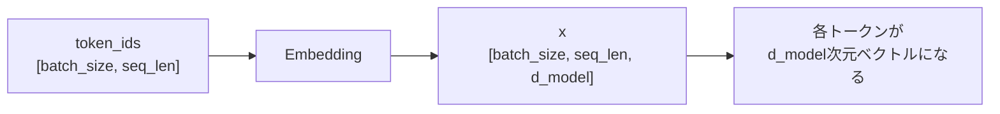

# 第2章 数・スカラー・ベクトル・行列

**この章のゴール**

スカラー、ベクトル、行列、テンソルの違いを説明し、Transformerでよく出る `[batch_size, seq_len, d_model]` のshapeを読めるようになること。

## 2.1 スカラーとは何か

まず、いちばん基本になるのは「数」です。数学では、普通の1つの数のことを **スカラー** と呼びます（`3`、`-1`、`0.5`、`2.718` など）。

機械学習では、スカラーはさまざまな場所に出てきます。たとえば、損失 `loss = 1.23`、学習率 `learning_rate = 0.001`、確率、重みやバイアスの1要素はスカラーです。

Transformerでは、スカラーだけを単独で扱うことは少なく、多くの場合、たくさんのスカラーを並べてベクトル・行列・テンソルとして扱います。しかし、ベクトルも行列もテンソルも、中身を細かく見ればスカラーの集まりです。

```text
スカラーが並ぶとベクトルになる → ベクトルが並ぶと行列になる → 行列がさらに並ぶとテンソルになる
```

まずは「スカラーは1つの数」と理解しておけば十分です。

## 2.2 ベクトルとは何か

**ベクトル** は、数を一列に並べたものです（`[1.0, 2.0, 3.0]` は3つの数を並べた3次元ベクトル）。ここでいう「3次元」は、空間の縦・横・高さという意味ではなく、「数が3個並んでいる」という意味です。

機械学習では、ベクトルは非常によく使われます。たとえば、単語やトークンをベクトルで表します（`"dog" → [0.12, -0.44, 0.87, 0.03]`）。このように単語を数値の並びに変換したものを **埋め込みベクトル**（embedding vector）と呼びます。

Transformerでは、文章をそのまま処理するのではなく、まず各トークンをベクトルに変換します。

```text
"I"    → [0.10, 0.20, -0.30, 0.40]
"love" → [0.55, -0.12, 0.08, 0.31]
"dogs" → [0.02, 0.77, -0.45, 0.19]
```

この時点で、文章は「文字の列」ではなく「ベクトルの列」になります（文章 → トークン列 → ベクトル列）。Transformerは、このベクトル列を入力として処理します。つまり、Transformerを理解するためには、まず「データはベクトルとして扱われる」という感覚が必要です。

## 2.3 行列とは何か

**行列** は、数を縦横に並べたものです。

```text
[
  [1.0, 2.0, 3.0],
  [4.0, 5.0, 6.0]
]
```

これは2行3列の行列で、shapeは `[2, 3]` です。行列は「ベクトルを並べたもの」として見られます（上の行列は、3次元ベクトルが2本並んでいる）。

Transformerでは、複数のトークンのベクトルをまとめて行列として扱います。前節の3トークン（各4次元）をまとめると、次の行列になります。

```text
[
  [0.10,  0.20, -0.30, 0.40],
  [0.55, -0.12,  0.08, 0.31],
  [0.02,  0.77, -0.45, 0.19]
]
```

この行列のshapeは `[3, 4]` で、3はトークン数、4は各トークンのベクトルの次元数です。Transformerの用語では `seq_len = 3`、`d_model = 4` で、この入力のshapeは `[seq_len, d_model]` と書けます。このように、文章をベクトル列にしたものは、実装上は行列として扱えます。

## 2.4 テンソルとは何か

**テンソル** は、スカラー、ベクトル、行列をさらに一般化したものです。最初は次のように理解すれば十分です。

```text
スカラー: 0次元のテンソル
ベクトル: 1次元のテンソル
行列: 2次元のテンソル
それ以上の多次元配列: テンソル
```

3次元のテンソルは、行列が複数枚並んだものだと考えるとわかりやすいです。

```text
[
  [[1.0, 2.0, 3.0], [4.0, 5.0, 6.0]],
  [[7.0, 8.0, 9.0], [10.0, 11.0, 12.0]]
]
```

これは2行3列の行列が2枚あると考えられ、shapeは `[2, 2, 3]` です。

Transformerではテンソルが重要です。なぜなら、実際の学習や推論では、1つの文章だけでなく、複数の文章をまとめて処理するからです。1つの文章が `[seq_len, d_model]` で表されるとき、複数の文章をまとめると、先頭に `batch_size` という次元が追加されます。

```text
[batch_size, seq_len, d_model]
（例：[2, 3, 4] = 2個の文章、各3トークン、各トークンは4次元ベクトル）
```

Transformerの実装では、このような3次元テンソルを基本単位として扱うことが多いです。

## 2.5 Python / PyTorchでのshapeの考え方

PyTorchでは、テンソルのshapeを `.shape` で確認できます。

```python
import torch

print(torch.tensor(3.14).shape)                              # torch.Size([])  スカラー
print(torch.tensor([1.0, 2.0, 3.0]).shape)                   # torch.Size([3]) ベクトル
print(torch.tensor([[1.0, 2.0, 3.0], [4.0, 5.0, 6.0]]).shape) # torch.Size([2, 3]) 行列
```

スカラーは1つの数なのでshapeは空（`[]`）、ベクトルは `[3]`、行列は `[2, 3]` です。

3次元テンソルも作れます。

```python
import torch

batch_size = 2
seq_len = 3
d_model = 4

x = torch.randn(batch_size, seq_len, d_model)
print(x.shape)   # torch.Size([2, 3, 4])
```

このshape `[2, 3, 4]` は、「2個の文章をまとめて処理している / 各文章は3トークン / 各トークンは4次元ベクトル」という意味です。Transformerでは、このshapeを `[batch_size, seq_len, d_model]` の意味で読むことが多いです。

## 2.6 shapeを読むことが実装力につながる

Transformerを実装するとき、shapeを読む力は非常に重要です。なぜなら、多くのエラーはshapeの不一致によって起こるからです。

行列積では、内側の次元が一致している必要があります。

```text
[a, b] @ [b, c] → [a, c]
（[3, 4] @ [4, 5] → [3, 5] はできる。[3, 4] @ [5, 6] は内側が 4 と 5 で一致しないのでできない）
```

Transformerでは、このようなshapeの確認を何度も行います。たとえば Self-Attention では `QK^T` という行列積が出てきます。`Q` も `K` も `[seq_len, d_k]` だと、`[seq_len, d_k] @ [seq_len, d_k]` は内側が一致せずできません。そこで `K` を転置します。

```text
K^T: [d_k, seq_len]
QK^T: [seq_len, d_k] @ [d_k, seq_len] → [seq_len, seq_len]
```

この結果 `[seq_len, seq_len]` は、各トークンが各トークンをどれくらい見るかを表すスコア表です（`seq_len = 3` なら3×3の行列で、`score_2_3` は2番目のトークンが3番目のトークンをどれくらい参照するかを表す）。このように、shapeを追うと、数式が何をしているかが見えやすくなります。

## 2.7 Transformerでよく出るshape

Transformerを学ぶと、いくつかのshapeが何度も出てきます。

**入力トークンID**：`[batch_size, seq_len]`。各トークンを整数IDで表したもの（2個の文章、各5トークンなら `[2, 5]`）。

**embedding後**：`[batch_size, seq_len, d_model]`。トークンIDを各トークンのベクトルに変換したもの（`d_model = 4` なら `[2, 5, 4]`）。



**Q, K, V**：入力 `x` から作り、簡単のため `d_k = d_v = d_model` とすれば、いずれも `[batch_size, seq_len, d_model]`。

**Attention score**：`QK^T` で計算し、`[batch_size, seq_len, seq_len]`（各トークンが各トークンを見るためのスコア表）。

**Attention weight**：scoreにsoftmaxをかけたもの。shapeは変わらず `[batch_size, seq_len, seq_len]`（値の意味だけが「生のスコア」から「合計1になる重み」に変わる）。

**Attention出力**：weightを `V` に掛けたもの。`[batch_size, seq_len, d_v]`（多くの場合 `d_v = d_model`）。最初の入力と同じように、トークンごとにベクトルが出てきます。

このように、Transformerでは、shapeを追うだけでもかなり理解が進みます。

## 2.8 PyTorchでTransformerらしいshapeを確認する

ここではまだAttentionの詳しい意味には踏み込まず、Transformerでよく出るshapeをPyTorchで確認します。次のコードは、トークンID → embedding → Q/K/V → score → weight → 出力、という流れのshapeを追います。

```python
import torch
import torch.nn as nn
import math

batch_size = 2
seq_len = 5
vocab_size = 100
d_model = 8

token_ids = torch.tensor([
    [12, 45, 98, 3, 7],
    [8, 21, 21, 56, 4],
])

embedding = nn.Embedding(vocab_size, d_model)
x = embedding(token_ids)

w_q = nn.Linear(d_model, d_model)
w_k = nn.Linear(d_model, d_model)
w_v = nn.Linear(d_model, d_model)

q = w_q(x)
k = w_k(x)
v = w_v(x)

scores = q @ k.transpose(-2, -1)
scores = scores / math.sqrt(d_model)
weights = torch.softmax(scores, dim=-1)
out = weights @ v

print("token_ids:", token_ids.shape)
print("x:", x.shape)
print("q:", q.shape)
print("scores:", scores.shape)
print("weights:", weights.shape)
print("out:", out.shape)
```

実行すると、次のような出力になります。

```text
token_ids: torch.Size([2, 5])
x: torch.Size([2, 5, 8])
q: torch.Size([2, 5, 8])
scores: torch.Size([2, 5, 5])
weights: torch.Size([2, 5, 5])
out: torch.Size([2, 5, 8])
```

いくつか補足します。`embedding(token_ids)` で `[2, 5]` が `[2, 5, 8]` になります（各トークンが8次元ベクトルに）。`w_q(x)` などは `d_model = 8` のまま変換するのでshapeは変わりませんが、中身の値は変わっています（x → q、x → k、x → v の3種類の変換）。

`scores = q @ k.transpose(-2, -1)` では、`k` の `[2, 5, 8]` の最後の2次元を入れ替えて `[2, 8, 5]` にしてから掛けるので、`[2, 5, 8] @ [2, 8, 5] → [2, 5, 5]` になります。この `[5, 5]` は5個のトークン同士の相性スコアです。softmaxをかけてもshapeは変わらず、最後に `weights @ v`（`[2, 5, 5] @ [2, 5, 8] → [2, 5, 8]`）でAttentionの出力が得られます。

このコードの意味をすべて理解する必要は、今はまだありません。この章で重要なのは、次の流れです。

```text
token_ids: [batch_size, seq_len]
 ↓ embedding
x:         [batch_size, seq_len, d_model]
 ↓ Q/K/V
q/k/v:     [batch_size, seq_len, d_model]
 ↓ QK^T
scores:    [batch_size, seq_len, seq_len]
 ↓ softmax → weights @ V
out:       [batch_size, seq_len, d_model]
```

このshapeの流れは、Transformerを実装するときに何度も出てきます。

## 2.9 まとめ

この章では、スカラー、ベクトル、行列、テンソルについて学びました。スカラーは1つの数、ベクトルは数を一列に並べたもの、行列は数を縦横に並べたもの、テンソルはそれらをさらに一般化した多次元配列です。

Transformerでは、データは基本的にテンソルとして扱われます。特に重要なのは、次のshapeです。

```text
[batch_size, seq_len, d_model]
batch_size: まとめて処理する文章の数
seq_len: 各文章に含まれるトークン数
d_model: 各トークンを表すベクトルの次元数
```

Transformerの実装では、shapeを読む力が非常に重要です。Self-Attention、Multi-Head Attention、Feed Forward Network、Layer Normalization など、ほとんどの処理でテンソルのshapeを正しく扱う必要があるからです。特に Attention では、次のshapeがよく出てきます。

```text
x:       [batch_size, seq_len, d_model]
q/k/v:   [batch_size, seq_len, d_model]
scores:  [batch_size, seq_len, seq_len]
weights: [batch_size, seq_len, seq_len]
out:     [batch_size, seq_len, d_model]
```

### 確認問題

次のshapeの意味を説明してください。

```text
[2, 5, 4]
```

答えは、たとえば「2個の文 / 各文は5トークン / 各トークンは4次元ベクトル」です。

### よくある誤解

`d_model` はトークンの個数ではありません。`d_model` は、1つのトークンを表すベクトルの次元数です。また、`seq_len` はベクトルの次元数ではなく、文の中に並んでいるトークンの数です。

この章の段階では、Attentionの意味を完全に理解する必要はありません。まずは、Transformerではデータがテンソルとして流れていき、そのshapeを追うことが大事だと理解できれば十分です。

次章では、ベクトルについてもう少し詳しく見ていきます。ベクトルは単なる数の並びではなく、単語やトークンの意味を表すための基本単位になります。ベクトルの足し算、スカラー倍、長さ、距離といった基本を理解することが、embeddingやAttentionを理解する土台になります。

---

<!-- chapter-nav:start -->

[← 第1章 なぜTransformerに数学が必要なのか](Chapter%201%20-%20Why%20Does%20a%20Transformer%20Need%20Mathematics.md) ｜ [目次](Table%20of%20Contents.md) ｜ [第3章 ベクトルの基本 →](Chapter%203%20-%20Vector%20Basics.md)

<!-- chapter-nav:end -->
