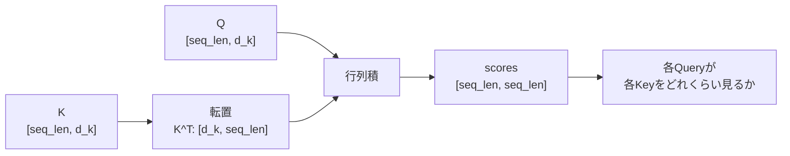

# 第5章 行列の基本

**この章のゴール**

行列積と転置のshapeを追い、`QK^T` が `[seq_len, seq_len]` の相性スコア表になることを理解すること。

## 5.1 行列は「ベクトルをまとめたもの」である

前章では、内積（2つのベクトルから1つのスカラーを作る計算）を学びました。Transformerでは、この内積を1つずつ計算するのではなく、たくさんの内積をまとめて計算します。そのために使うのが **行列** です。

行列は、数を縦横に並べたものです（`[[1.0, 2.0, 3.0], [4.0, 5.0, 6.0]]` は2行3列、shapeは `[2, 3]`）。見方を変えると「ベクトルをまとめたもの」で、上の行列は3次元ベクトルが2本縦に並んでいると見られます。

Transformerでは、この見方が重要です。複数のトークンのベクトルをまとめて行列として扱うからです。3個のトークン（各4次元）をまとめると、shape `[3, 4]` の行列になり、Transformerの用語では `seq_len = 3`、`d_model = 4` です。

```text
X = [
  [0.10,  0.20, -0.30, 0.40],   ← token_1
  [0.55, -0.12,  0.08, 0.31],   ← token_2
  [0.02,  0.77, -0.45, 0.19]    ← token_3
]
```

Transformerでは、各トークンを1つずつ処理するのではなく、行列としてまとめて処理します。これにより、計算を効率よく行えます。

## 5.2 行列は「変換」として見ることができる

行列にはもう1つ重要な見方があります。行列を **ベクトルを変換するもの** として見ることです。

ベクトル `x = [1.0, 2.0]` に行列 `W = [[1.0, 0.0], [0.0, 2.0]]` を掛けると `[1.0, 4.0]` になります（2番目の成分が2倍）。別の行列 `[[0.0, 1.0], [1.0, 0.0]]` なら2つの成分を入れ替えます（`[1.0, 2.0] → [2.0, 1.0]`）。このように、行列はベクトルを別のベクトルへ変換します。

機械学習では、この見方が非常に重要です。ニューラルネットワークの線形層は、基本的に `y = xW + b`（x：入力ベクトル、W：重み行列、b：バイアス、y：出力）という計算で、入力 `x` を重み行列 `W` によって別のベクトル `y` に変換しています。

Transformerでも同じで、入力されたトークンのベクトルから、Query、Key、Valueを作るときに行列による変換を使います。

```text
xW_Q → q / xW_K → k / xW_V → v
```

このように、行列は単なる数の表ではなく、「ベクトルを別の表現へ変換する道具」として使われます。

## 5.3 行列とベクトルの掛け算

行列とベクトルの掛け算を見ます。行列の各行とベクトルの内積を並べたものになります。

```text
W = [[1.0, 2.0], [3.0, 4.0], [5.0, 6.0]]   ([3, 2])
x = [10.0, 20.0]                            ([2])
W @ x:
  1行目: [1, 2]・[10, 20] = 50
  2行目: [3, 4]・[10, 20] = 110
  3行目: [5, 6]・[10, 20] = 170
→ [50.0, 110.0, 170.0]  ([3])
```

つまり、行列とベクトルの掛け算は「行列の各行とベクトルの内積を並べる」ことです。Transformerで重要なのは、「行列積は内積をまとめて計算している」という感覚です。行列積を難しいものとして見るのではなく、「たくさんの内積をまとめて計算する仕組み」として見ると、Attentionの式も理解しやすくなります。

```python
import torch

W = torch.tensor([[1.0, 2.0], [3.0, 4.0], [5.0, 6.0]])
x = torch.tensor([10.0, 20.0])
print(W @ x, (W @ x).shape)   # tensor([ 50., 110., 170.]) torch.Size([3])
```

行列とベクトルの掛け算は、内側の次元が一致しているときに計算できます（`[3, 2] @ [2] → [3]`）。

## 5.4 行列と行列の掛け算

次に、行列と行列の掛け算を見ます。これも基本的には内積の集まりで、各要素は、左の行列の行ベクトルと、右の行列の列ベクトルの内積です。

```text
A = [[1.0, 2.0], [3.0, 4.0]]              ([2, 2])
B = [[10.0, 20.0, 30.0], [40.0, 50.0, 60.0]]  ([2, 3])
A @ B の (1,1) = [1, 2]・[10, 40] = 90
       (1,2) = [1, 2]・[20, 50] = 120  ...
→ [[90, 120, 150], [190, 260, 330]]  ([2, 3])
```

```python
import torch

A = torch.tensor([[1.0, 2.0], [3.0, 4.0]])
B = torch.tensor([[10.0, 20.0, 30.0], [40.0, 50.0, 60.0]])
print((A @ B).shape)   # torch.Size([2, 3])
```

行列積のshapeは、次のように決まります。内側の `b` が一致している必要があります。

```text
[a, b] @ [b, c] → [a, c]
（[2, 3] @ [3, 4] → [2, 4] はできる。[2, 3] @ [5, 4] は内側 3 と 5 が一致せずできない）
```

Transformerの実装では、このshapeのルールを何度も使います。

## 5.5 転置とは何か

**転置** とは、行列の行と列を入れ替える操作です。`[2, 3]` の行列を転置すると `[3, 2]` になります。

```text
A = [[1.0, 2.0, 3.0], [4.0, 5.0, 6.0]]   ([2, 3])
A^T = [[1.0, 4.0], [2.0, 5.0], [3.0, 6.0]]   ([3, 2])
```

PyTorchでは、2次元行列の転置は `.T` で書けます。

Transformerでは、転置が非常によく出てきます。特に重要なのは、Attentionの中の `QK^T` です。なぜ転置する必要があるのでしょうか。理由は、行列積のshapeを合わせるためです。

`Q` も `K` も `[seq_len, d_k]` だと、`Q @ K` は `[seq_len, d_k] @ [seq_len, d_k]` で内側（`d_k` と `seq_len`）が一致せず計算できません。そこで `K` を転置します。

```text
K^T: [d_k, seq_len]
QK^T: [seq_len, d_k] @ [d_k, seq_len] → [seq_len, seq_len]
```

この結果は、各Queryと各Keyの内積をまとめたスコア行列です。つまり、転置は単なる見た目の入れ替えではなく、全トークン同士の相性をまとめて計算するために必要な操作です。

## 5.6 なぜ `K^T` が出てくるのか

Attentionの式に出てくる `K^T` をもう少し詳しく見ます。

Self-Attentionでは、各トークンからQueryとKeyを作ります。3個のトークン（各2次元）のQuery行列 `Q`、Key行列 `K`（どちらも `[3, 2]`）があるとします。やりたいことは、すべてのQueryとすべてのKeyの内積を計算し、3×3の行列として並べることです。

```text
[
  [q1・k1, q1・k2, q1・k3],
  [q2・k1, q2・k2, q2・k3],
  [q3・k1, q3・k2, q3・k3]
]
```

この計算を行列積で一度に行うために、`K`（`[3, 2]`）を転置して `K^T`（`[2, 3]`）にします。すると `Q @ K^T`（`[3, 2] @ [2, 3] → [3, 3]`）が計算でき、1行目が `q1` と各Keyの内積、2行目が `q2` と各Keyの内積、というように並びます。

つまり、`K^T` が出てくる理由は、すべてのQueryとKeyの内積をまとめて計算するためです（`QK^T` = すべてのQueryとすべてのKeyの内積表）。

## 5.7 `QK^T` のshapeを追う

Transformerの数式を読むとき、shapeを追うことは非常に重要です。`QK^T` のshapeを丁寧に追います。

1つの文（トークン数 `seq_len`、Query/Keyの次元 `d_k`）では、`Q` も `K` も `[seq_len, d_k]` です。`K` を転置して `K^T: [d_k, seq_len]` にすると、行列積のルール（`[a, b] @ [b, c] → [a, c]`）から、`QK^T: [seq_len, d_k] @ [d_k, seq_len] → [seq_len, seq_len]` になります。



この `[seq_len, seq_len]` は、トークン同士の相性スコア表です。バッチ付きの場合は、先頭に `batch_size` が付きます。

```python
import torch

batch_size, seq_len, d_k = 2, 4, 3

Q = torch.randn(batch_size, seq_len, d_k)   # [2, 4, 3]
K = torch.randn(batch_size, seq_len, d_k)   # [2, 4, 3]

scores = Q @ K.transpose(-2, -1)            # [2, 4, 3] @ [2, 3, 4] -> [2, 4, 4]
print("K^T:", K.transpose(-2, -1).shape)    # torch.Size([2, 3, 4])
print("scores:", scores.shape)              # torch.Size([2, 4, 4])
```

`K` の最後の2次元を転置し（`K.transpose(-2, -1)`）、`QK^T: [batch_size, seq_len, d_k] @ [batch_size, d_k, seq_len] → [batch_size, seq_len, seq_len]` になります。各文ごとに4×4のAttention score行列ができます。このように、`QK^T` のshapeを追えるようになると、Attentionの式がかなり読みやすくなります。

## 5.8 行列計算で複数トークンをまとめて処理する

Transformerの大きな特徴のひとつは、複数のトークンをまとめて計算しやすいことです。RNNではトークンを左から右へ順番に処理しましたが、Transformerではトークン列を行列としてまとめて処理します。

入力は `X: [seq_len, d_model]`（各行が1つのトークンのベクトル）です。この `X` に重み行列を掛けることで、すべてのトークンをまとめて変換できます。

```text
Q = XW_Q    （[seq_len, d_model] @ [d_model, d_k] → [seq_len, d_k]）
```

これは、各トークンのベクトルに同じ変換を適用していると考えられます（`q1 = x1W_Q`、`q2 = x2W_Q`、... を1行で `Q = XW_Q` と書ける）。計算の見通しがよくなるだけでなく、GPUで高速に計算しやすい形でもあります。KeyとValueも同じです。

```python
import torch

seq_len, d_model, d_k, d_v = 4, 6, 3, 5

X = torch.randn(seq_len, d_model)
W_Q = torch.randn(d_model, d_k)
W_K = torch.randn(d_model, d_k)
W_V = torch.randn(d_model, d_v)

Q, K, V = X @ W_Q, X @ W_K, X @ W_V
print(Q.shape, K.shape, V.shape)   # [4, 3] [4, 3] [4, 5]
```

このように、行列計算によって複数トークンをまとめて処理できます。この考え方は、Transformer実装の中心になります。

## 5.9 PyTorchの `nn.Linear` と行列

ここまで行列を直接作って `Q = X @ W_Q` と掛けてきましたが、PyTorchでニューラルネットワークを書くときは、通常 `nn.Linear` を使います。`nn.Linear` は線形変換を行う層で、数学的には `y = xW^T + b` という計算をします。

注意点として、数学の説明では `y = xW + b` と書くことが多いですが、PyTorchの `nn.Linear(in_features, out_features)` の重みは内部的に `[out_features, in_features]` のshapeを持つため、実装上は `W^T` を掛ける形になります。最初は細かい内部表現にこだわりすぎなくて大丈夫です。重要なのは、`nn.Linear` が「最後の次元を in_features から out_features に変換する」ことです。

```python
import torch
import torch.nn as nn

batch_size, seq_len, d_model, d_k = 2, 4, 6, 3
X = torch.randn(batch_size, seq_len, d_model)   # [2, 4, 6]

linear_q = nn.Linear(d_model, d_k)
Q = linear_q(X)
print(X.shape, "->", Q.shape)   # torch.Size([2, 4, 6]) -> torch.Size([2, 4, 3])
```

ここで重要なのは、`nn.Linear` が最後の次元だけを変換することです。先頭の `batch_size` と `seq_len` はそのまま残ります（`[2, 4, 6]` → 最後の次元 6 を 3 に → `[2, 4, 3]`）。

Transformerでは、Q, K, Vを作るときに、この `nn.Linear` を使うことが多いです。

```python
w_q = nn.Linear(d_model, d_k)
w_k = nn.Linear(d_model, d_k)
w_v = nn.Linear(d_model, d_v)
q, k, v = w_q(x), w_k(x), w_v(x)
```

このように、PyTorchの `nn.Linear` は、行列による変換をニューラルネットワークの層として扱いやすくしたものです。

## 5.10 行列積とAttentionのつながり

ここまで学んだ内容を、Attentionの式に接続します。Transformerの中心式は次の通りで、行列積が2回（`QK^T` と `softmax(...)V`）出てきます。

```text
Attention(Q, K, V) = softmax(QK^T / sqrt(d_k))V
```

`QK^T`（`[seq_len, d_k] @ [d_k, seq_len] → [seq_len, seq_len]`）は、各Queryと各Keyの内積をまとめて計算し、全トークン同士の相性スコアを作ります。`softmax(QK^T / sqrt(d_k))` は相性スコアを重みに変換したもので、shapeは変わりません（`[seq_len, seq_len]`）。最後に `weights @ V`（`[seq_len, seq_len] @ [seq_len, d_v] → [seq_len, d_v]`）で、Attention weightを使ってValueを混ぜます（各トークンが他のトークンのValueをどれくらい取り込むか）。

```python
import torch
import math

seq_len, d_k, d_v = 4, 3, 5

Q = torch.randn(seq_len, d_k)
K = torch.randn(seq_len, d_k)
V = torch.randn(seq_len, d_v)

scores = Q @ K.T
scores = scores / math.sqrt(d_k)
weights = torch.softmax(scores, dim=-1)
out = weights @ V

print("scores:", scores.shape)   # torch.Size([4, 4])
print("out:", out.shape)         # torch.Size([4, 5])
```

shapeの流れは、`Q/K: [seq_len, d_k]`、`V: [seq_len, d_v]` → `QK^T: [seq_len, seq_len]` → `weights: [seq_len, seq_len]` → `out: [seq_len, d_v]` です。

この式を理解するために必要なのは、まさにこの章で学んだ行列の基本です（行列はベクトルをまとめたもの／変換するもの、行列積は内積をまとめたもの、転置は行と列を入れ替える操作）。Attentionの数式は難しそうに見えますが、分解すると行列積の組み合わせです。

## 5.11 よくあるshapeエラー

Transformerを実装していると、shapeエラーがよく起こります。これは自然なことです。特に、行列積では内側の次元が一致している必要があります（`[a, b] @ [b, c] → [a, c]`）。

Attentionでよくある間違いは、`K` を転置し忘れることです。`Q` も `K` も `[seq_len, d_k]` のとき、`scores = Q @ K` は内側が一致せず失敗します。正しくは `scores = Q @ K.T`、バッチ付きなら `scores = Q @ K.transpose(-2, -1)` とします。

バッチ付きで `.T` を使うと、意図しない転置になることがあるので注意が必要です。`K: [batch_size, seq_len, d_k]` でやりたいのは最後の2次元だけを入れ替えること（`[batch_size, d_k, seq_len]`）なので、`K.transpose(-2, -1)` を使います。

shapeエラーが出たときは、まず `print(Q.shape)`、`print(K.transpose(-2, -1).shape)` などで確認し、行列積のルール（`[a, b] @ [b, c] → [a, c]`）に当てはめます。Transformerの実装では、エラー文を読むことも大事ですが、それ以上にshapeを自分で追えることが重要です。

## 5.12 まとめ

この章では、行列の基本について学びました。行列は、数を縦横に並べたもの（shapeで表すと `[2, 3]` など）で、複数のベクトルをまとめたものとして見られます。Transformerでは、複数のトークンのベクトルをまとめて行列 `X: [seq_len, d_model]` として扱います（各行が1つのトークンのベクトル）。

また、行列はベクトルを変換するものとしても見られます。ニューラルネットワークの線形層は `y = xW + b` という変換で、Transformerでは入力ベクトルからQuery、Key、Valueを作るときに使います（`Q = XW_Q` など）。

行列積は、内積をまとめて計算する仕組みです（`[a, b] @ [b, c] → [a, c]`）。Attentionでは `QK^T` が重要で、すべてのQueryとKeyの内積をまとめて計算します。

```text
Q/K: [seq_len, d_k], K^T: [d_k, seq_len] → QK^T: [seq_len, seq_len]
バッチ付き：QK^T: [batch_size, seq_len, seq_len]
```

この `[seq_len, seq_len]` の行列は、トークン同士の相性スコアを表します。また、Attentionでは最後に `weights @ V`（`[seq_len, seq_len] @ [seq_len, d_v] → [seq_len, d_v]`）でValueを混ぜます。つまり、Attentionは行列積の組み合わせ（QK^Tで相性スコア → softmaxで重み → weights @ VでValueを混ぜる）として理解できます。

この章で特に重要なのは、次の理解です。

```text
行列はベクトルをまとめたもの／変換するもの
行列積は内積をまとめたもの
転置によって行列積のshapeを合わせる
QK^Tは全トークン同士の相性スコア表である
```

### 確認問題

次のshapeのとき、`QK^T` のshapeはどうなりますか。

```text
Q: [2, 4, 8], K: [2, 4, 8]
```

答え：`K.transpose(-2, -1): [2, 8, 4]`、`QK^T: [2, 4, 4]`。

### よくある誤解

`QK^T` の結果は、Valueそのものではありません。`QK^T` は、どのトークンを見るかを決めるためのスコア表です。Valueを混ぜるのは、その後の `weights @ V` です。

次章では、線形変換について学びます。行列を「変換」として見る考え方をもう少し深めます。Transformerでは、embedding、Q/K/Vの生成、Feed Forward Network、出力層など、多くの場所で線形変換が使われます。そのため、線形変換を理解することは、ニューラルネットワークとTransformerの内部構造を理解するための重要な土台になります。

---

<!-- chapter-nav:start -->

[← 第4章 内積](Chapter%204%20-%20Inner%20Products.md) ｜ [目次](Table%20of%20Contents.md) ｜ [第6章 線形変換 →](Chapter%206%20-%20Linear%20Transformations.md)

<!-- chapter-nav:end -->
