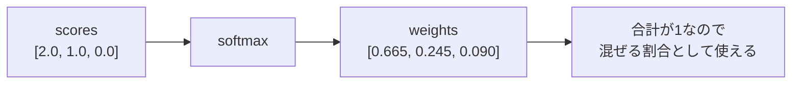

# 第7章 softmax

**この章のゴール**

softmaxがスコアの列を合計1の重みに変換することを理解し、Attention weightとして使われる理由を説明できるようになること。

## 7.1 softmaxとは何か

この章では **softmax** について学びます。Self-Attentionでは次の式に出てきます。

```text
Attention(Q, K, V) = softmax(QK^T / sqrt(d_k))V
```

この中の `softmax(QK^T / sqrt(d_k))` が、Attention scoreをAttention weightに変換する部分です。

softmaxは、ざっくり言えば「数値の列を、合計が1になる重みに変換する関数」です。たとえば `[2.0, 1.0, 0.1]` にsoftmaxをかけると `[0.659, 0.242, 0.099]` になります。この出力には次の特徴があります。

```text
すべての値が0以上
合計すると1になる
元の値が大きいほど、softmax後の値も大きい
```

softmaxの出力は数学的には確率分布として解釈できますが、Attentionで使う場合はまず「どの要素をどれくらい強く見るかを表す重み」と理解するとよいです。たとえばあるトークンが他の3つを見るスコアが `[2.0, 1.0, 0.1]` のとき、softmax後の `[0.659, 0.242, 0.099]` は「1番目を強く見る、2番目を少し見る、3番目はあまり見ない」と解釈できます。

---

## 7.2 数値の列を確率のような重みに変換する

softmaxの役割は、数値の列を「重み」に変換することです。スコア `[3.0, 1.0, 0.0]` は「1番目が一番よさそう」と読めますが、このままでは重みとして使いにくい。合計が1ではないし、スコアにはマイナスが入ることもあるからです。

重みとして扱うには「すべて0以上・合計が1・大きいスコアほど大きい重み」という性質があると便利です。softmaxはこれを満たすように変換します。

```text
softmax([3.0, 1.0, 0.0]) = [0.844, 0.114, 0.042]
合計: 0.844 + 0.114 + 0.042 = 1.000
```

ここで重要なのは、softmaxは単に合計で割るだけではないことです。たとえば `[3.0, 1.0, 0.0] / 4.0 = [0.75, 0.25, 0.0]` は合計1になりますが、`[2.0, -1.0, 0.5]` のようにマイナスがあると重みにマイナスが残ってしまいます。softmaxは指数関数を使い、すべての値を正にしてから正規化するので、元のスコアにマイナスがあっても出力はすべて正になります。

```text
softmax([2.0, -1.0, 0.5]) = [0.786, 0.039, 0.175]
```

---

## 7.3 なぜ合計が1になるのか

softmaxの式は次の通りです。

```text
softmax(x_i) = exp(x_i) / Σ exp(x_j)
```

`exp` は指数関数で、ここでは次の性質だけ押さえれば十分です。

```text
入力が大きいほど出力も大きい
どんな入力でも出力は正の値になる
（例: exp(0)=1, exp(1)=2.718, exp(2)=7.389, exp(-1)=0.368）
```

softmaxは2段階です。まず各値に `exp` をかけて正にし、次にその合計で割ります。全部を合計で割るので、出力を全部足すと必ず1になります。

```text
(exp(x_1) + exp(x_2) + exp(x_3)) / 合計 = 合計 / 合計 = 1
```

たとえば `x = [2.0, 1.0, 0.0]` なら、

```text
exp: [7.389, 2.718, 1.000]
合計: 11.107
各値 / 合計: [0.665, 0.245, 0.090]
```

このように、softmaxの出力は必ず合計1になります。

---

## 7.4 大きい値がより強調される理由

softmaxでは大きい値がより大きな重みになります。これは指数関数 `exp` を使っているからです。`exp` は入力が少し増えると出力が大きく増えます。

```text
exp(0)=1.000, exp(1)=2.718, exp(2)=7.389, exp(3)=20.086
```

そのため、スコアの差が大きいほど出力の差も大きくなります。

```text
softmax([1.0, 0.0, 0.0]) = [0.576, 0.212, 0.212]
softmax([5.0, 0.0, 0.0]) = [0.987, 0.007, 0.007]
```

差が大きい後者では、1番目にほとんどの重みが集まりました。Attentionで言えば、相性スコアが他より少し高ければ少し強く見る、かなり高ければほとんどそのトークンを見る、ということです。

ただしスコアが大きくなりすぎると、`[100.0, 1.0, 0.0]` のようにほぼ1番目だけを見る極端な出力になります。Attentionでは内積が大きくなりすぎるとこうなるので、softmaxに入れる前に `QK^T / sqrt(d_k)` でスケールを調整します。今は次のように理解しておけば十分です。

```text
softmaxは大きい値を強調する
スコアが大きすぎると重みが極端になる
Transformerではsqrt(d_k)で割ってスコアを調整する
```

---

## 7.5 softmaxとargmaxの違い

softmaxと似た場面で出てくる言葉に **argmax** があります。argmaxは「一番大きい値の位置を選ぶ」操作です。

```text
argmax([2.0, 5.0, 1.0]) = 1   （0始まりで2番目）
```

一方softmaxは1つだけを選ぶのではなく、重みを分配します。

```text
softmax([2.0, 5.0, 1.0]) = [0.047, 0.936, 0.017]
```

Attentionではsoftmaxを使います。なぜなら「1つのトークンだけを見る」のではなく「複数のトークンを重みに応じて混ぜる」からです。重みが `[0.6, 0.3, 0.1]` なら、1番目を60%・2番目を30%・3番目を10%混ぜることを意味します。argmaxだと一番大きいものだけを選んでしまい、他のトークンの情報を柔らかく混ぜられません。

```text
argmax = hard selection（一つを選ぶ）
softmax = soft selection（重みをつけて混ぜる）
```

この「柔らかく選ぶ」性質が、softmaxの重要な役割です。

---

## 7.6 Attention weightとしてのsoftmax

Self-Attentionでは、まずQueryとKeyの内積でスコアを作ります（`scores = QK^T`）。このスコアは各トークン同士の相性を表します。3個のトークンなら次のようなスコア行列になります。

```text
scores = [
  [2.0, 1.0, 0.0],
  [0.5, 1.5, 0.0],
  [1.0, 1.0, 2.0]
]
```

各行は「あるQueryが各Keyをどれくらい見るか」を表します。たとえば1行目 `[2.0, 1.0, 0.0]` は、1番目のトークンのQueryが各Keyとどれくらい相性がよいかです。Attentionでは通常、各行ごとにsoftmaxをかけます。

```text
softmax([2.0, 1.0, 0.0]) = [0.665, 0.245, 0.090]
```



全行にsoftmaxをかけると、各行の合計が1になります。

```text
weights = [
  [0.665, 0.245, 0.090],
  [0.231, 0.629, 0.140],
  [0.212, 0.212, 0.576]
]
```

この `weights` がAttention weightです。次にこの重みでValueを混ぜます（`out = weights @ V`）。Attention全体の流れは次の通りで、softmaxは真ん中の「スコアを重みに変換する」役割を持ちます。

```text
QK^T → 相性スコア
softmax → どのトークンをどれくらい見るかの重み
weights @ V → 重みに応じてValueを混ぜた出力
```

---

## 7.7 `softmax(QK^T / sqrt(d_k))` の意味

TransformerのAttentionでは、softmaxにそのまま `QK^T` を入れず、`sqrt(d_k)` で割ってから入れます。

```text
softmax(QK^T / sqrt(d_k))
```

`QK^T` はQueryとKeyの内積をまとめたもので、shapeは次の通りです。

```text
Q: [seq_len, d_k] / K: [seq_len, d_k] / K^T: [d_k, seq_len]
QK^T: [seq_len, seq_len]
```

内積は対応する要素同士を掛けて足す計算でした。次元数 `d_k` が大きくなると足し合わせる項が増え、内積の値が大きくなりやすくなります（2次元なら2項、64次元なら64項）。スコアが大きくなりすぎると、`[20.0, 1.0, 0.0]` のようにsoftmaxの出力が `≒ [1.0, 0.0, 0.0]` と硬くなりすぎ、学習時の勾配も扱いにくくなります。

そこで `QK^T` を `sqrt(d_k)` で割ります。たとえば `d_k = 64` なら `sqrt(64) = 8` で割ります。これでsoftmaxに入る値が大きくなりすぎるのを防ぎます。この処理を含むAttentionを **scaled dot-product attention** と呼びます。

```text
dot-product: QueryとKeyの内積を使う
scaled: sqrt(d_k)で割ってスケールを調整する
```

つまり `softmax(QK^T / sqrt(d_k))` は「内積で相性スコアを作る → sqrt(d_k)で割って調整する → softmaxで重みに変換する」という意味です。

---

## 7.8 softmaxの数値安定化

softmaxを実装するときは数値安定性に注意します。式通りに `exp(x_i) / Σ exp(x_j)` を計算すると、入力が大きいとき問題が起きます。たとえば `x = [1000.0, 1001.0, 1002.0]` に `exp` をかけると、コンピュータで扱うには大きすぎてオーバーフローします。

そこで、入力から最大値を引いてから計算します。実は、すべての値から同じ定数を引いてもsoftmaxの結果は変わりません。

```text
softmax(x) = softmax(x - max(x))
softmax([1000.0, 1001.0, 1002.0]) = softmax([-2.0, -1.0, 0.0])
```

PyTorchの `torch.softmax` は内部でこの安定化を行っているので、通常は自分で最大値を引く必要はありません。

```python
import torch

x = torch.tensor([1000.0, 1001.0, 1002.0])
print(torch.softmax(x, dim=0))   # tensor([0.0900, 0.2447, 0.6652])
```

Attentionの実装でも `torch.softmax(scores, dim=-1)` を使えば大丈夫です。ここで `dim=-1` は最後の次元に沿ってsoftmaxをかける指定です。`scores: [batch_size, seq_len, seq_len]` の最後の次元は「各QueryがどのKeyを見るか」を表すので、最後の次元にかけます。

---

## 7.9 PyTorchでsoftmaxを確認する

`dim=-1` を指定すると、各行ごと（最後の次元ごと）にsoftmaxがかかり、各行の合計が1になります。

```python
import torch

scores = torch.tensor([
    [2.0, 1.0, 0.0],
    [0.5, 1.5, 0.0],
    [1.0, 1.0, 2.0],
])

weights = torch.softmax(scores, dim=-1)
print(weights)
print(weights.sum(dim=-1))
```

```text
tensor([[0.6652, 0.2447, 0.0900],
        [0.2312, 0.6285, 0.1402],
        [0.2119, 0.2119, 0.5761]])
tensor([1.0000, 1.0000, 1.0000])
```

3次元テンソル `[batch_size, seq_len, seq_len]` でも同様で、shapeは変わらず、最後の次元ごとに合計1になります。Attentionでは各行が「どのKeyを見るか」の重みになります。

---

## 7.10 softmaxを自分で実装する

理解のために自分でも実装してみます。数値安定化のため、最大値を引く版を書きます。

```python
import torch

def stable_softmax_last_dim(x):
    x = x - x.max(dim=-1, keepdim=True).values
    exp_x = torch.exp(x)
    return exp_x / exp_x.sum(dim=-1, keepdim=True)

scores = torch.tensor([
    [2.0, 1.0, 0.0],
    [0.5, 1.5, 0.0],
    [1.0, 1.0, 2.0],
])

weights = stable_softmax_last_dim(scores)
print(weights.sum(dim=-1))   # tensor([1., 1., 1.])
```

この実装で重要なのは `keepdim=True` です。`scores` が `[3, 3]` のとき、最大値のshapeは `keepdim=False` なら `[3]`、`keepdim=True` なら `[3, 1]` になります。`[3, 1]` の形を残しておくと、元の `[3, 3]` から引きやすくなります（`[3, 3] - [3, 1]`）。このような自動的な次元合わせをbroadcastと呼びます。今は深く理解しなくてもよいですが、Transformer実装でよく出てきます。

---

## 7.11 AttentionのsoftmaxをPyTorchで確認する

Attentionの中でsoftmaxがどう使われるか、Q/K/Vからの一連の流れで確認します。

```python
import torch
import math

batch_size, seq_len, d_k, d_v = 2, 4, 3, 5

Q = torch.randn(batch_size, seq_len, d_k)
K = torch.randn(batch_size, seq_len, d_k)
V = torch.randn(batch_size, seq_len, d_v)

scores = Q @ K.transpose(-2, -1)
scores = scores / math.sqrt(d_k)
weights = torch.softmax(scores, dim=-1)
out = weights @ V

print("scores:", scores.shape)   # [2, 4, 4]
print("weights:", weights.shape) # [2, 4, 4]
print("row sums:", weights.sum(dim=-1))  # 全要素 1.0
print("out:", out.shape)         # [2, 4, 5]
```

shapeを追います。

```text
Q: [2,4,3], K.transpose: [2,3,4] → scores: [2,4,4]
weights: [2,4,4], V: [2,4,5] → out: [2,4,5]
```

このコードはSelf-Attentionの中心部分です。この章では特に次の3行を理解できれば十分です。

```python
scores = Q @ K.transpose(-2, -1)
scores = scores / math.sqrt(d_k)
weights = torch.softmax(scores, dim=-1)
```

つまり「内積でスコアを作る → sqrt(d_k)で調整する → softmaxで重みに変換する」という流れです。

---

## 7.12 まとめ

この章では、softmaxについて学びました。softmaxは、数値の列を合計が1になる重みに変換する関数です。

```text
softmax([2.0, 1.0, 0.0]) = [0.665, 0.245, 0.090]
softmax(x_i) = exp(x_i) / Σ exp(x_j)
```

出力は「すべて0以上・合計が1・元のスコアが大きいほど大きい重み」という性質を持ちます。処理は「expで正の値にする → 合計で割って合計1にする」の2段階です。

softmaxとargmaxは似ていますが、argmaxは一番大きいものを1つ選び、softmaxは各候補に重みを配ります。Attentionでは複数のトークンのValueを重みに応じて混ぜるので、softmaxを使います。

Self-Attentionでは、QueryとKeyの内積でスコアを作り、`sqrt(d_k)` で割り、softmaxをかけたものがAttention weightです。

```text
softmax(QK^T / sqrt(d_k))
weights: [batch_size, seq_len, seq_len]（各行の合計は1）
out = weights @ V
```

これにより、各トークンは他のトークンの情報を重みに応じて取り込みます。この章で特に重要なのは、次の理解です。

```text
softmaxはスコアを重みに変換する
Attentionではsoftmaxで「どのトークンを見るか」を決める
softmaxは最後の次元にかけることが多い
softmax後の各行の合計は1になる
QK^T / sqrt(d_k) にsoftmaxをかけたものがAttention weightである
```

### 確認問題

`scores: [batch_size, seq_len, seq_len]` のとき、Attentionではどの次元にsoftmaxをかけることが多いでしょうか。

答えは最後の次元です。

```python
weights = torch.softmax(scores, dim=-1)
```

`examples/01_softmax.py` を実行すると、softmax後の各行の合計が1になることを確認できます。

### よくある誤解

softmaxは「一番大きいものを1つ選ぶ」操作ではありません。1つ選ぶのはargmaxです。softmaxは候補全体に重みを配る操作です。

次章では、確率分布について学びます。softmaxの出力は確率分布として解釈でき、言語モデルは最終的に次のトークン候補に対する確率分布を出します。この考え方を理解すると、言語モデルの出力・cross entropy・学習の仕組みがさらに見えやすくなります。
