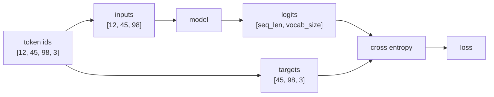

# 第9章 損失関数とクロスエントロピー

**この章のゴール**

cross entropyを「正解トークンに割り当てた確率を見るloss」として理解し、次トークン予測の `inputs` と `targets` を作れるようになること。

## 9.1 損失関数とは何か

この章では **損失関数**（loss function）と **クロスエントロピー** について学びます。損失関数とは、モデルの予測がどれくらい間違っているかを数値で表す関数です。

機械学習では「合っている/間違っている」だけでは不十分で、どれくらい悪い予測なのかを数値にする必要があります。この損失の値を小さくするように、モデルのパラメータを更新します。

```text
予測する → 損失を計算する → 損失が小さくなる方向にパラメータを更新する
```

言語モデルでは、モデルは次トークンの確率分布を出します。`I love` の正解が `dogs` のとき、`dogs` に高い確率（0.70）を割り当てていればよい予測、低い確率（0.05）なら悪い予測です。損失関数はこの予測の悪さを数値にします。

```text
正解トークンの確率が高い → 損失は小さい
正解トークンの確率が低い → 損失は大きい
```

言語モデルでは、この損失関数として **クロスエントロピー** がよく使われます。

---

## 9.2 予測がどれくらい間違っているかを数値化する

損失関数の役割は、予測の間違いを数値化することです。数値化できれば、損失を小さくする方向を計算でき、モデルを改善できます。

回帰問題（数値を予測する問題）では、二乗誤差 `loss = (正解 - 予測)^2` のような損失を使います。たとえば正解10・予測8なら `loss = (10-8)^2 = 4` です。

しかし言語モデルが予測するのは数値ではなく次のトークンです。これは分類問題として扱えます。語彙が5個なら5クラス分類で、モデルは各クラスに確率 `[0.05, 0.10, 0.05, 0.70, 0.10]` を出します。正解が `dogs`（クラス3）なら、モデルの良し悪しは正解クラスにどれだけ高い確率を割り当てたかで判断できます。クロスエントロピーは、この「正解クラスの確率」を見て、高いほど損失を小さく、低いほど大きくします。

---

## 9.3 正解ラベルと予測分布

クロスエントロピーを理解するには、**正解ラベル** と **予測分布** を分けて考えます。

予測分布は、モデルが出す語彙全体に対する確率分布です。語彙 `["I","you","love","dogs","."]` でモデルの予測が次のようなら、

```text
pred = [0.05, 0.10, 0.05, 0.70, 0.10]
```

これが予測分布です。正解ラベルは、正解が `dogs` なら `target = 3`（`dogs` のインデックス）です。機械学習では正解をone-hotベクトルで表すこともあります。

```text
target_one_hot = [0, 0, 0, 1, 0]   （正解トークンだけが1）
```

クロスエントロピーは予測分布と正解分布を比べますが、正解分布は `dogs` の位置だけが1なので、損失に効いてくるのは基本的に `dogs` に割り当てた確率（0.70）だけです。この値が高ければ損失は小さく、低ければ大きくなります。

---

## 9.4 cross entropyの直感

クロスエントロピーは直感的には「正解にどれだけ高い確率を割り当てたかを見る損失」です。正解トークンの確率が高いほど損失が小さくなります。

正解が `dogs` のとき、モデルAが `dogs: 0.90`、モデルBが `dogs: 0.10` なら、Aの方がよい予測で損失が小さくなります。クロスエントロピーでは、正解トークンの確率 `p` に対して次の値を損失にします。

```text
loss = -log(p)
```

たとえば `p = 0.90` なら `-log(0.90)` は小さく、`p = 0.10` なら大きく、`p = 0.01` ならもっと大きくなります。

```text
正解確率 p が 1 に近い → -log(p) は 0 に近い
正解確率 p が 0 に近い → -log(p) は大きくなる
```

この性質が言語モデルの学習に都合がよいのです。

---

## 9.5 なぜ正解の確率が高いほど損失が小さいのか

クロスエントロピーの基本式は `loss = -log(p)` で、`p` は正解トークンの確率です。対数に慣れていなくても、次の具体的な値を見れば性質がわかります。

```text
p = 1.00 → -log(p) = 0.000
p = 0.90 → -log(p) = 0.105
p = 0.50 → -log(p) = 0.693
p = 0.10 → -log(p) = 2.303
p = 0.01 → -log(p) = 4.605
```

正解に90%を割り当てた予測は損失が小さく、10%しか割り当てなければ損失が大きく、1%ならもっと大きくなります。これは「自信を持って間違えた場合に大きなペナルティを与える」ということです。たとえば正解が `dogs` なのに `cats: 0.90, dogs: 0.01` と予測すれば、大きく罰せられます。クロスエントロピーは、このように正解に割り当てた確率で予測の良し悪しを数値化します。

---

## 9.6 言語モデルにおけるcross entropy loss

言語モデルでは、各位置で次のトークンを予測します。実装では長いトークン列を一度に処理し、入力と正解を1つずらして使います。入力IDが `[12, 45, 98, 3]` なら、

```text
入力: [12, 45, 98]
正解: [45, 98, 3]
（12の次は45、45の次は98、98の次は3 を予測）
```

モデルは各位置について語彙全体へのlogits（`[batch_size, seq_len, vocab_size]`）を出し、正解は各位置の正解トークンID（`targets: [batch_size, seq_len]`）です。クロスエントロピーは各位置で正解トークンの確率を見て、それぞれの損失 `loss_i = -log(正解トークンの確率)` を計算し、最後に平均します。



つまり各位置で「正解の次トークンにどれだけ高い確率を出せたか」を見ます。高ければlossは小さく、低ければ大きくなります。

---

## 9.7 perplexityとの関係

言語モデルの評価では **perplexity** という指標が出てきます。これは「モデルが平均してどれくらい迷っているか」を表し、cross entropy lossと次の関係があります。

```text
perplexity = exp(loss)
```

たとえば loss=0.0 なら perplexity=1.0（完全に迷わず正解）、loss=1.0 なら 2.718、loss=2.0 なら 7.389 です。lossが大きいほどperplexityも大きくなります。直感的には「平均して何個くらいの候補で迷っているか」で、perplexityが10なら（ざっくり）10個くらいの候補で迷っている、と解釈できます。

```text
cross entropy loss が小さい → perplexity も小さい → 次トークンをよく予測できている
```

ただし現代のLLM評価では、perplexityだけで良し悪しは判断できません。文章の有用性、指示への従いやすさ、安全性、推論能力など多くの評価軸があります。それでも基礎的な言語モデルの学習を理解する上では、perplexityは重要な指標です。

---

## 9.8 PyTorchでcross entropyを計算する

PyTorchでクロスエントロピーを計算します。語彙5個で、モデルが出したlogitsと正解 `dogs`（ID 3）を用意します。`F.cross_entropy` は入力にバッチ次元が必要なので、`unsqueeze(0)` でshapeを整えます。

```python
import torch
import torch.nn.functional as F

logits = torch.tensor([0.1, 0.2, -0.5, 2.0, 0.0])
target = torch.tensor(3)

loss = F.cross_entropy(logits.unsqueeze(0), target.unsqueeze(0))
print(loss)   # tensor(0.5163)
```

`F.cross_entropy` は内部で「logits → log_softmax → 正解ラベルの位置を見る → negative log likelihood」という処理を行います。つまりsoftmaxを自分でかけてから渡すのではなく、logitsをそのまま渡します。これは重要です。

```text
正しい: F.cross_entropy(logits, targets)
避ける: F.cross_entropy(softmax(logits), targets)
```

PyTorchの `cross_entropy` は、softmax前のlogitsを受け取るように設計されています。

---

## 9.9 cross entropyを手計算してPyTorchと比べる

cross entropyを手計算して、PyTorchの結果と一致することを確認します。手計算は「softmax → 正解トークンの確率を取り出す → -log」という流れです。

```python
import torch
import torch.nn.functional as F

logits = torch.tensor([0.1, 0.2, -0.5, 2.0, 0.0])
target = torch.tensor(3)

probs = torch.softmax(logits, dim=-1)
p_correct = probs[target]                 # tensor(0.5967)
manual_loss = -torch.log(p_correct)       # tensor(0.5163)

loss = F.cross_entropy(logits.unsqueeze(0), target.unsqueeze(0))  # tensor(0.5163)

print(manual_loss, loss)
```

同じ値になりました。1つのサンプルに対するcross entropyは「logits → softmax → 正解トークンの確率 → -log(正解確率) → loss」です。ただし実装では数値安定性のため、通常は `F.cross_entropy` にlogitsを直接渡します。

---

## 9.10 バッチ付き・系列付きのcross entropy

実際の言語モデルでは、logitsは `[batch_size, seq_len, vocab_size]`、targetsは `[batch_size, seq_len]` です。一方 `F.cross_entropy` はクラス次元が2番目にある `[N, C]` の形を期待します（`C` はクラス数＝語彙サイズ）。言語モデルのlogitsは語彙サイズが最後の次元なので、batchとseq_lenをまとめて渡します。

```python
import torch
import torch.nn.functional as F

batch_size, seq_len, vocab_size = 2, 3, 5
logits = torch.randn(batch_size, seq_len, vocab_size)
targets = torch.tensor([[1, 3, 4], [0, 2, 3]])

logits_flat = logits.reshape(batch_size * seq_len, vocab_size)  # [6, 5]
targets_flat = targets.reshape(batch_size * seq_len)            # [6]

loss = F.cross_entropy(logits_flat, targets_flat)
print(loss)
```

shapeは次のように変わります。

```text
logits:  [batch_size, seq_len, vocab_size] → [batch_size * seq_len, vocab_size]
targets: [batch_size, seq_len]             → [batch_size * seq_len]
```

つまり、すべての位置（この例では6個）をまとめて普通の5クラス分類として扱い、各位置の次トークン予測の損失を平均します。

---

## 9.11 次トークン予測のtargetsを作る

言語モデルでは、入力と正解を1つずらして作ります。トークンID列 `[12, 45, 98, 3, 7]` なら、

```text
入力: [12, 45, 98, 3]
正解: [45, 98, 3, 7]
```

PyTorchではスライスで作れます。バッチ付きも同様です。

```python
import torch

token_ids = torch.tensor([
    [12, 45, 98, 3, 7],
    [8, 21, 21, 56, 4],
])

inputs = token_ids[:, :-1]
targets = token_ids[:, 1:]

print(inputs.shape, targets.shape)   # [2, 4] [2, 4]
```

```text
inputs:  tensor([[12, 45, 98,  3], [ 8, 21, 21, 56]])
targets: tensor([[45, 98,  3,  7], [21, 21, 56,  4]])
```

このように元の列を1つずらして入力と正解を作ります。この形は、Decoder-only Transformer（GPT系の言語モデル）で特に重要です。

---

## 9.12 小さな言語モデル出力でlossを計算する

実際の言語モデルに近い形でlossを計算します。本物のTransformerはまだ作らず、embeddingと線形層だけでshapeとloss計算の流れを確認します。

```python
import torch
import torch.nn as nn
import torch.nn.functional as F

batch_size, seq_len, vocab_size, d_model = 2, 5, 100, 8

token_ids = torch.tensor([
    [12, 45, 98, 3, 7],
    [8, 21, 21, 56, 4],
])

inputs = token_ids[:, :-1]
targets = token_ids[:, 1:]

embedding = nn.Embedding(vocab_size, d_model)
output_layer = nn.Linear(d_model, vocab_size)

hidden = embedding(inputs)       # [2, 4, 8]
logits = output_layer(hidden)    # [2, 4, 100]

B, T, V = logits.shape
loss = F.cross_entropy(logits.reshape(B * T, V), targets.reshape(B * T))

print("logits:", logits.shape)
print("loss:", loss)
```

shapeの流れは「inputs `[batch, seq-1]` → embedding → hidden `[batch, seq-1, d_model]` → 出力層 → logits `[batch, seq-1, vocab_size]`」で、targetsは `[batch, seq-1]` です。loss計算は各位置の次トークン予測の損失を平均しています。

このコードは言語モデル学習の最後の部分にかなり近いです。本物のTransformerでは、embeddingと出力層の間にSelf-AttentionやFeed Forward Networkが入ります。

```text
inputs → embedding → Transformer blocks → hidden → output_layer → logits → cross entropy loss
```

しかし、lossの計算部分は基本的に同じです。

---

## 9.13 まとめ

この章では、損失関数とクロスエントロピーについて学びました。損失関数は、モデルの予測がどれくらい悪いかを数値化する関数で、よい予測ならlossが小さく、悪い予測なら大きくなります。機械学習では、このlossを小さくするようにパラメータを更新します。

言語モデルでは、モデルは次トークンの確率分布（logits → softmax）を出します。正解トークンに高い確率を割り当てていればよい予測です。クロスエントロピーはこの正解トークンの確率を使って損失を計算します。

```text
loss = -log(p)
（p が 1 に近い → loss は 0 に近い / p が 0 に近い → loss は大きい）
```

PyTorchでは `loss = F.cross_entropy(logits, targets)` で計算します。重要なのは、softmax後の確率ではなくsoftmax前のlogitsを渡すことです。

言語モデルでは、logitsは `[batch_size, seq_len, vocab_size]`、targetsは `[batch_size, seq_len]` です。loss計算ではbatchとseq_lenをまとめます。

```python
B, T, V = logits.shape
loss = F.cross_entropy(logits.reshape(B * T, V), targets.reshape(B * T))
```

次トークン予測では、入力と正解を1つずらして作ります（`inputs = token_ids[:, :-1]`、`targets = token_ids[:, 1:]`）。

この章で特に重要なのは、次の理解です。

```text
lossは予測の悪さを数値化する
cross entropyは正解トークンの確率を見る
正解確率が高いほどlossは小さい
言語モデルは各位置で次トークンを予測する
PyTorchのcross_entropyにはlogitsを渡す
```

### 確認問題

トークン列 `[12, 45, 98, 3]` から、`inputs` と `targets` はどう作ればよいでしょうか。

答えは次の通りです。

```text
inputs:  [12, 45, 98]
targets: [45, 98, 3]
```

`examples/02_cross_entropy.py` を実行すると、手計算したlossとPyTorchの `F.cross_entropy` が一致することを確認できます。

### よくある誤解

PyTorchの `F.cross_entropy` には、softmax後の確率ではなくlogitsを渡します。

```text
正しい: F.cross_entropy(logits, targets)
避ける: F.cross_entropy(torch.softmax(logits), targets)
```

次章では、微分の直感について学びます。ここまでで、モデルが予測を出しlossを計算するところまで見ました。次に必要なのは「lossを小さくするには、パラメータをどちら向きに動かせばよいのか」という考え方で、そのために微分と勾配が必要になります。
