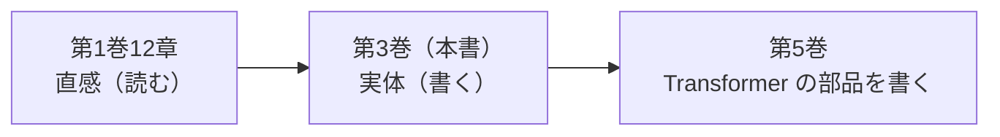

# 第1章　この巻の地図

**この章でわかること**

- この巻（第3巻）で、最終的に何ができるようになるか
- 第1巻12章で植えた「直感」を、この巻でどう「実体」に変えるか
- この巻でやらないこと（＝次の巻の仕事）と、その理由
- 使う道具（PyTorch を最小限から）

### 1.1　この巻でできるようになること

まず、ここまでの旅を振り返ります。

第1巻では、機械学習を「データから規則性を学び、損失を小さくする営み」として理解しました。

このとき、コードは書きませんでした。

「読んで腑に落ちる」ことを目的にした、直感の巻だったからです。

第2巻では、その営みを支える数学を学びました。

ベクトル、行列、内積、softmax、微分、勾配降下。

これらを、記号とコードで「一度確かめる」ところまでやりました。

そして、この第3巻です。

この巻のゴールは、はっきりしています。

```text
小さなニューラルネットワーク（MLP）を、
自分の手で書いて、最後まで学習させ切る。
```

ここでいう「自分の手で書く」とは、どういうことでしょうか。

それは、PyTorch を使って、

- モデルを定義し、
- 損失を計算し、
- 勾配を流し、
- パラメータを更新する、

という学習のループを、自分で組める、という意味です。

第1巻では「学習とは損失を小さくすること」と言葉で理解しました。

この巻では、その「損失を小さくする」を、実際に動くコードとして実現します。

そして、この巻にはもう一つ、とても重要な仕込みがあります。

```text
残差接続（residual connection）と
Layer Normalization（LayerNorm）を、
「なぜ必要か」まで含めて、自分で実装する。
```

この2つは、いまはまだ何のことか分からなくて構いません。

ですが、覚えておいてほしいことがあります。

第6巻で論文『Attention Is All You Need』を読むとき、Transformer のあらゆるブロックは、次の形をしています。

```text
LayerNorm(x + Sublayer(x))
```

この一行は、Transformer の骨格そのものです。

そして、この巻を読み終えるころには、あなたはこの一行を見て、こう思えるようになります。

「ああ、残差接続で `x +` をして、LayerNorm で整える、あれのことか」と。

つまりこの巻は、論文のこの一行を「謎の呪文」で終わらせないための、準備の巻でもあるのです。

### 1.2　第1巻12章の「直感」を実体化する

第1巻の第12章では、「ニューラルネットワークとは何か」を、直感で説明しました。

ニューロンとは何か。

層を重ねるとはどういうことか。

活性化関数とは何か。

順伝播と逆伝播の、おおまかなイメージ。

これらは、すべて「読んで腑に落ちる」レベルで止めてありました。

コードは一行も書いていません。

この第3巻は、その続きです。

同じ概念を、今度は **手が動く** レベルまで落とします。



ここで、大切な点を確認しておきます。

第1巻と第3巻で、同じ概念（ニューロンや活性化関数）が再び登場します。

これは、無駄な繰り返しではありません。

意図した「スパイラル（らせん）」です。

1巻で直感を植え、3巻で実体に落とす。

同じ山を、違う高さから、もう一度登るのです。

だからこの巻は、「ニューロンとは何か」という説明から始めません。

それは第1巻12章で、すでに済んでいるからです。

ここでは、すでに直感がある前提で、いきなり手を動かしはじめます。

### 1.3　この巻でやらないこと（＝次の巻の仕事）

良い教科書は、「何を教えるか」と同じくらい、「何を教えないか」をはっきりさせます。

スコープ（扱う範囲）を最初に固定しておかないと、説明がどんどん膨らみ、本筋が見えなくなるからです。

そこで、この巻が **やらないこと** を、先に並べておきます。

**1. 「ニューロンとは何か」をゼロから説明すること。**

これは第1巻12章で済んでいます。

ここで繰り返すと、同じ話を二度することになります。

**2. 言語・トークン・embedding を本格的に扱うこと。**

これは次の第4巻の仕事です。

この巻では、入力はずっと「ただの数のベクトル」です。

言語をどう数にするか、という問題には立ち入りません。

**3. Self-Attention・Q/K/V・Multi-Head など、Transformer の部品を作ること。**

これは第5巻の仕事です。

この巻で残差接続と LayerNorm を仕込むのは、第5巻でそれらを使うための準備にすぎません。

Attention そのものには、まだ触れません。

**4. 自前の自動微分（autograd）フレームワークを作ること。**

「逆伝播を自動でやってくれる仕組みを、自分でゼロから作る」というのは、とても魅力的なテーマです。

ですが、それは「別の山」です。

この巻が目指す方向からは外れるので、今回は登りません。

逆伝播は、PyTorch の autograd に任せます。

**5. 部品を統合して、動く言語モデルにすること。**

これは第7巻の仕事です。

迷ったときの判定基準は、たった一つです。

「これは、小さな MLP を学習させ切り、残差接続と LayerNorm を仕込む、というこの巻の出口に効くか？」

効かないなら、それは別の巻の仕事です。

この問いを、各章のあちこちで、自分に投げかけてください。

### 1.4　使う道具（PyTorch を最小限から）

この巻では、PyTorch を使います。

ただし、最初から全部の機能を使うのではありません。

必要になった順に、少しずつ導入していきます。

まず、最低限、次のコードが動く環境を用意してください。

```bash
python3 -c "import torch; print(torch.__version__)"
```

これを実行して、バージョン番号（たとえば `2.x.x`）が表示されれば、準備は完了です。

GPU は不要です。

この巻のコードは、すべて小さく、CPU だけで一瞬で動きます。

なぜなら、この巻の目的は「速く計算すること」でも「高い性能を出すこと」でもないからです。

目的は、ただ一つ。

「順伝播・損失・逆伝播・更新の一周を、自分のコードで通す」ことです。

その一周さえ通せれば、あとは規模を大きくするだけ、というところまで連れていきます。

### 1.5　本章のまとめ

- この巻の出口は「小さな MLP を自分で書いて、最後まで学習させ切る」こと。
- あわせて、残差接続と LayerNorm を「なぜ必要か」まで含めて実装し、論文の `LayerNorm(x + Sublayer(x))` を読む準備をする。
- 「ニューロンとは」からは始めない。第1巻12章の直感を、手が動くレベルに実体化する巻である。
- Transformer の部品づくりは第5巻、統合は第7巻。自前 autograd も作らない。いずれもこの巻ではやらない。
- 道具は PyTorch。GPU は不要で、CPU で一瞬。目的は性能でなく「一周を自分の手で通す」こと。

---

<!-- chapter-nav:start -->

[目次](Table%20of%20Contents.md) ｜ [第2章　線形モデルから多層へ →](Chapter%202%20From%20Linear%20Models%20to%20Multiple%20Layers.md)

<!-- chapter-nav:end -->
