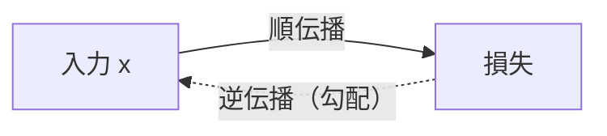

# 第6章　逆伝播と連鎖律（実装で）

**この章でわかること**

- 学習とは、損失を下げる方向に重みを動かすこと（の復習）
- 勾配が「どちらへ動かすか」を教えてくれること
- 連鎖律で、勾配が出力から入力へ後ろ向きに流れること（第2巻の回収）
- PyTorch の autograd に、逆伝播を任せる
- `loss.backward()` で何が起きているか、勾配を実際にのぞいて確かめる

### 6.1　学習とは損失を下げる方向に重みを動かすこと

ここまでで、順伝播（入力から損失まで）が計算できるようになりました。

入力を層に通し、ロジットを出し、softmax と cross entropy で損失を出す。

ここまでが、前向きの計算でした。

では次に、何が必要でしょうか。

それは、「損失を小さくするには、各パラメータを、どちらへ、どれだけ動かせばよいか」を知ることです。

たとえば、ある重み `w` を、いまより少し大きくすべきか、小さくすべきか。

それを教えてくれるのが、**勾配**（gradient）です。

第1巻5章、第2巻10〜11章で学んだとおり、勾配はパラメータごとの「損失の傾き」です。

「傾き」とは、「そのパラメータを少し動かすと、損失がどれだけ変わるか」を表す量でした。

そして、勾配と **逆向き** に少し動かせば、損失は下がります。

```text
新しい重み = 今の重み - 学習率 × 勾配
```

`学習率`（learning rate）は、「どれくらいの大きさで動かすか」を決める値です（第1巻5章、次章で詳しく）。

ここで、問題があります。

ニューラルネットには、重みが大量にあります。

しかも、何層も重なっています。

最後の出力からは遠い、最初の層の重みについて、どうやって「損失の傾き」を求めればよいのでしょうか。

「この一番奥の重みを少し動かすと、ずっと先の損失がどう変わるか」を、どうやって計算するのか。

ここで、連鎖律が効きます。

### 6.2　連鎖律で勾配が後ろへ流れる（第2巻の回収）

ニューラルネットは、関数の合成です。

入力が、いくつもの関数を順に通って、損失になります。

```text
x → 線形 → 活性化 → 線形 → 損失
```

第2巻12章で学んだ連鎖律は、「合成関数の微分は、各段の微分の掛け算になる」というものでした。

たとえば、`y = f(g(x))` のとき、`x` についての `y` の傾きは、

```text
（f の傾き）×（g の傾き）
```

という、掛け算になりました。

この性質を使うと、何が嬉しいのでしょうか。

損失に近い側（出力側）から順に、各段の傾きを掛け合わせていけば、どんなに奥の重みについても、傾き（勾配）を求められるのです。

「損失に近いところの傾き」から始めて、それを後ろへ後ろへと伝えていく。

この「出力側から入力側へ、勾配を伝える計算」が **逆伝播**（backpropagation）です。

順伝播が前向き（入力→損失）なのに対し、逆伝播は後ろ向き（損失→入力）です。



イメージを言葉にすると、こうです。

各層は、自分のところを通る勾配を、後ろから受け取ります。

そして、2つのことをします。

1. 自分の重みの勾配を計算する（自分の重みをどう動かすべきか）。
2. さらに前の層へ、勾配を渡す（前の層が計算を続けられるように）。

これを、最初の層まで繰り返します。

すると、すべての重みの勾配が、求まります。

バケツリレーのように、勾配を後ろへ後ろへと手渡していく、というイメージです。

### 6.3　PyTorch の autograd に任せる

連鎖律を、手で書くのは大変です。

層が2つ3つならまだしも、Transformer のように何十層もあると、手計算は現実的ではありません。

幸い、PyTorch には **autograd**（自動微分）という仕組みがあります。

autograd は、順伝播の計算を記録しておきます。

そして、`backward()` を呼ぶと、連鎖律にそって、すべてのパラメータの勾配を、自動で計算してくれます。

第2巻10章・12章で、`requires_grad` と計算グラフに触れました。

ここではそれを、ニューラルネットの学習として使います。

朗報があります。

`nn.Linear` などのパラメータは、最初から `requires_grad=True` になっています。

つまり「このパラメータについて、勾配を計算してほしい」という印が、すでについているのです。

だから、私たちが何か特別なことをしなくても、モデルを組んで損失を出せば、`backward()` 一発で全部の勾配が求まります。

### 6.4　`loss.backward()` で何が起きているか

実際にやってみましょう。

順伝播して損失を出し、`backward()` を呼び、勾配を見ます。

```python
import torch
import torch.nn as nn

torch.manual_seed(0)

model = nn.Sequential(
    nn.Linear(3, 4),
    nn.ReLU(),
    nn.Linear(4, 2),
)
loss_fn = nn.CrossEntropyLoss()

x = torch.randn(5, 3)          # バッチ5件
targets = torch.tensor([0, 1, 1, 0, 1])

# 順伝播
logits = model(x)
loss = loss_fn(logits, targets)

# 逆伝播
loss.backward()

# 最初の層の重みの勾配が計算されている
print(model[0].weight.grad.shape)   # torch.Size([4, 3])
```

たった `loss.backward()` の一行で、損失から各パラメータまで、連鎖律がたどられます。

そして、`model[0].weight.grad` などに、勾配が入ります。

`model[0]` は最初の `nn.Linear(3, 4)` で、その `weight` の shape は `[4, 3]` でした（第3章）。

その勾配も、同じ `[4, 3]` の形で求まります。

「重みと同じ形の勾配が、重みの一つ一つについて求まる」と覚えてください。

手で連鎖律を書く必要は、まったくありません。

これが autograd の力です。

第7巻では、この `backward()` を「自分の手で書いた逆伝播」と並べて、そのありがたみを体感します。

実は、第7巻の冒頭では、いまブラックボックスにしている `backward()` の中身を、NumPy で手書きします。

そして、自分で書いた何十行もの逆伝播が、PyTorch だと `loss.backward()` の一行で消える、という対比を味わうのです。

いまは「一行で全層の勾配が求まる」ことを、ありがたく受け取っておけば十分です。

### 6.5　勾配をのぞいて確かめる

勾配が、本当に「損失を下げる向き」を指しているか。

その感覚を、持っておきましょう。

勾配は、各重みについて「その重みを少し増やすと、損失がどれだけ増えるか」を表します。

ここから、動かす向きが決まります。

```text
勾配が正：その重みを増やすと損失が増える → だから、減らすべき
勾配が負：その重みを増やすと損失が減る → だから、増やすべき
```

どちらの場合も、「勾配の逆向きに動かせば、損失が下がる」ことが分かります。

だから、更新の式が「重み − 学習率 × 勾配」と、勾配を **引く** 形になっているのです。

勾配が正なら引いて減らし、勾配が負なら引いて（マイナスを引くので）増やす。

どちらも、損失を下げる向きに動きます。

最後に、実装上の大切な注意があります。

`backward()` を呼ぶ前には、前回の勾配を消しておく必要があります。

なぜなら、勾配は **加算されていく** からです。

何もしないと、前回の勾配に、今回の勾配が足され続けてしまいます。

これを忘れると、勾配が溜まり続けて、おかしな更新になります。

消すには、次のように書きます。

```python
# 勾配は溜まるので、毎ステップ消す必要がある（次章で学習ループとして使う）
model.zero_grad()
```

次章の学習ループでは、これを `optimizer.zero_grad()` として、毎ステップ呼びます。

「forward の前に、勾配を消す」。

これを、学習ループの作法として、体に染み込ませてください。

### 6.6　本章のまとめ

- 学習は「損失を下げる向き（＝勾配の逆向き）に重みを動かす」こと。勾配は各パラメータの「損失の傾き」。
- ニューラルネットは関数の合成。連鎖律で、出力側から入力側へ勾配を伝えるのが逆伝播（バケツリレーのイメージ）。
- PyTorch の autograd が、`loss.backward()` 一行で全パラメータの勾配を計算してくれる。`weight` と同じ形の勾配が求まる。
- 勾配は「重みを増やすと損失がどう変わるか」。だから、その逆向きに動かす（更新式が引き算なのはこのため）。
- 勾配は溜まるので、毎ステップ `zero_grad()` で消す（次章の学習ループで使う）。

---

<!-- chapter-nav:start -->

[← 第5章　出力層と損失](Chapter%205%20Output%20Layers%20and%20Loss.md) ｜ [目次](Table%20of%20Contents.md) ｜ [第7章　勾配降下で学習させる →](Chapter%207%20Training%20with%20Gradient%20Descent.md)

<!-- chapter-nav:end -->
