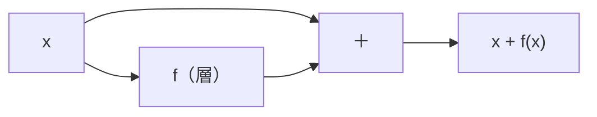

# 第9章　残差接続

**この章でわかること**

- 層を深くすると、なぜ問題が起きるのか
- 残差接続（`x + f(x)`）とは何か
- なぜ残差接続で、勾配が流れやすくなるのか（数で確かめる）
- 残差接続を実装する
- これが論文の `x + Sublayer(x)` にどうつながるか

この章と次章は、この巻が Transformer のために用意した「仕込み」です。

第6巻で論文を読むとき、Transformer のあらゆるブロックは、`LayerNorm(x + Sublayer(x))` という形をしています。

その `x +` の部分が、この章の残差接続です。

ここをしっかり理解しておくと、第5巻・第6巻・第7巻が、ぐっと楽になります。

### 9.1　層を深くすると起きる問題

ニューラルネットは、層を深くするほど、複雑な表現を学べる。

そう期待したくなります。

ところが、現実はそう単純ではありません。

ただ層を増やしただけだと、かえって学習がうまくいかなくなることがあるのです。

なぜでしょうか。

理由の一つが、勾配の問題です。

逆伝播では、勾配が各層を通るたびに、掛け算されていきます（連鎖律、第6章）。

このとき、各層の傾きが「1より小さい」と、掛け算するたびに勾配が小さくなっていきます。

具体的な数で見てみましょう。

各層の傾きが、だいたい 0.5 だとします。

10層を通ると、勾配は、

```text
0.5 を 10 回かける = 0.5^10 ≈ 0.001
```

最初の1000分の1になってしまいます。

20層なら、

```text
0.5^20 ≈ 0.000001
```

ほぼ0です。

これでは、入力に近い層まで勾配が届かず、最初の層がほとんど学習しません。

これが **勾配消失** です（第4章で活性化関数の文脈でも触れました）。

逆に、各層の傾きが「1より大きい」と、今度は勾配がどんどん大きくなり、発散します（勾配爆発）。

どちらにしても、層を深くすると、勾配がうまく流れにくくなる。

これが、深いネットワークの大きな壁でした。

この壁を、驚くほどシンプルなアイデアで和らげるのが、残差接続です。

### 9.2　残差接続とは何か（`x + f(x)`）

残差接続（residual connection、スキップ接続とも呼ばれます）は、本当に単純です。

ある層（または、ひとかたまりの処理）`f` の出力に、その入力 `x` を **そのまま足す** だけです。

```text
出力 = x + f(x)
```

ふつうなら、`f(x)` だけを次へ渡します。

残差接続では、`f(x)` に `x` を足してから渡すのです。

なぜ、こんなことをするのでしょうか。

考え方の鍵は、「`f` は、入力からの **差分**（残差＝residual）だけを学べばよい」という点です。

`出力 = x + f(x)` を、こう読み替えてみてください。

「`x` を土台にして、`f` がそこにどれだけ修正を加えるか」。

`f(x)` は、その「修正分」だけを担当すればよいのです。

図にすると、こうです。



入力 `x` が、2つの道に分かれています。

1つは `f` を通る道。

もう1つは、`f` を飛び越えて、そのまま足し算へ向かう道（これがスキップ接続です）。

ここに、嬉しい性質があります。

もし `f` が「何も足す必要がない」と判断したら、`f(x)` を0に近づければよいのです。

その場合、`出力 ≈ x` となり、情報がそのまま素通りします。

つまり、残差接続は「少なくとも、入力をそのまま通せる」という逃げ道を、常に確保しています。

「下手に変換するより、何もしないほうがマシ」なときは、何もしない（素通りする）ことを選べる。

これが、深いネットワークでも壊れにくい理由の一つです。

### 9.3　なぜ勾配が流れやすくなるのか（数で確かめる）

逆伝播の観点で見ると、残差接続のうれしさが、はっきり分かります。

`出力 = x + f(x)` を、`x` で微分してみましょう。

足し算の微分は、それぞれの微分の和です。

```text
d(出力)/d(x) = d(x)/d(x) + d(f(x))/d(x)
             = 1 + d(f(x))/d(x)
```

ここで、`d(x)/d(x) = 1` です。

`x` を `x` で微分すれば、当然1だからです。

だから、`x` の項からくる「1」が、必ず残ります。

この「+1」が、決定的に重要です。

前の節で、各層の傾きが0.5だと、10層で勾配が0.001になる、と計算しました。

残差接続があると、各層の傾きが `1 + (f の傾き)` になります。

`f` の傾きが小さくても（たとえば0.1でも）、

```text
1 + 0.1 = 1.1
```

と、1より大きい値が残ります。

つまり、勾配は「1」を通して、後ろの層へ、ほぼそのまま流れていけます。

たとえ `f` 側の勾配がゼロに近くても、「+1」のおかげで、勾配が消えずに伝わるのです。

残差接続は、勾配にとっての「高速道路（バイパス）」を作るのだ、とよく言われます。

`f` を通る一般道が渋滞（勾配消失）していても、バイパス（`x` の道）を通れば、勾配はすいすい流れる、というイメージです。

これが、何十層もの深いネットワーク（そして、何層も積む Transformer）が学習できる、大きな理由の一つです。

### 9.4　残差接続を実装する

実装も、単純です。

入力と出力の次元が同じなら、足すだけです。

```python
import torch
import torch.nn as nn

class ResidualBlock(nn.Module):
    def __init__(self, dim):
        super().__init__()
        self.fc = nn.Linear(dim, dim)
        self.act = nn.ReLU()

    def forward(self, x):
        f = self.act(self.fc(x))
        return x + f          # ← 残差接続

block = ResidualBlock(4)
x = torch.randn(2, 4)
out = block(x)
print(out.shape)             # torch.Size([2, 4])  入力と同じ shape
```

`forward` の最後が `return x + f` になっているのが、ポイントです。

`f` だけでなく、`x` を足してから返しています。

ここで、一つ大切な注意があります。

足し算をするには、`f` の出力 shape と、入力 `x` の shape が、一致していなければなりません。

ここでは、両方とも `[2, 4]` です。

だから足せます。

もし `f` が次元を変えてしまったら（たとえば `[2, 4]` を `[2, 8]` にしたら）、足せなくなります。

だから、残差接続を使う層は、入出力の次元をそろえるのが基本です。

このことは、Transformer を理解するうえで重要です。

Transformer のブロックが、終始 `d_model` という同じ次元を保つのは、まさにこの「残差接続のために、次元をそろえる」という理由があるからです。

第5巻で、Attention も FFN も、入出力の次元をそろえて作ります。

それは、こうして残差接続で包めるようにするためなのです。

### 9.5　論文の `x + Sublayer(x)` への布石

論文『Attention Is All You Need』では、各サブlayer（Attention や Feed-Forward）が、次の形で使われます。

```text
x + Sublayer(x)
```

これは、いま実装した `x + f(x)` と、まったく同じ構造です。

`f` が `Sublayer`（Attention だったり FFN だったり）に変わるだけです。

```text
本章で書いたもの : x + f(x)
論文のブロック    : x + Sublayer(x)   ← f が Attention や FFN に変わるだけ
```

ここに、大切なメッセージがあります。

Attention の中身を、まだ何も知らなくても、「それを残差接続で包む」という骨格は、もうこの章で手に入れているのです。

第5巻で `Sublayer` の中身（Attention）を作るとき、あなたは「ああ、これを `x +` で包めばいいんだな」と、すぐに分かります。

なぜなら、その包み方を、いま、自分で実装したからです。

次章で、この `x + Sublayer(x)` を、さらに LayerNorm で整える形を学べば、論文のブロックの骨格が完成します。

### 9.6　本章のまとめ

- 層を深くすると、勾配が掛け算で小さく（または大きく）なり、学習が難しくなる（勾配消失・爆発）。
- 残差接続は `出力 = x + f(x)`。`f` は入力からの差分だけを学べばよく、最悪でも入力を素通りできる。
- 微分すると必ず「+1」が残る。各層の傾きが `1 + (f の傾き)` になり、勾配が後ろへまっすぐ流れる「バイパス」になる。
- 実装は `x + f(x)`。足せるよう、入出力の次元をそろえる（Transformer が `d_model` を保つ理由）。
- 論文の `x + Sublayer(x)` は、この `x + f(x)` の `f` を Attention/FFN に置き換えたもの。骨格はもう手にしている。
