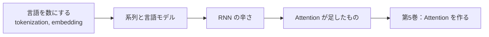

# 第1章　この巻の地図

**この章でわかること**

- この巻（第4巻）で、最終的に何ができるようになるか
- 言語を扱うと、何が新しく必要になるのか
- この巻でやらないこと（＝次の巻の仕事）と、その理由

### 1.1　言語を扱うと何が新しいのか

第3巻まで、ニューラルネットへの入力は、つねに「数のベクトル」でした。

XOR の `[0, 1]` のように、最初から数になっているものを扱ってきました。

家の価格予測なら、広さや駅距離といった、すでに数である情報を入れていました。

ところが、Transformer が相手にするのは、**言語** です。

「犬」「走る」「。」といった、そのままでは数でないものを、どうやってニューラルネットに入れるのか。

ここで、新しい問いが2つ生まれます。

```text
問い1：文字や単語を、どうやって数（ベクトル）にするのか？
問い2：単語が一列に並んだ「系列」を、どう扱うのか？
```

問い1は、「犬」をどんな数で表すか、という問題です。

問い2は、「犬 が 猫 を 追う」と「猫 が 犬 を 追う」が違う、という「順序」をどう扱うか、という問題です。

第3巻まで扱ってきた XOR のような問題には、順序という概念はありませんでした。

`[0, 1]` と `[1, 0]` は、別の入力ではありますが、「順番が意味を持つ」という話ではありませんでした。

言語は違います。

語順が、意味そのものを変えます。

この巻は、この2つの問いに、正面から答える巻です。

### 1.2　この巻でできるようになること

この巻の出口は、次のとおりです。

- tokenization（トークン化）・embedding（埋め込み）・言語モデル（次トークン予測）が何かを、説明できる。
- そして、「RNN は何が辛くて、Attention が何を足したのか」を、自分の言葉で語れる。

最後の一文が、この巻のいちばんの狙いです。

少し、種明かしをしておきましょう。

Transformer は、ある日突然、天才のひらめきで生まれたわけではありません。

それ以前にも、系列（言語）を扱うモデルがありました。

RNN や LSTM と呼ばれるものです。

それらには、いくつかの「辛さ（弱点）」がありました。

その辛さを解くために、Attention が登場しました。

つまり、Attention には「なぜ生まれたか」という、はっきりした理由（動機）があるのです。

その「なぜ」を腑に落とすことが、第5巻で Attention の部品を作る前の、最良の準備になります。

理由を知らずに作るのと、理由を知って作るのとでは、理解の深さがまったく違うからです。

この巻の流れを、図にしておきます。



前半で「言語を数にする」、後半で「RNN の辛さから Attention へ」という、2つの山を登ります。

### 1.3　この巻でやらないこと（＝次の巻の仕事）

スコープ（扱う範囲）を、最初に固定します。

この巻は、次のことを **しません**。

**1. RNN / LSTM を実装すること。**

この巻では、RNN を動機づけに留め、コードでは作りません。

なぜでしょうか。

この巻での RNN の役割は、あくまで「Attention がなぜ必要になったか」を説明するための、**比較対象** だからです。

RNN を実装するのは、それ自体は学びがありますが、「別の道」です。

この巻が目指す方向からは外れるので、立ち入りません。

実は、RNN は「実装したくなる」誘惑が強い場所です。

仕組みが面白いので、つい手を動かしたくなります。

でも、ここでぐっとこらえます。

RNN は、Attention の良さを引き立てる「当て馬」として、直感だけをつかみます。

**2. Self-Attention・Q/K/V を実装すること。**

これは第5巻の仕事です。

この巻では、Attention の「動機」までを扱い、「実装」には踏み込みません。

**3. Transformer を組むこと。**

これは第7巻の仕事です。

**4. 現代の LLM のトークナイザ（BPE など）の詳細。**

これは第8巻で扱います。

この巻では、概念まで（「こういう考え方で分割する」というところまで）です。

判定基準は、いつもの一つです。

「これは、言語をベクトルにし、系列と言語モデルを理解し、Attention の動機を語る、というこの巻の出口に効くか？」

効かないなら、別の巻の仕事です。

### 1.4　本章のまとめ

- 言語を扱うには、「記号を数にする」「系列（順序）を扱う」という2つの新しい問いが生まれる。
- この巻の出口は、tokenization・embedding・言語モデルの理解と、「RNN の辛さと Attention が足したもの」を語れること。
- RNN は実装せず、Attention の動機づけのための比較対象として、直感だけをつかむ。
- Attention の実装は第5巻、Transformer の統合は第7巻、現代のトークナイザの詳細は第8巻。
