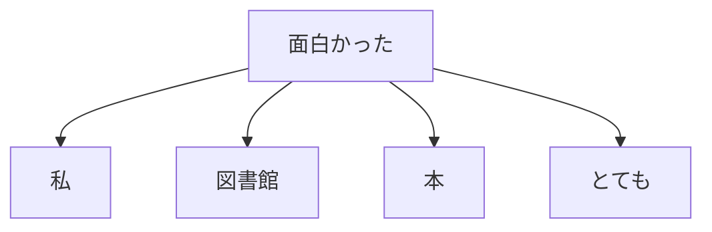

# 第11章　Attention は何を足したか（動機づけ）

**この章でわかること**

- すべてのトークンを、直接見比べるという発想
- 「どこに注目するか」を、重みで表す
- 内積で相性を測る（第2巻4章の回収）
- 並列に計算できるという、決定的な利点

この章は、この巻のクライマックスです。

前章の RNN の辛さに対して、Attention が何を足したのかを、動機のレベルで腑に落とします。

実装は、次の第5巻で行います。

ここでは「なぜ効くのか」を語れるようになることが、目標です。

### 11.1　すべてのトークンを直接見比べる

RNN は、情報を1ステップずつ、状態を経由して運んでいました。

Attention の発想は、それを根本から変えます。

```text
各トークンが、系列内の すべてのトークンを 直接 見比べる。
```

これが、Attention の出発点です。

「面白かった」を処理するとき、どうするでしょうか。

間のステップを経由しません。

「私」も「図書館」も「本」も、すべてのトークンを、一度に見渡します。

距離が遠くても近くても、関係なく、直接アクセスします。

前章の「遠くの単語を直接見たい」という欲求に、これがそのまま応えます。



「面白かった」から、すべてのトークンへ、直接、線が引かれています。

RNN のように、間を1つずつ通る必要は、ありません。

「本」へ、直接、手を伸ばせるのです。

### 11.2　「どこに注目するか」を重みで表す

すべてを見比べる、と言っても、全部を同じ重さで見るわけではありません。

「面白かった」にとっては、「本」が重要です。

「図書館」は、それほどでもありません。

この「どこを、どれだけ重視するか」を、**注目の重み**（attention weight）として表します。

各トークンについて、「他のどのトークンに、どれだけ注目するか」を表す重みを、計算します。

重みは、合計が1になる（確率のような）値です。

重要なトークンには、大きな重み。

そうでないトークンには、小さな重み。

具体例で見ましょう。

```text
「面白かった」から見た注目の重み:
  本     → 0.6   （重要。大きい重み）
  とても  → 0.2
  私     → 0.1
  図書館  → 0.1
  （合計 1）
```

「本」に0.6、つまり最も強く注目しています。

そして、この重みで、各トークンのベクトルを **重み付き和** にして、混ぜ合わせます。

```text
混ぜた結果 = 0.6 × 本のベクトル + 0.2 × とてものベクトル + 0.1 × ... 
```

こうして、「面白かった」の表現に、「本」の情報が、強く混ざり込みます。

第6章で「embedding しただけでは各トークンは独立」と言いました。

Attention が、この重み付き和で、各トークンに文脈を混ぜ込むのです。

「面白かった」のベクトルが、「本」の情報を取り込んで、「（本が）面白かった」を表すベクトルに、更新される。

これが、Attention のやっていることの核心です。

### 11.3　内積で相性を測る（第2巻4章の回収）

では、注目の重みは、どうやって決めるのでしょうか。

ここで、第2巻4章で学んだ **内積** が、効きます。

内積は「2つのベクトルの相性（似ている度合い）」を測る計算でした。

Attention は、トークンどうしのベクトルの内積を取って、「相性が高いほど大きい」スコアを作ります。

「面白かった」のベクトルと、「本」のベクトルの内積が大きければ、相性が高い、つまり強く注目すべき、というわけです。

そのスコアを softmax（第2巻7章）に通すと、合計1の重みになります。

流れを、まとめましょう。

```text
スコア = トークンどうしのベクトルの内積（相性）
重み   = softmax(スコア)              （合計1に）
出力   = 重み付き和でベクトルを混ぜる
```

第2巻4章で「Query と Key の相性を内積で測る」、7章で「softmax(QK^T / sqrt(d_k)) の意味」に触れました。

あれは、この瞬間のための、布石だったのです。

いまはまだ、Q・K・V という名前を、厳密に使う必要はありません。

「内積で相性を測り、softmax で重みにして、重み付き和で混ぜる」。

この3点が、Attention の核だと、つかんでおいてください。

具体的な Q/K/V の役割分担と実装は、第5巻のテーマです。

### 11.4　並列に計算できるという利点

Attention の、もう一つの決定的な利点が、**並列性** です。

これが、前章の3つ目の辛さ（逐次処理）に、直接応えます。

RNN は、前から順にしか計算できませんでした。

Attention は、違います。

「すべてのトークンの組み合わせの相性」を、一度の行列計算で、まとめて求められます。

第2巻5章で学んだ行列積が、ここで効きます。

`QK^T` という1回の行列積で、全トークン対の相性スコアが、一気に出ます。

```text
RNN      : 状態1 → 状態2 → ... → 状態L   （逐次。並列化できない）
Attention: 全トークン対の相性を 1回の行列積で同時に計算  （並列）
```

これにより、GPU の並列計算を、フルに活かせます。

前章で「逐次処理が致命的だった」と述べた問題が、ここで解消されます。

大量のテキストで、巨大なモデルを学習する、という時代の要求に、Attention は、ぴたりと合致したのです。

「100人の料理人が、100個の鍋を、同時に使える」。

そんなイメージです。

### 11.5　ここまでで Attention の必要性が腑に落ちる

RNN の3つの辛さと、Attention が足したものを、対応させて並べます。

これが、この章で、いちばん持ち帰ってほしい表です。

```text
RNN の辛さ                    Attention が足したもの
─────────────────────────────────────────────
1. 長距離が薄まる        →  全トークンを直接見比べる（距離に依存しない）
2. 勾配が消える/爆発     →  経路が短く、深い時間展開に頼らない
3. 逐次で並列化できない   →  行列積でまとめて並列計算
```

3つの辛さの、一つ一つに、Attention が、ぴたりと応えています。

「Attention is all you need（注意さえあればよい）」という論文タイトルの主張は、こういうものでした。

「RNN（再帰）も畳み込みもやめて、Attention だけで系列を扱えるし、その方がよい」。

なぜ、そう言えるのか。

その動機が、いま、腑に落ちたはずです。

ただし、Attention には一つ、補わなければならないことがあります。

全トークンを「見比べる」だけだと、**順序の情報が失われる** のです。

どういうことでしょうか。

Attention は、内積で相性を測り、重み付き和で混ぜるだけです。

この計算には、「何番目にあるか」という情報が、どこにも入っていません。

だから、誰が見比べても同じ結果になり、「犬が猫を追う」と「猫が犬を追う」を、区別できないのです。

第6章で「語順が意味を変える」と強調したのに、これでは困ります。

これをどう補うか（位置エンコーディング）は、第5巻で扱います。

### 11.6　本章のまとめ

- Attention の核は「各トークンが全トークンを直接見比べ、注目の重みで重み付き和を取る」こと。
- 重みは、ベクトルの内積で相性を測り（第2巻4章）、softmax で合計1にして決める（第2巻7章）。
- これにより文脈が各トークンに混ざる。embedding だけでは独立だった表現が、文脈を取り込む。
- 全トークン対の相性は1回の行列積で並列に計算できる。RNN の逐次性の問題を解消する。
- RNN の3つの辛さ（長距離・勾配・逐次）に、Attention はそれぞれ直接応える。
- 残る課題は順序の情報。これは第5巻の位置エンコーディングで補う。
