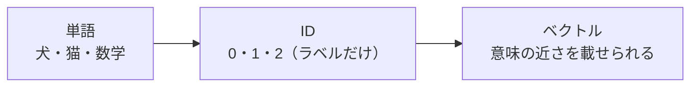

# 第2章　言語をどう数にするか

**この章でわかること**

- 文字・単語・記号をコンピュータに渡す、基本の考え方
- 離散的な記号（ID）と、連続的なベクトルの違い
- 「意味の近さ」を数で表したい、という動機

### 2.1　文字・単語・記号をコンピュータに渡す

コンピュータが直接扱えるのは、数です。

文字や単語を、そのまま理解することはできません。

だから、言語を扱う第一歩は、文字や単語を、数に対応させることです。

いちばん素朴な方法は、各文字や単語に、番号を振ることです。

たとえば、こんなふうに。

```text
"犬"   → 0
"猫"   → 1
"走る" → 2
"。"   → 3
```

こうすれば、文章は、番号の列になります。

「犬 が 走る 。」という文は、（「が」も番号を振れば）`[0, 5, 2, 3]` のような、整数の列になります。

これで、コンピュータが扱える形になりました。

しかし、ここで終わりではありません。

実は、この番号には、大きな問題があります。

この番号は、ただの「名前の付け替え」にすぎず、それ自体に意味がないのです。

どういうことでしょうか。

`0`（犬）と `1`（猫）は、番号としては隣同士です。

では、「犬」と「猫」は似ている、という情報が、この番号に入っているでしょうか。

入っていません。

たまたま、犬に0、猫に1を振っただけです。

犬に100、猫に3を振っても、まったく構いませんでした。

番号の大小や近さには、意味がないのです。

番号は、便宜上のラベル（名札）でしかありません。

### 2.2　離散的な記号と連続的なベクトル

ここで、2種類の「数の扱い」を、区別しておきます。

これは、この先ずっと効いてくる、大切な区別です。

**離散的な記号（ID）。**

各単語に振った番号のことです。

`犬=0, 猫=1` のような、とびとびの整数です。

これは「どの単語か」を指すだけのラベルで、大小や距離には意味がありません。

`0` と `1` が隣でも、犬と猫が近いわけではない、というのが前の節の話でした。

**連続的なベクトル。**

単語を、複数の実数からなるベクトルで表したものです。

たとえば「犬」を `[0.8, -0.2, 0.5]` のように表します。

こちらは、ベクトル同士の近さや方向に、意味を持たせられます。

2つの単語のベクトルが近ければ「意味が近い」、遠ければ「意味が遠い」、というふうにできるのです。

並べて比べてみましょう。

```text
ID（離散）       : 犬 = 0                  ← ただのラベル。近さに意味なし
ベクトル（連続）  : 犬 = [0.8, -0.2, 0.5]   ← 近さ・方向に意味を載せられる
```

第3巻まで扱ってきたニューラルネットは、連続的なベクトルを入力にとります。

`nn.Linear` は、ベクトルを受け取って、ベクトルを返すものでした。

だから、言語を扱うには、「単語 → ID（離散）→ ベクトル（連続）」という、2段階の変換が必要になります。

```text
単語  →（トークン化・ID付与）→  ID  →（embedding）→  ベクトル
```

前半の「単語 → ID」が、トークン化（第3章・第4章）。

後半の「ID → ベクトル」が、embedding（第5章）。

この2段階を、これから順に見ていきます。

### 2.3　「意味の近さ」を数で表したい

なぜ、わざわざベクトルにするのでしょうか。

ID（番号）のままでは、何が困るのでしょうか。

理由は、「意味の近さ」を、数として扱いたいからです。

第2巻で、内積やベクトル間の距離を学びました。

内積は「2つのベクトルがどれくらい似ているか」を測る計算でした（第2巻4章）。

単語を、うまくベクトルにできれば、この内積や距離を使って、意味の関係を測れます。

たとえば、こんなふうに。

```text
「犬」と「猫」のベクトルは近い（どちらも動物、ペット）
「犬」と「数学」のベクトルは遠い（まったく関係ない）
```

これは、ID（ただの番号）では、絶対にできなかったことです。

`犬=0, 猫=1, 数学=2` という番号からは、「犬と猫が近くて、犬と数学が遠い」という関係は、まったく読み取れません。

ベクトルにして初めて、意味の関係を、距離や方向として表せるのです。



そして、ここが面白いところです。

このベクトルは、人間が手で「犬はこういうベクトル」と設計するのではありません。

学習を通じて、自動的に獲得されます。

第1巻10章で学んだ「表現学習」「特徴量の自動獲得」が、言語に対して効くわけです。

どうやって自動で獲得されるのか、という話は、第5章（embedding）で詳しく扱います。

ここでは、「単語をベクトルにすると、意味の近さを数で扱えるようになる」「そのベクトルは学習で決まる」という、2点をつかんでください。

次章から、この変換の各段を、順に見ていきます。

まず次の第3章で、「単語 → トークン」の切り分け（トークン化）を扱います。

### 2.4　本章のまとめ

- コンピュータは数しか扱えないので、言語はまず数に対応させる。
- 単語に番号を振った ID は「離散的なラベル」で、それ自体に意味（近さ）はない（`0` と `1` が隣でも犬と猫が近いわけではない）。
- 単語をベクトル（連続）で表すと、内積や距離で「意味の近さ」を扱えるようになる（第2巻4章）。
- 言語の入力は「単語 → ID → ベクトル」の2段階。前半がトークン化（3〜4章）、後半が embedding（5章）。
- ベクトルは手で設計せず、学習で獲得する（表現学習）。
