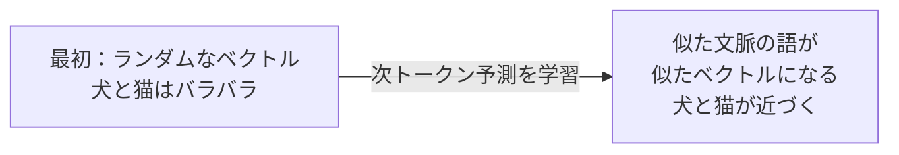

# 第5章　embedding：トークンをベクトルにする

**この章でわかること**

- one-hot 表現の限界（第1巻・第2巻の回収）
- embedding 行列とは何か
- ID から表現ベクトルを引く、という仕組み
- 学習で「意味」が宿るとは、どういうことか
- `nn.Embedding` で確かめる

### 5.1　one-hot の限界（第1巻・第2巻の回収）

ID をベクトルにする、最も素朴な方法が、**one-hot 表現** です（第1巻10章で学びました）。

one-hot とは、語彙のサイズだけの長さを持ち、そのトークンの位置だけ1、ほかは全部0、というベクトルです。

具体例で見ましょう。

語彙サイズが5で、"走る" の ID が2だとします。

```text
"走る"=ID2 のとき
one-hot: [0, 0, 1, 0, 0]
         位置0 1 2 3 4
              ↑ ここだけ1
```

ID 2 の位置だけが1で、あとは0です。

これには、2つの大きな問題があります。

**1. 巨大で、無駄。**

語彙が5万あれば、1トークンが長さ5万のベクトルになります。

しかも、そのうち1個だけが1で、残りの49,999個は0です。

ほとんどが0の、巨大なベクトルです。

メモリも計算も、もったいないです。

**2. 意味が載らない。**

どの2つの one-hot も、内積を取れば0になります。

なぜなら、1が立っている位置が、必ず違うからです（第2巻4章の内積を思い出してください）。

```text
犬   = [1, 0, 0, 0, 0]
猫   = [0, 1, 0, 0, 0]
内積 = 1*0 + 0*1 + 0*0 + 0*0 + 0*0 = 0
```

どの単語のペアも、内積0、距離は同じ。

これでは、「犬」と「猫」が近い、という情報を、まったく表せません（第2章で見たとおり）。

結局、one-hot は「どのトークンか」を指すだけで、ID とほとんど変わりません。

私たちが欲しいのは、意味の近さを載せられる、短くて密なベクトルです。

### 5.2　embedding 行列とは何か

そこで使うのが、**embedding**（埋め込み）です。

各トークンに、長さ `d_model`（たとえば数百次元）の、密なベクトルを割り当てます。

「密」というのは、one-hot のように「ほとんど0」ではなく、全部の要素に意味のある値が入っている、という意味です。

これらのベクトルを、全トークン分まとめると、1つの大きな行列になります。

これを **embedding 行列** と呼びます。

```text
embedding 行列 E : [語彙サイズ, d_model]
```

各行が、1つのトークンのベクトルです。

たとえば、語彙サイズ5万、`d_model`=512 なら、`E` は `[50000, 512]` の行列です。

5万行、各行が512次元のベクトル、というわけです。

```text
E の 0 行目  = "<pad>" のベクトル（長さ512）
E の 3 行目  = "犬" のベクトル（長さ512）
E の 5 行目  = "走る" のベクトル（長さ512）
...
```

この行列の中身（各トークンのベクトル）は、最初はランダムです。

そして、学習で調整される、パラメータです。

第3巻で学んだ「学習で決まるパラメータ」が、ここにも出てきます。

embedding 行列は、巨大なパラメータの塊なのです。

### 5.3　ID から表現ベクトルを引く

embedding の操作は、驚くほど単純です。

ID を受け取り、embedding 行列の、その行を **引いてくる** だけです。

```text
"犬" の ID = 3
→ E の 3 行目を取り出す
→ "犬" の表現ベクトル（長さ d_model）
```

前章で「ID は住所」と言ったのは、このことでした。

ID 3 は、「embedding 行列の3行目を引け」という住所だったのです。

この操作は、実は one-hot ベクトルと embedding 行列の掛け算と、同じ結果になります。

しかし、わざわざ巨大な掛け算をする必要はありません。

「3行目を引く」だけで済むからです（だから効率的なのです）。

ID 列を渡せば、各 ID に対応する行が、並んだ行列が返ってきます。

shape を追ってみましょう。

```text
入力 ID 列:    [3, 4, 5]              （長さ 3 の系列）
embedding 後:  [3, d_model] の行列     （各トークンがベクトルに）
```

ここで、第3巻で慣れた shape の感覚が、効きます。

系列長 `L` の ID 列を embedding すると、`[L, d_model]` の行列になります。

バッチ付きなら、`[batch, L, d_model]` です。

これは、第2巻・第3巻で何度も見た形です。

この `[batch, L, d_model]` という3次元の形が、この先ずっと、Transformer の中を流れていく、基本の形になります。

### 5.4　学習で意味が宿るとはどういうことか

embedding 行列の中身は、最初はランダムでした。

ランダムということは、最初は「犬」と「猫」のベクトルも、てんでバラバラな方向を向いています。

では、どうやって「犬」と「猫」が近くなるのでしょうか。

答えは、学習を通じて、です。

言語モデルが「次のトークンを当てる」というタスク（次章）を解くうちに、不思議なことが起きます。

似た文脈で使われる単語のベクトルが、だんだん似た方向を向くようになるのです。

なぜでしょうか。

「犬」も「猫」も、似た文脈に現れます。

「___ を飼う」「___ が鳴く」「___ と散歩する」。

こうした似た文脈で「次を当てる」のに役立つように、学習が進むと、「犬」と「猫」のベクトルは、自然と近づいていきます。

似た働きをする単語は、似たベクトルを持つほうが、予測に都合がよいからです。



これが、第1巻10章で学んだ「表現学習」の、言語における姿です。

人間が「犬と猫は似ている」と教え込むのではありません。

データから、自動的に獲得されるのです。

「次の単語を当てる」を繰り返すうちに、副産物として、意味の構造が、ベクトルの中に立ち上がってくる。

これは、とても美しい現象です。

### 5.5　`nn.Embedding` を使って確かめる

PyTorch には、`nn.Embedding` があります。

語彙サイズと `d_model` を渡すと、embedding 行列を内部に持ち、ID を渡すと、対応する行を返します。

```python
import torch
import torch.nn as nn

vocab_size = 7      # 第4章の語彙
d_model = 4         # 説明用に小さく

emb = nn.Embedding(vocab_size, d_model)
print(emb.weight.shape)   # torch.Size([7, 4])  ← embedding 行列

ids = torch.tensor([1, 3, 4, 5, 6, 2])   # <bos> 犬 が 走る 。 <eos>
vecs = emb(ids)
print(vecs.shape)         # torch.Size([6, 4])  ← 各 ID が長さ4のベクトルに

# バッチ付き
batch_ids = torch.tensor([[1, 3, 4], [1, 5, 2]])  # [batch=2, L=3]
print(emb(batch_ids).shape)   # torch.Size([2, 3, 4])  [batch, L, d_model]
```

順に読みましょう。

`emb.weight` が、embedding 行列そのものです。

shape は `[7, 4]`、つまり「語彙7、各4次元」です。

これが、学習で更新されるパラメータです。

`emb(ids)` は、ID 列に対応する行を引いて、並べているだけです。

長さ6の ID 列を渡すと、`[6, 4]`（6トークン、各4次元）が返ります。

バッチ付きで `[2, 3]` の ID を渡すと、`[2, 3, 4]`（batch, L, d_model）が返ります。

この出力の shape `[batch, L, d_model]` は、この先 Transformer の中をずっと流れていく、基本の形です。

第5巻で Attention を作るとき、入力はこの形でやってきます。

だから、いまのうちに、この形に慣れておきましょう。

### 5.6　本章のまとめ

- one-hot は巨大で、しかも意味も載らない（どの2つも内積0）。欲しいのは短くて密で、意味の近さを載せられるベクトル。
- embedding 行列 `[語彙サイズ, d_model]` の各行が、1トークンのベクトル。中身は学習で決まるパラメータ。
- embedding は「ID に対応する行を引く」操作。系列を渡すと `[L, d_model]`（バッチ付きで `[batch, L, d_model]`）になる。
- 似た文脈で使われる語のベクトルは、次トークン予測の学習を通じて、似てくる（表現学習）。
- `nn.Embedding(vocab_size, d_model)` がこれを担う。出力の shape `[batch, L, d_model]` は、この先の基本形。
