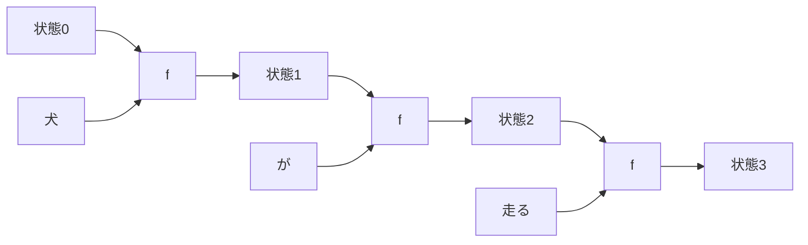

# 第9章　RNN の考え方（実装しない）

**この章でわかること**

- 状態を持ち越す、という発想
- RNN の基本構造（図と直感）
- 時間方向に展開する、とはどういうことか
- LSTM / GRU が足したもの（直感）

> この章は、Attention がなぜ必要になったかを理解するための **比較対象** として、RNN を扱います。第1章で固定したとおり、この巻では RNN を実装しません。仕組みの直感だけを、つかみます。

### 9.1　状態を持ち越すという発想

前章の固定窓モデルの問題は、「窓の外が見えない」ことでした。

直前の数トークンしか見られず、ずっと前の情報を使えない。

**RNN**（Recurrent Neural Network、再帰型ニューラルネットワーク）は、これを「状態を持ち越す」という発想で、解こうとします。

アイデアを、言葉にしてみましょう。

トークンを1つずつ、順に読んでいきます。

そのとき、「これまで読んだ内容の要約」を、**状態**（state）として持ちます。

そして、次のトークンを読むときに、その状態を引き継ぎます。

図にすると、こうです。

```text
状態0 ──(犬を読む)──> 状態1 ──(がを読む)──> 状態2 ──(走るを読む)──> 状態3
```

各ステップで、「前の状態」と「今のトークン」から、「新しい状態」を作ります。

状態は、いわば「ここまでの文章の、要約メモ」です。

トークンを読むたびに、このメモを更新していくのです。

ここがポイントです。

状態が「これまで全部の要約」を運ぶので、原理的には、窓の大きさに縛られません。

いくらでも前の情報を、状態を通して持ち越せる。

これが、RNN の狙いでした。

固定窓の「窓の外が見えない」問題を、状態という「要約メモ」で乗り越えようとしたのです。

### 9.2　RNN の基本構造（図と直感）

RNN は、同じ小さなニューラルネットを、トークンの数だけ、繰り返し使います。

各ステップでやることは、同じです。

```text
新しい状態 = f(前の状態, 今のトークンのベクトル)
```

`f` は、第3巻で学んだような、線形変換＋活性化の、かたまりです。

ここで、とても重要なことがあります。

この `f` が、**全ステップで共通**（同じ重み）なのです。

1番目のトークンを読むときも、100番目のトークンを読むときも、同じ `f` を使います。

だから「再帰（recurrent）」と呼ばれます。

同じ関数を、繰り返し適用するからです。

図にしましょう。



`f` が3回出てきますが、これらはすべて同じ `f`（同じ重み）です。

各ステップの状態から、その時点での「次トークンの予測」を出すこともできます。

状態3 から「次は『。』だろう」と予測する、というように。

これで、系列を頭から順に処理する、言語モデルが作れます。

### 9.3　時間方向に展開する

RNN は「同じ `f` を繰り返す」ものです。

しかし、系列に沿って、横に並べて描くと、どう見えるでしょうか。

上の図のように、「`f` が何個も連なった、深いネットワーク」に見えます。

これを **時間方向に展開する**（unroll）と言います。

展開して見ると、大事なことが分かります。

RNN は「系列長と同じ深さを持つ、非常に深いネットワーク」なのです。

系列が100トークンなら、`f` が100段つながっているのと、同じです。

```text
状態0 → f → 状態1 → f → 状態2 → f → ... → 状態100
         （f が100段つながった、深いネットワーク）
```

この「展開すると非常に深い」という事実が、次章で見る RNN の苦しさ（勾配の問題）の、根っこになります。

第3巻9章で「深いネットワークは勾配が消えやすい」と学びました。

RNN は、まさにそれが起きやすい構造なのです。

100段もの深さを、勾配が逆向きに通り抜けるのは、とても大変です。

### 9.4　LSTM / GRU が足したもの（直感）

素朴な RNN には、弱点がありました。

長い系列だと、状態がうまく情報を保てないのです。

昔の情報を、だんだん忘れてしまう。

要約メモが、新しい情報で上書きされていって、最初のほうの内容が薄れていく、というイメージです。

これを和らげるために、考案されたのが **LSTM**（Long Short-Term Memory）や **GRU**（Gated Recurrent Unit）です。

これらが足したのは、**ゲート**という仕組みです。

ゲートとは、「弁（バルブ）」のようなものです。

何を調整するのでしょうか。

- 「今の情報を、どれだけ取り込むか」。
- 「前の情報を、どれだけ忘れるか、どれだけ保つか」。

これらを、学習で調整できるようにする仕組みです。

```text
素朴な RNN : 毎ステップ、状態をまるごと作り直す → 昔の情報が薄まりやすい
LSTM / GRU : ゲートで「保つ／忘れる」を調整 → 長い情報を保ちやすい
```

「この情報は大事だから、ずっと保とう」「この情報はもう要らないから、忘れよう」。

ゲートが、そういう判断を、学習で身につけるのです。

LSTM/GRU は、素朴な RNN よりずっと長い文脈を扱えるようになり、長く使われました。

しかし、後で見るように、根本的な弱点（逐次処理と、それでも残る長距離の難しさ）は、残ります。

その弱点が、Attention 登場の舞台を、整えることになります。

なお、これらの具体的なゲートの式や実装には、この巻では立ち入りません。

第1章で約束したとおり、RNN は実装しないからです。

「ゲートで情報の出し入れを調整する、改良版」という直感で、十分です。

### 9.5　本章のまとめ

- RNN は「状態を持ち越す」ことで、固定窓の限界（窓の外が見えない）を超えようとした。状態は「ここまでの要約メモ」。
- 各ステップは共通の `f` で「新しい状態 = f(前の状態, 今のトークン)」を計算する（再帰）。
- 時間方向に展開すると、系列長と同じ深さの、非常に深いネットワークになる（勾配の問題の根っこ）。
- LSTM / GRU はゲートで「保つ／忘れる」を調整し、長い文脈を扱いやすくした改良版。
- 仕組みの直感だけをつかめばよい。実装はしない。次章で、RNN の「辛さ」へ進む。
