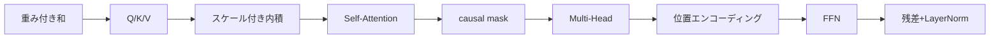

# 第1章　この巻の地図と教え方の順番

**この章でわかること**

- この巻（第5巻）で作る部品の一覧
- なぜ「論文の順」で教えないのか
- 教えるのに最適な順番
- この巻でやらないこと（＝次の巻の仕事）

### 1.1　この巻で作る部品の一覧（部品表）

ここは、このシリーズの心臓部です。

第4巻で「なぜ Attention が必要か」を、腑に落としました。

RNN の3つの辛さ（長距離・勾配・逐次）を、Attention が解く。

その動機を、つかみました。

この巻では、その Attention をはじめとする、Transformer の部品を、**実際に手で書きます**。

動機を持った状態で、いよいよ実装に入るのです。

作る部品は、次のとおりです。

```text
□ 重み付き和（Attention の核）
□ Q / K / V という役割分担
□ スケール付き内積 Attention： softmax(QK^T / sqrt(d_k)) V
□ Self-Attention
□ causal mask（未来を見ない）
□ Multi-Head Attention
□ 位置エンコーディング（順序の情報を入れる）
□ Feed-Forward Network（FFN）
□ これらを残差接続と LayerNorm で包む（第3巻の回収）
```

第3巻で「`LayerNorm(x + Sublayer(x))` の `Sublayer` の中身は、第5巻で埋める」と言いました。

その約束を、この巻で果たします。

`Sublayer` が、Attention と FFN として、姿を現すのです。

### 1.2　なぜ論文の順で教えないのか

ここで、この巻の、重要な方針を宣言します。

**部品を作る順番は、論文『Attention Is All You Need』の提示順とは、違います。**

これは、意図的な選択です。

なぜでしょうか。

論文は、研究成果を簡潔に伝えるために、書かれています。

それは「読んで、正しさを確認する」には、良い順序です。

しかし、「初めて理解しながら、作る」には、必ずしも最適ではありません。

たとえば、論文は、いきなり Multi-Head Attention の全体像を示します。

しかし、初学者には、「まず1つのヘッドの、素の Attention」から入るほうが、ずっと分かりやすいのです。

いきなり複雑な完成形を見せられるより、単純な核から、一つずつ足していくほうが、理解できます。

```text
論文の順    : 完成形を簡潔に提示（確認向き）
この巻の順   : 易しい核から、少しずつ足していく（理解しながら作る向き）
```

論文を読むのは、第6巻です。

そこでは「全部もう知っている」状態で、論文の提示順に、向き合います。

この巻は、その「全部知っている」を作るための、最適な学習順を取ります。

つまり、この巻と第6巻で、同じ Transformer を、2つの順序で見るのです。

この巻では「作るのに最適な順」で、第6巻では「論文の順」で。

### 1.3　最適な順：核から少しずつ足す

この巻がたどる順番は、次のとおりです。

それぞれが「一つ前に、何かを1つ足す」形になっています。

```text
1. 重み付き和         … Attention の核。まず「重みで混ぜる」だけ
2. Q / K / V         … 重みの決め方に「役割分担」を導入
3. スケール付き内積    … 相性を内積で測り、sqrt(d_k) で整える
4. Self-Attention    … 自分自身を Q/K/V にする
5. causal mask       … 「未来を見ない」制約を足す
6. Multi-Head        … 注目を複数の視点に分ける
7. 位置エンコーディング … 失われた「順序」を足す
8. FFN               … 各位置で表現を変換する層を足す
9. 残差 + LayerNorm   … 第3巻の殻で包む
```



一段ずつ「なぜそれを足すのか」を確かめながら、進みます。

だから、最後まで来たとき、Transformer ブロックの全部品が、理由とともに、手の内に入っています。

「なぜ Q/K/V に分けるのか」「なぜ sqrt(d_k) で割るのか」「なぜ Multi-Head なのか」。

すべて、理由とともに、自分で書けるようになります。

### 1.4　この巻でやらないこと（＝次の巻の仕事）

スコープを、固定します。

この巻は、次のことを **しません**。

**1. 論文を頭から精読すること。**

これは第6巻の仕事です。

部品を全部知ってから、論文を読みます。

**2. 部品を統合して、文字レベル言語モデルとして通すこと。**

これは第7巻の仕事です。

この巻では、部品を作るところまで。

**3. Decoder-only 化・事前学習・RLHF など、現代 LLM の話。**

これは第8巻の仕事です。

この巻のゴールは、各部品を **小さく書いて動かす** ことです。

フルスケールの最適化や、データパイプライン、長時間の学習には、踏み込みません。

最後の章でも、部品を「並べてみる」だけで、言語モデルとして統合はしません。

統合は、第7巻の仕事です。

この線を守ることが、第7巻を生かします。

「あと少しで言語モデルになる」というところで、ぐっとこらえて止める。

それが、各巻の使命を守る、ということです。

### 1.5　本章のまとめ

- この巻は Transformer の部品を手で書く、シリーズの心臓部。第3巻の `Sublayer` の中身を、ここで埋める。
- 部品を作る順番は論文の順ではなく、「易しい核から1つずつ足す」最適な学習順。
- 論文を読むのは第6巻。そこで「全部もう知っている」状態にするのが、この巻の役割。
- この巻は部品を小さく書いて動かすまで。統合（第7巻）・現代 LLM（第8巻）には踏み込まない。
