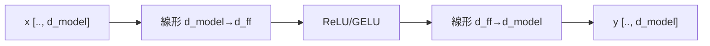

# 第10章　Feed-Forward Network（FFN）

**この章でわかること**

- Attention の後に、なぜ FFN が要るのか
- 位置ごとに独立な2層 MLP（第3巻の回収）
- 次元を広げて戻す、という形
- FFN を実装する

### 10.1　Attention の後になぜ FFN が要るのか

Attention は、トークンどうしの情報を **混ぜる** のが得意でした。

各トークンが、文脈中の関連トークンから、情報を集めてきました。

しかし、Attention の計算（内積・softmax・重み付き和）は、本質的には「重み付き平均」です。

重み付き平均は、「いろいろなベクトルを、ほどよく混ぜる」ことはできます。

でも、各トークンの表現を、その場で複雑に変換する力は、強くありません。

混ぜることはできても、こねることは、苦手なのです。

そこで、Attention で情報を集めたあと、各トークンの表現を **個別に変換する** 層を、足します。

これが **Feed-Forward Network**（FFN）です。

役割分担を、はっきりさせましょう。

```text
Attention : トークン間で情報を「混ぜる」（横方向のやりとり）
FFN       : 各トークンの表現を「変換する」（縦方向の加工）
```

Attention は横（トークン間）、FFN は縦（各トークンの中）。

この2つを交互に繰り返すことが、Transformer ブロックの、基本のリズムです。

「集めて、こねる。集めて、こねる」。

これを何段も繰り返して、表現を豊かにしていくのです。

### 10.2　位置ごとに独立な2層 MLP（第3巻の回収）

FFN の正体は、何でしょうか。

第3巻で書いた MLP（線形 → 活性化 → 線形）、そのものです。

ただし、重要な特徴があります。

FFN は、**各トークン（各位置）に、独立に、同じ重みで** 適用されます。

```text
各位置のベクトルに対して:
  h = 活性化(x W1 + b1)
  y = h W2 + b2
```

トークン間で混ぜることは、しません（それは Attention の仕事でした）。

位置ごとに、同じ MLP を、別々に通すだけです。

5トークンあれば、同じ MLP を、5回（各トークンに1回ずつ）適用します。

だから「position-wise（位置ごとの）FFN」とも呼ばれます。

第3巻で MLP を「入力ベクトルを別の表現に変換するもの」として、学びました。

FFN は、それを、系列の各位置に、それぞれ適用しているだけです。

第3巻の知識が、ここでそのまま、部品になります。

### 10.3　次元を広げて戻すという形

FFN には、もう一つ、定番の形があります。

中間で、次元を **広げて、また戻す** のです。

```text
d_model → d_ff（広い） → d_model
（論文では d_ff = 4 × d_model が定番。例: 512 → 2048 → 512）
```

入口は `d_model`、中間は `d_ff`(広い)、出口はまた `d_model`。

いったん広い次元に持ち上げて、活性化（ReLU など）を通し、また `d_model` に戻します。

なぜ、広げるのでしょうか。

広い中間層を経由することで、各トークンの表現を、より豊かに変換できます。

たとえるなら、いったん大きな作業台に広げて、じっくりこねてから、元の大きさにまとめ直す、というイメージです。

入口と出口は `d_model` でそろえるので、出力の shape は、入力と同じです。

だから、残差接続で包めます。



### 10.4　FFN を実装する

`nn.Module` として、書きます。

第3巻の MLP と、ほとんど同じです。

```python
import torch
import torch.nn as nn

class FeedForward(nn.Module):
    def __init__(self, d_model, d_ff=None):
        super().__init__()
        d_ff = d_ff or 4 * d_model       # 定番は 4 倍
        self.fc1 = nn.Linear(d_model, d_ff)
        self.act = nn.ReLU()             # GELU でもよい
        self.fc2 = nn.Linear(d_ff, d_model)

    def forward(self, x):
        # x: [batch, L, d_model] -> 同じ shape
        return self.fc2(self.act(self.fc1(x)))

ffn = FeedForward(d_model=16)
x = torch.randn(2, 5, 16)
print(ffn(x).shape)   # torch.Size([2, 5, 16])
```

`fc1` で `d_model`(16) を `d_ff`(64) に広げ、ReLU を通し、`fc2` で `d_model`(16) に戻す。

第3巻の MLP と、構造はまったく同じです。

ここで、面白いことがあります。

「位置ごとに独立に適用する」と言いましたが、実装では、特別なループは書いていません。

なぜでしょうか。

`nn.Linear` は、入力の最後の次元にだけ作用し、先頭の `[batch, L]` はそのまま保たれるからです（第3巻3章の回収）。

つまり、`[batch, L, d_model]` を渡すと、各位置に独立に、同じ MLP が適用される、という FFN の性質が、自動的に実現されているのです。

入出力は `[batch, L, d_model]` で、変わりません。

これで、Transformer ブロックを構成する、2大部品が、揃いました。

- Attention（第4〜7章）：横に混ぜる。
- FFN（本章）：縦に変換する。

次章で、これらを、第3巻の残差接続と LayerNorm で、包みます。

### 10.5　本章のまとめ

- Attention は情報を混ぜる（横）、FFN は各トークンの表現を変換する（縦）。役割が違い、交互に使う。
- FFN の正体は、位置ごとに独立に・同じ重みで適用する2層 MLP（第3巻の回収）。
- 中間で次元を広げて戻す（定番は `d_ff = 4 × d_model`、例：512→2048→512）。入出力は `d_model` でそろう。
- `nn.Linear` は最後の次元にだけ作用するので、位置ごと独立が、ループなしで自動で実現される。出力 shape は不変。
