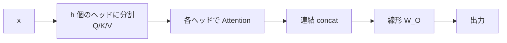

# 第7章　Multi-Head Attention

**この章でわかること**

- なぜ複数のヘッドが要るのか
- 表現を分割して、並列に注目する
- ヘッドごとの計算と結合
- Multi-Head Attention を実装し、shape を最後まで追う

### 7.1　なぜ複数のヘッドが要るのか

ここまでの Self-Attention は、各トークンが「1通りの注目の仕方」しか、できませんでした。

1つの重み分布で、1通りの混ぜ方をするだけです。

しかし、言語の関係は、1通りではありません。

具体例で考えましょう。

「走る」というトークンは、

- ある観点では「主語は誰か」を知るために、「犬」に注目したい。
- 別の観点では「いつ走るのか」を知るために、「昨日」に注目したい。
- また別の観点では、直前の単語との文法的なつながりを見たい。

つまり、「文法的な係り受け」「意味的な関連」「位置的な近さ」など、複数の観点で、同時に注目できると、表現力が上がります。

1通りの注目だと、これらが1つに平均化されてしまい、もったいないのです。

そこで、Attention を **複数並列に** 走らせます。

それぞれの並列な Attention を、**ヘッド**（head）と呼びます。

各ヘッドが、独立の Q/K/V の重みを持ち、別々の観点で注目します。

これが **Multi-Head Attention**（多頭注意）です。

```text
1ヘッド  : 1通りの注目（観点が1つ）
多ヘッド  : 複数の観点で同時に注目し、あとで束ねる
```

頭が複数ある、というイメージから、Multi-Head（多頭）と呼ばれます。

### 7.2　表現を分割して並列に注目する

素朴には「`d_model` 次元の Attention を、`h` 個並べる」と考えられます。

しかし、それだと計算量が `h` 倍になってしまいます。

実際の Multi-Head は、もっとうまくできています。

**`d_model` を、`h` 個のヘッドで分割** するのです。

各ヘッドの次元を、`d_k = d_model / h` とします。

具体例で見ましょう。

```text
d_model = 512, ヘッド数 h = 8
→ 各ヘッドは d_k = 512 / 8 = 64 次元
→ 8 ヘッド × 64 = 512（全体は d_model のまま）
```

512次元を、8個のヘッドで分けて、各ヘッドは64次元を担当します。

全ヘッドを合わせると、ちょうど512（= d_model）に戻ります。

こうすると、何が嬉しいのでしょうか。

ヘッドを増やしても、全体の計算量は、ほぼ変わりません。

各ヘッドが狭い `d_k` 次元で計算するので、合計しても、フル次元の1ヘッドと、だいたい同じコストなのです。

つまり、「タダ同然で、観点の数を増やせる」のです。

各ヘッドは、狭い `d_k` 次元で、それぞれの観点に特化した注目を、学びます。

### 7.3　ヘッドごとの計算と結合

Multi-Head の流れは、次のとおりです。

```text
1. 入力 x から、ヘッドごとの Q/K/V を作る（d_model を h 個に分割）
2. 各ヘッドで、これまでどおり Attention を計算する（第4〜6章）
3. 全ヘッドの出力を連結（concat）して、元の d_model 次元に戻す
4. 最後に線形変換 W_O を通して、出力をまとめる
```



ステップ2の「各ヘッドで Attention」は、第4〜6章で作ったもの、そのままです。

新しいのは、ステップ1の「分割」と、ステップ3〜4の「連結してまとめる」だけです。

最後の `W_O`（出力用の線形変換）は、何をしているのでしょうか。

各ヘッドが、別々の観点で集めた情報を、混ぜ合わせて、最終的な表現にまとめる役割です。

8個のヘッドの結果を、ただ並べただけでは、バラバラです。

`W_O` で混ぜることで、それらを統合した、1つの表現にします。

### 7.4　Multi-Head Attention を実装する

causal mask 付きの Multi-Head Attention を、`nn.Module` として書きます。

ヘッドへの分割は、`d_model` 次元を `[h, d_k]` に `view` で割り、`transpose` でヘッドを前に出して、実現します。

```python
import torch
import torch.nn as nn
import torch.nn.functional as F

class MultiHeadAttention(nn.Module):
    def __init__(self, d_model, n_heads):
        super().__init__()
        assert d_model % n_heads == 0
        self.n_heads = n_heads
        self.d_k = d_model // n_heads
        self.W_q = nn.Linear(d_model, d_model, bias=False)
        self.W_k = nn.Linear(d_model, d_model, bias=False)
        self.W_v = nn.Linear(d_model, d_model, bias=False)
        self.W_o = nn.Linear(d_model, d_model, bias=False)

    def split_heads(self, t):
        # [B, L, d_model] -> [B, n_heads, L, d_k]
        B, L, _ = t.shape
        return t.view(B, L, self.n_heads, self.d_k).transpose(1, 2)

    def forward(self, x, causal=True):
        B, L, _ = x.shape
        Q = self.split_heads(self.W_q(x))   # [B, h, L, d_k]
        K = self.split_heads(self.W_k(x))
        V = self.split_heads(self.W_v(x))

        scores = Q @ K.transpose(-2, -1) / (self.d_k ** 0.5)   # [B, h, L, L]
        if causal:
            mask = torch.tril(torch.ones(L, L, device=x.device))
            scores = scores.masked_fill(mask == 0, float("-inf"))
        weights = F.softmax(scores, dim=-1)
        out = weights @ V                    # [B, h, L, d_k]

        # ヘッドを結合して [B, L, d_model] に戻す
        out = out.transpose(1, 2).contiguous().view(B, L, -1)
        return self.W_o(out)                 # [B, L, d_model]
```

コードが長く見えますが、新しい本質は、ほとんどありません。

ポイントは、第4〜6章で作ったスコア計算・mask・softmax・重み付き和が、ヘッド次元 `h` を加えても、**まったく同じ式** で動くことです。

`Q @ K.transpose(-2, -1)` も、`F.softmax(..., dim=-1)` も、先頭の `[B, h]` をバッチとして扱い、各ヘッドを並列に計算します。

第3巻から積み上げた「shape を追う」感覚が、ここで効きます。

`split_heads` がやっているのは、`[B, L, d_model]` を `[B, h, L, d_k]` に組み替えることです。

`d_model` を `[h, d_k]` に割り、ヘッド `h` を前に持ってくる、というわけです。

### 7.5　shape を最後まで追う

実際に動かし、shape の流れを確認しましょう。

```python
import torch

torch.manual_seed(0)
mha = MultiHeadAttention(d_model=16, n_heads=4)   # 各ヘッド d_k=4

x = torch.randn(2, 5, 16)     # [B=2, L=5, d_model=16]
out = mha(x)
print(out.shape)              # torch.Size([2, 5, 16])
```

shape の旅を、一段ずつ追いましょう。

```text
入力 x           : [2, 5, 16]      （B, L, d_model）
 ↓ W_q + split_heads
Q（など）        : [2, 4, 5, 4]    （B, h, L, d_k）← d_model=16 が h=4 × d_k=4 に
 ↓ 各ヘッドで Attention
out              : [2, 4, 5, 4]    （B, h, L, d_k）
 ↓ ヘッド結合（transpose + view）
                 : [2, 5, 16]      （B, L, d_model）← 4 × 4 が 16 に戻る
 ↓ W_o
出力             : [2, 5, 16]      （B, L, d_model）
```

入力 `[2, 5, 16]` → 内部で `[2, 4, 5, 4]`（B, h, L, d_k）に分かれて、各ヘッドが Attention → 結合して `[2, 5, 16]` に戻る。

入出力の shape は、`[B, L, d_model]` で、変わりません。

だから、これも残差接続で包め、何段も積めます。

これで、Attention 系の部品は、完成しました。

残るは、失われた「順序」を補う位置エンコーディング（次章）と、各位置で表現を変換する FFN（第10章）です。

### 7.6　本章のまとめ

- 1つの注目では1通りの混ぜ方しかできない。Multi-Head は複数の観点で同時に注目する。
- `d_model` を `h` 個のヘッドに分割（各ヘッド `d_k = d_model / h`、例：512 = 8 × 64）するので、計算量を増やさず観点を増やせる。
- 各ヘッドで Attention を計算し、連結して `W_O` でまとめる。`W_O` は各ヘッドの情報を統合する。
- スコア計算・mask・softmax・重み付き和は、ヘッド次元を足してもそのまま動く（shape を追えば分かる）。
- 入出力は `[B, L, d_model]` で不変。残差接続で包め、積み重ねられる。
