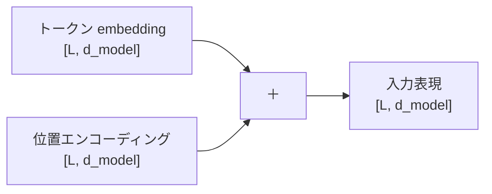

# 第8章　位置エンコーディング

**この章でわかること**

- Attention は順序を知らない、という問題
- 位置の情報を、どう足すか
- sin / cos による位置エンコーディング
- 学習する位置埋め込みとの違い（直感）

### 8.1　Attention は順序を知らない

第4巻11章の最後で、Attention には「順序の情報が失われる」という課題がある、と予告しました。

この章で、それに向き合います。

Self-Attention を、思い出してください。

各トークンは、全トークンとの相性を内積で測り、重み付き和を取りました。

ここで、よく考えてみてください。

この計算のどこに、「トークンが何番目にあるか」という情報が、入っているでしょうか。

どこにも、入っていません。

内積も、softmax も、重み付き和も、「何番目か」を、まったく使っていないのです。

その結果、何が起きるでしょうか。

トークンの順番を入れ替えても、各トークンの出力は、本質的に変わりません（対応する位置の出力が、入れ替わるだけです）。

Attention は、入力を「順序のある列」ではなく、「順序のない集合」として、見てしまうのです。

具体例で、確かめましょう。

```text
"犬 が 猫 を 追う"
"猫 が 犬 を 追う"
→ Attention だけでは、この2つを区別する手がかりがない
```

「犬」と「猫」の位置が入れ替わっても、Attention の計算には、その違いを捉える手段が、ありません。

しかし、第4巻6章で強調したとおり、語順は意味を変えます。

「犬が猫を追う」と「猫が犬を追う」は、意味が逆です。

これでは、言語を正しく扱えません。

だから、各トークンに「自分は何番目か」という **位置の情報** を、明示的に与える必要があります。

### 8.2　位置の情報をどう足すか

いちばん素直な方法は、何でしょうか。

各トークンの embedding ベクトルに、「位置を表すベクトル」を、足すことです。

これを **位置エンコーディング**（positional encoding, PE）と呼びます。

```text
入力表現 = トークンの embedding + 位置エンコーディング
```

位置エンコーディングは、embedding と同じ `d_model` 次元のベクトルで、位置ごとに異なる値を持ちます。

これを足すことで、何が変わるでしょうか。

同じトークンでも、「1番目にある犬」と「3番目にある犬」が、少し違うベクトルになります。

なぜなら、足す位置ベクトルが、1番目と3番目で、違うからです。

```text
1番目の犬 = 犬のembedding + 位置1のベクトル
3番目の犬 = 犬のembedding + 位置3のベクトル
→ 同じ「犬」でも、足すものが違うので、結果が違う
```

Attention は、この差を通じて、順序を扱えるようになります。



足し算なので、shape は変わりません。

`[L, d_model]` のまま、Attention に渡せます。

「位置の情報を、別のベクトルとして足し込む」。

これが、位置エンコーディングの、基本のアイデアです。

### 8.3　sin / cos による位置エンコーディング

論文『Attention Is All You Need』が使ったのは、サイン・コサインを使った位置エンコーディングです。

位置 `pos` と次元 `i` に対して、次のように値を決めます。

```text
PE(pos, 2i)   = sin( pos / 10000^(2i/d_model) )
PE(pos, 2i+1) = cos( pos / 10000^(2i/d_model) )
```

式だけ見ると、難しそうです。

直感を、つかみましょう。

これは、次元ごとに「波の周期」を変えた、たくさんの sin/cos 波を、重ねたものです。

低い次元（先頭のほう）は、ゆっくりした波。

高い次元（後ろのほう）は、速い波。

各位置は、これらの波の値の組み合わせとして、固有の「指紋」を持ちます。

たとえるなら、時計の針のようなものです。

秒針、分針、時針、と速さの違う針を組み合わせると、いまが何時何分何秒かが、一意に決まります。

それと同じで、速さの違う波を組み合わせると、各位置が、固有のパターンで表されるのです。

なぜ sin/cos なのか。

利点が、いくつかあります。

- 位置の値が `-1〜1` に収まり、スケールが安定する。
- 学習データより長い系列にも、原理的に値を計算できる（外挿しやすい）。なぜなら、ただ式に位置を入れれば、どんな位置でも値が出るからです。
- 「位置 `a` と位置 `a+k` の関係」が、波の性質から、一定のパターンで表れ、相対的な位置関係を捉えやすい。

詳しい理屈より、「位置ごとに違う、なめらかな指紋ベクトルを与える」という直感を、つかめば十分です。

実装は、次章で行います。

### 8.4　学習する位置埋め込みとの違い（直感）

位置の情報を与える方法は、sin/cos だけでは、ありません。

もう一つの代表が、**学習する位置埋め込み**（learned positional embedding）です。

これは、トークンの embedding と同じように、

- 「位置0のベクトル」、
- 「位置1のベクトル」、
- …、

を、学習可能なパラメータとして、持つ方法です。

第4巻5章の `nn.Embedding` を、トークンではなく「位置」に対して使う、と考えれば、分かりやすいです。

トークン埋め込みが「単語 → ベクトル」なら、位置埋め込みは「位置 → ベクトル」です。

2つの方法を、比べましょう。

```text
sin/cos（固定）   : 計算式で決まる。学習しない。長い系列に外挿しやすい
学習する埋め込み   : 位置ごとのベクトルを学習する。柔軟だが、学習した長さまで
```

sin/cos は、式で決まるので、学習しません。

そのかわり、学習データより長い系列にも、対応できます。

学習する埋め込みは、データに合わせて柔軟に学べます。

そのかわり、学習で使った長さ（`max_len`）を超える位置は、扱えません。

論文は sin/cos を使いましたが、現代の多くのモデルは、学習する位置埋め込み（やその発展形）を使います。

第7巻で、実際に小さな GPT を作るときは、実装の素直さから、学習する位置埋め込みを採用します。

この巻では、論文に合わせて sin/cos を実装し、両者の違いを、直感で押さえます。

なお、より新しい相対位置の手法（RoPE など）は、第8巻で触れます。

### 8.5　本章のまとめ

- Attention は順序を知らず、入力を「順序のない集合」として見てしまう（「犬が猫を追う」と「猫が犬を追う」を区別できない）。
- 位置エンコーディングは、位置ごとに異なるベクトルを embedding に足すことで、順序を与える。足し算なので shape は不変。
- 論文は sin/cos の位置エンコーディングを使う。速さの違う波の組み合わせで、位置ごとに固有の「指紋」を与える（時計の針のイメージ）。
- 学習する位置埋め込みという方法もある（`nn.Embedding` を位置に使う。柔軟だが学習した長さまで）。第7巻ではこちらを使う。
