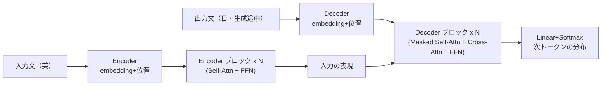

# 第3章　Model Architecture：全体図を自分の言葉で

**この章でわかること**

- Encoder–Decoder の全体像
- 論文の図1を、第5巻の部品で読み替える
- 入力から出力までの流れ

### 3.1　Encoder–Decoder の全体像

論文の「Model Architecture」の節は、有名な図1（モデル全体図）から始まります。

この図1は、一見すると、箱と矢印が多くて、複雑に見えます。

初めて見ると、「うわ、難しそう」と思うかもしれません。

しかし、あなたにとっては、第5巻で作った部品の、組み合わせにすぎません。

落ち着いて、一つずつ見れば、すべて知っているものです。

Transformer は **Encoder–Decoder** 構造です。

これは、翻訳のような「入力系列を、別の出力系列に変換する」タスクのための、形です。

役割を、はっきりさせましょう。

```text
Encoder : 入力系列（例：英語の文）を読み、表現に変換する
Decoder : Encoder の表現を見ながら、出力系列（例：日本語の文）を1トークンずつ生成する
```

Encoder は「入力を理解する側」。

Decoder は「出力を作る側」。

第4巻7章で学んだ言語モデル（次トークン予測）が、主に Decoder 側に対応します。

### 3.2　論文の図1を、第5巻の部品で読み替える

図1の箱を、第5巻の部品で、置き換えてみましょう。

新しいものは、一つもありません。

```text
図1 の箱                          第5巻の部品
──────────────────────────────────────────────
Input Embedding               →  embedding（第4巻5章）
Positional Encoding           →  第8〜9章
Multi-Head Attention          →  第7章
Masked Multi-Head Attention   →  第7章 + causal mask（第6章）
Add & Norm                    →  残差 + LayerNorm（第11章）
Feed Forward                  →  FFN（第10章）
Linear + Softmax（出力）        →  出力層（第3巻5章の応用、詳細は第7巻）
Nx（N 回積む）                  →  ブロックの積み重ね（第12章）
```

この表を、図1の横に置いて、一つずつ照らし合わせてみてください。

すべての箱が、あなたが作ったものに、対応します。

では、図1は、なぜあれほど複雑に見えるのでしょうか。

理由は、2つです。

1. これらの部品が、Encoder 側と Decoder 側に、配置されている。
2. それぞれが `Nx`（N 段）積まれている。

つまり、複雑さは「部品の種類が多い」からではなく、「同じ部品が、2か所に、何段も並んでいる」からなのです。

一つ一つの箱は、もう手の内にあります。

複雑に見えるのは、配置のせいだけ、と分かれば、怖くありません。

### 3.3　入力から出力までの流れ

翻訳（英→日）を例に、全体の流れを、自分の言葉で追いましょう。



順を追いましょう。

**1. Encoder。**

入力文（英語）を、embedding ＋ 位置エンコーディングし、Self-Attention と FFN のブロックを、N 段通します。

こうして、入力全体の表現を作ります。

**2. Decoder。**

これまで生成した出力（日本語）を、embedding ＋ 位置エンコーディングし、

- (a) masked Self-Attention（未来を見ない、第6章）、
- (b) Encoder の表現を見る Cross-Attention（次章）、
- (c) FFN、

のブロックを、N 段通します。

**3. 出力。**

Decoder の出力を、Linear ＋ Softmax で、次トークンの確率分布にします（第4巻7章の形）。

ここで、Encoder と Decoder の違い、特に Decoder にある2種類の Attention（masked Self-Attention と Cross-Attention）が、次章のポイントになります。

Decoder には、Attention が2つ入っているのです。

その理由は、次章で明らかになります。

### 3.4　本章のまとめ

- Transformer は Encoder–Decoder 構造。Encoder が入力を理解し、Decoder が出力を1トークンずつ生成する。
- 論文の図1の箱は、すべて第5巻（と第4巻・第3巻）で作った部品に対応する。新しいものはない。
- 図1の複雑さは、部品が Encoder/Decoder に配置され、N 段積まれているから。部品自体は手の内。
- Decoder には masked Self-Attention と Cross-Attention の、2種類の Attention がある（次章）。
