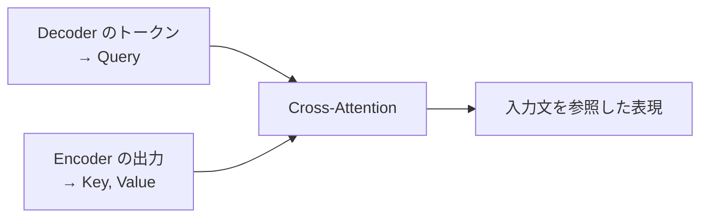

# 第4章　Encoder と Decoder のスタック

**この章でわかること**

- 同じブロックを積む、という構造
- Encoder ブロックの中身
- Decoder ブロックの中身（masked self-attention）
- Encoder–Decoder attention（cross-attention）

### 4.1　同じブロックを積む構造

論文は、Encoder も Decoder も「同じ構造のブロックを、N 段積む」と述べます（論文では N=6）。

第5巻12章で、ブロックを積み重ねられることを、shape で確認しました。

それが、ここで効きます。

```text
Encoder = [Encoder ブロック] を N 段
Decoder = [Decoder ブロック] を N 段
```

各ブロックの入出力は `[batch, L, d_model]` でそろっているので、同じものを何段でも積めます（第5巻11〜12章）。

「同じ部品の繰り返し」という単純さが、Transformer の特徴です。

複雑な専用部品を、いくつも組み合わせるのではありません。

シンプルなブロックを、ただ何段も積む。

その素直さが、Transformer の強さでもあります。

### 4.2　Encoder ブロックの中身

Encoder ブロックは、第5巻11章で作った `TransformerBlock` と、ほぼ同じです。

2つのサブlayer から、なります。

```text
Encoder ブロック:
  1. Multi-Head Self-Attention（mask なし）
  2. Feed-Forward Network
  各サブlayer を Add & Norm（残差 + LayerNorm）で包む
```

ここで、大事なポイントがあります。

Encoder の Self-Attention には、**causal mask がない** のです。

なぜでしょうか。

Encoder は、入力文全体を、一度に読みます。

だから、各トークンが、未来も含む全トークンを、見てよいのです。

翻訳なら、入力の英文は、最初から全部わかっています。

「I have a dog」という入力文を読むとき、「I」を処理しながら「dog」を見ても、何も問題ありません。

入力は、答えではないからです。

だから、隠す必要が、ありません。

### 4.3　Decoder ブロックの中身（masked self-attention）

Decoder ブロックは、Encoder より、サブlayer が1つ多く、3つから、なります。

```text
Decoder ブロック:
  1. Masked Multi-Head Self-Attention（causal mask あり）
  2. Multi-Head Cross-Attention（Encoder の出力を見る）
  3. Feed-Forward Network
  各サブlayer を Add & Norm で包む
```

1つ目の Self-Attention には、**causal mask があります**（第5巻6章）。

なぜでしょうか。

Decoder は、出力を1トークンずつ、生成します。

だから、まだ生成していない未来のトークンを、見てはいけません。

第5巻6章で作った causal mask が、まさに、ここで使われます。

第4巻7章で学んだ「言語モデルは未来を見てはいけない」が、Decoder 側の性質なのです。

Encoder は入力全体を見てよく、Decoder は未来を見てはいけない。

この違いが、「mask あり/なし」の違いになっています。

### 4.4　Encoder–Decoder attention（cross-attention）

Decoder ブロックの、2つ目のサブlayer が、**Cross-Attention**（Encoder–Decoder attention）です。

第5巻5章で、名前だけ予告した、あれです。

Self-Attention との違いを、はっきりさせましょう。

Self-Attention は、Q・K・V を、同じ系列から作りました。

Cross-Attention は、違います。

```text
Self-Attention  : Q, K, V すべて同じ系列から（第5巻）
Cross-Attention : Q は Decoder 側から、K と V は Encoder の出力から
```

これは、第5巻3章の検索のたとえで言えば、こうです。

「Decoder の各トークンが Query を出し、Encoder が作った入力文の表現（Key・Value）を、検索する」。

翻訳なら、「いま生成しようとしている日本語のトークンが、入力の英文の、どこに注目すべきか」を、計算します。



日本語の「犬」を生成しようとするとき、入力英文の「dog」に注目する。

そういう「入力と出力の対応」を、Cross-Attention が、つけるのです。

ここで、嬉しいことがあります。

計算の仕組み自体は、第5巻4章のスケール付き内積 Attention と、まったく同じです。

`softmax(QK^T / sqrt(d_k)) V` の式は、変わりません。

違うのは、Q の出どころと、K・V の出どころが、別々だ、という点だけ。

だから、新しく学ぶことは、ありません。

第5巻の `attention(Q, K, V)` 関数に、別々の系列から作った Q と K・V を渡せば、それが Cross-Attention です。

部品は、もう持っているのです。

### 4.5　本章のまとめ

- Encoder も Decoder も、同じ構造のブロックを N 段積む（論文では N=6）。シンプルな繰り返し。
- Encoder ブロックは「Self-Attention（mask なし）＋ FFN」。入力全体を見てよい（入力は答えではない）。
- Decoder ブロックは「Masked Self-Attention ＋ Cross-Attention ＋ FFN」の3サブlayer。
- Decoder の Self-Attention には causal mask（未来を見ない）。第5巻6章のあれ。
- Cross-Attention は Q を Decoder、K・V を Encoder から作る。計算は第5巻4章と同じで、新しいことはない。
