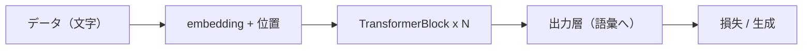

# 第5章　nn.Module で部品を書く

**この章でわかること**

- `nn.Module` の作法の、おさらい
- パラメータの登録と forward
- 第5巻の部品を、`nn.Module` として組み直す方針

### 5.1　`nn.Module` の作法

第3巻8章で、`nn.Module` を継承してモデルを書く作法を、学びました。

小さな GPT も、この作法で、部品を組み立てます。

基本は、2つだけです。

```text
__init__ : 使う部品（層）を用意する
forward  : 入力をどう流すかを書く
```

例を見ましょう。

```python
import torch.nn as nn

class MyLayer(nn.Module):
    def __init__(self, d_in, d_out):
        super().__init__()
        self.fc = nn.Linear(d_in, d_out)   # 部品を持つ

    def forward(self, x):
        return self.fc(x)                  # 流れを書く
```

`__init__` で、使う部品（ここでは `nn.Linear`）を用意します。

`forward` で、入力をどう流すか（ここでは `fc` に通すだけ）を書きます。

そして、`backward` は、書きません。

autograd が、自動でやってくれます（第2〜3章で体感したとおり）。

第3巻8章で、XOR を解く MLP を、この型で書きました。

第5巻でも、Attention や FFN を、この型で書きました。

もう、何度も使った、おなじみの型です。

### 5.2　パラメータの登録と forward

`__init__` の中で、`self.xxx = nn.Linear(...)` のように部品を代入すると、何が起きるでしょうか。

その部品のパラメータが、自動的に、このモジュールのパラメータとして **登録** されます。

だから `model.parameters()` で、全部まとめて取り出せ、optimizer に渡せます（第3巻7章）。

```python
import torch
import torch.nn as nn

layer = MyLayer(4, 8)
print(sum(p.numel() for p in layer.parameters()))   # パラメータ数を数えられる
```

`sum(p.numel() for p in layer.parameters())` で、全パラメータの個数を、数えられます。

複数のモジュールを、入れ子にしても、この登録は、再帰的に効きます。

`Block` の中に `Attention` を持ち、`Attention` の中に `Linear` を持つ……としても、いちばん外側の `model.parameters()` が、すべてのパラメータを、集めてくれます。

これが、複雑なモデルを組んでも、学習ループが単純なままでいられる、理由です。

どんなに部品を入れ子にしても、最後は `model.parameters()` を optimizer に渡すだけ。

学習ループは、第3巻7章のまま、変わりません。

### 5.3　第5巻の部品を組み直す方針

第5巻で、私たちはすでに、次の部品を `nn.Module` として書きました。

```text
- MultiHeadAttention（第5巻7章）
- FeedForward（第5巻10章）
- TransformerBlock（第5巻11章）
- LearnedPositionalEmbedding（第5巻9章）
```

この巻では、これらをそのまま使い、文字レベル言語モデルとして、組み上げます。

第5巻のコードは「部品を小さく動かす」ためのものでしたが、設計は、最初から統合を見すえて、ありました。

入出力 shape を `[batch, L, d_model]` でそろえてあるので、つなぐだけで、動きます。

第5巻で繰り返し「入出力は `[B, L, d_model]` で不変」と確認したのは、この統合のためでもあったのです。

組み上げる流れは、こうです。



方針は、この図のとおりです。

次章から、左から順に、作っていきます。

- 第6章で、データ。
- 第7章で、embedding ＋ 位置。
- 第8〜9章で、Attention とブロック。
- 第10章で、モデル全体。
- 第11章で、学習。
- 第12章で、生成。

第5巻で部品を作り、論文（第6巻）で設計を確認し、いま統合する。

旅の、総仕上げです。

### 5.4　本章のまとめ

- `nn.Module` は `__init__` で部品、`forward` で流れを書く。`backward` は autograd に任せる。
- `__init__` で代入した部品のパラメータは自動登録され、`model.parameters()` で一括取得できる。入れ子でも再帰的に効く。
- だから、どんなに部品を入れ子にしても、学習ループは第3巻7章のまま変わらない。
- 第5巻で書いた MultiHeadAttention・FeedForward・TransformerBlock・位置埋め込みを、そのまま使って統合する。
- 入出力 shape を `[batch, L, d_model]` でそろえてあるので、つなぐだけで動く。次章からデータ→モデル→学習→生成と作る。

---

<!-- chapter-nav:start -->

[← 第4章　テンソルと autograd](Chapter%204%20Tensors%20and%20Autograd.md) ｜ [目次](Table%20of%20Contents.md) ｜ [第6章　データを用意する（文字レベル） →](Chapter%206%20Preparing%20Character%20Level%20Data.md)

<!-- chapter-nav:end -->
